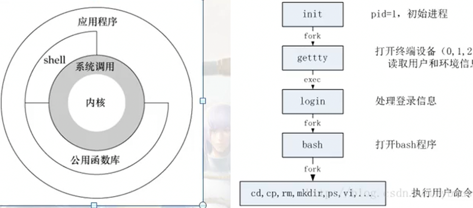

# 语言 c++
## 编译步骤
* 预处理
    * 生成预处理文件
* 编译
    * 生成汇编文件
* 汇编
    * 生成目标文件
* 连接
    * 连接库 系统引导 生成可执行程序
## 
## 作用域生命周期
* static局部变量是在进入函数时被初始化的，生命周期为定义到程序结束
## 常量
* 整型 1 2 3
* 浮点型 1.1 2.2 3.3
* 字符型 'a' 'b' 'c'
* 字符串型 "a" "b" "c"
### 常量表达式
* 编译期间可以直接求值的表达式
### 宏函数
* [宏函数](./语言/宏/宏函数.cpp)
* 提高效率，普通函数调用会造成额外开销
```cpp
    #define func(x) ((x) * (x) + 11)

    #define print() do { \
    printf("hello "); \
    printf("world\n"); \
    }while(0)

    int i = 2;
    int num = func(++i); // 会加两次
    std::cout << num << "\n"; // 4 * 4 + 11 = 27
    print(); // hello world
```
## 输入输出
### printf格式化输出
* %d：输出十进制整数。 
* %f：输出浮点数。 
* %c：输出字符。 
* %s：输出字符串。 
* %p：输出指针地址。 
* %x：输出十六进制整数。0x开头 
* %o：输出八进制整数。0开头
* %u：输出无符号十进制整数。 
* %e：输出科学计数法表示的浮点数。 
* %g：根据实际情况选择%f或%e格式输出浮点数。
* printf("%05.3f\n");
    * 宽度为5 填充0 显示点后3位小数
### cout格式化输出
* std::oct, 八进制
* std::dec，十进制
* std::hex，十六进制
```cpp
    int num = 11;
    std::cout << std::oct << num << "\n"; // 13
    std::cout << num << "\n"; // 13
    std::cout << std::dec << num << "\n"; // 11
```
### scanf匹配(行缓冲)
* [当scanf中有空白字符时，可以匹配0个或多个](./语言/输入输出/scanf.cpp)
```cpp
    // 输入 num    =   11  ,  num2   =   22
    // num2会匹配失败','前没有空格所以无法匹配后续
    scanf("num   = %d, num2 =   %d", &num, &num2);
    printf("num = %d, num2 = %d\n", num, num2);
```
* [数值匹配时会忽略数值前面的空白字符](./语言/输入输出/scanf2.cpp)
```cpp
    // 输入:    11    22     33
    scanf("%d%d%d", &num, &num2, &num3);
    printf("num = %d, num2 = %d, num3 = %d\n", num, num2, num3);
```
* [%c不会忽略前面的空白字符](./语言/输入输出/scanf3.cpp)
```cpp
    char ch = 0;

    scanf("%c", &ch); // 输入：   a
    printf("[%c]", ch); // [ ]

    while(getchar() != '\n');

    // 空白字符可以匹配0个或多个
    scanf(" %c", &ch); // 输入：   a
    printf("[%c]", ch); // [a]
```
### scanf输入返回值，只有当返回值为空时scanf才会阻塞等待输入
* 返回成功匹配的次数
### 读写字符getchar/putchar
```cpp
    char ch = getchar();
    putchar(ch);
```
#### 舍弃剩余字符
```cpp
    while (getchar() != '\n');
```
## 整形运算默认是int
* [整形运算默认是int](./语言/基础类型/整型运算.cpp)
```cpp
    // 0000 0000 0000 0000 0000 0000 1001 1001
    // 000 0000 0000 0000 0000 0000 1001 1001 0
    // 0000 0000 0000 0000 0000 0000 1001 1001
    unsigned char num = 0x99 << 1 >> 1; // 99
    printf("%x\n", num);

    // 1001 1001
    // 0011 0010 -> 0x32
    // 0001 1001 -> 0x19
    unsigned char num2 = 0x99 << 1;
    num2 = num2 >> 1;
    printf("%x\n", num2); // 19
```
## 浮点数存储IEEE754标准
* float
    * 符号位1位 指数部分8位 小数部分23位
    * 4.5 可以完整的算出
    * 十六进制 0x40900000
    * 二进制 0 10000001 00100000000000000000000
    * 指数部分 10000001 -> 需要转成十进制然后减去127 -> 129 - 127 = 2(结果是2的几次幂) -> 4
    * 小数部分 00100000000000000000000 -> 前面有一个1 -> 1.001(2的0次幂 到 2的-3次幂) -> 1.125
    * 4 * 1.125 = 4.5
### 浮点数有效位(第一个不为0的数开始)
    > 0.0001 1位有效数字
    > 1.0001 5位有效数字
* float 有效位 6-7
* double 有效位 15-16
* long double 有效位 18-19
### 浮点数判断
```cpp
    // 用需要的精度来做判断
    float f = 1.234f;
    if ((f - 1.234) < 0.001 && (f - 1.234) > 0.001) {
        statement
    }
```
## ascii码: A 65, a 97, space 32
## 字符控制 c中需要加头文件ctype.h c++中无需加头文件
* 转大写 toupper(int)
* 转小写 tolower(int)
* 是否为数字 isdigit(int)
* 是否为字母 isalpha(int)
* 是否为字母或数字 isalnum(int)
* 是否为大写字母 isupper(int)
* 是否为小写字母 islower(int)
* 是否是空白字符 isspace(int)
## bool类型 stdbool.h
```cpp
    printf("sizeof(bool): %ld\n", sizeof(bool)); // 1    
```
## 隐式类型转换
> 整型默认int 浮点型double
> char -> short -> int -> long -> long long -> float -> double
* short, char 运算会隐式转换成int
    > 计算机在运算int类型数据最快
    > int 运算注意 int 越界
* 有符号, 无符号 运算会隐式转换成 无符号
    > 有无符号不要一起进行运算
## 别名typedef/using
* 基础类型
    * typedef int int_type;
    * using int_type = int;
* 数组
    * typedef int arr_type[11];
    * using arr_type = int[11];
* 函数指针
    * typedef void (*p_func_type)();
    * using p_func_type = void(*)();
## sizeof 编译时期确定 得到的结果是一个常量表达式
## 运算符
### 算术运算符
* 取模运算不能用于浮点数
    * a % b 符号和a相同
### 赋值运算符可能会发生隐式类型转换
* 整型默认int 浮点型double
### 自增自减运算符
```cpp
    // 都是未定义行为
    i = i++;
    j = (i++) + (i++);
    arr[i] = arr2[i++];
    // 会产生临时值 在赋值
    j = i++;        i = i++;
    temp = i;       temp = i;
    j = temp;       i = temp;
    i = i + 1;      i = i + 1;
```
### 关系运算符 > < 从左向右
### 逻辑运算符 &&(优先级高于||) || 会发生短路现象 从左到右
### 位运算
#### 左移 右移 << >>
* i << j 左移 低位补0
* i >> j 右移 高位补符号位
#### 与 & 置1
```cpp
    // 一个数为奇偶数
    bool is_odd(int num) {
        return num & 0x1;
    }
```
```cpp
    // 一个数是否为2的幂
        // 2的幂只有一位为1
        // 1000 0000
        // &
        // 0111 1111
        // 0000 0000
    bool is_power_of_two(int num) {
        return (num & (num - 1)) == 0;
    }
```
```cpp
    // 权重最低的位的值
        // 正负数二进制表示只有权重最低位相同
        // 0101 1000
        // &
        // 1010 1000
        // 0000 1000
    int weight_lowest_order(int num) {
        return num & (-num);
    }
```
#### 异或 ^ 相同数字异或为0
```cpp
    // 找出数组中为一不成对的数字
    int find_single(const std::vector<int>& vec) {
        int num = 0;
        for (const auto& val : vec) {
            num ^= vec[i];
        }
        return num;
    }
```
## 控制语句
### switch 语句
```cpp
    switch (整型 字符型) {
        case 常量表达式: {
            statement
            break;
        }
        // 多个 case 可以共用一条语句
        case 常量表达式: case 常量表达式2: case 常量表达式3: {
            statement
            break;
        }
        default: {
            statement
            break;
        }
    }
```
#### switch和if else
* switch可读性、效率都高于if else
### 三目运算符 从右向左结合
```cpp
    int i = 1, j = 2, k = 0;
    k = i > j ? ++i : ++j;
    i : 1, j : 3, k : 3
```
### goto不能跨函数 不能跳过定义
## 递归
### 斐波那契数列
* [斐波那契数列](./语言/递归/斐波那契数列.cpp)
```cpp
    long long fibonacci(int n) {
        if (n == 0) { return 0; }
        if (n == 1) { return 1; }
        return fibonacci(n - 1) + fibonacci(n - 2);
    }
```
* [斐波那契数列非递归](./语言/递归/斐波那契数列非递归.cpp)
```cpp
    long long fibonacci(int n) {
        if (n == 0) { return 0; }
        if (n == 1) { return 1; }
        long long num = 0;
        long long num2 = 1;
        for (int i = 2; i <= n; ++i) {
            long long temp = num + num2;
            num = num2;
            num2 = temp;
        }
        return num2;
    }
```
### 汉诺塔
* [汉诺塔](./语言/递归/汉诺塔.cpp)
```cpp
    void hanoi(int n, char a, char b,char c) { // a b c 三个柱子
        if (n == 1) {
            std::cout << a << "->" << c << std::endl;
            return;
        }
        hanoi(n - 1, a, c, b); // a - > b
        std::cout << a << "->" << c << std::endl; // a -> c
        hanoi(n - 1, b, a, c); // b -> c
    }
```
### 约瑟夫环
* 一群个物体，指定间隔，清除
* [约瑟夫环数组实现](./语言/递归/约瑟夫环数组实现.cpp)
```cpp
    #include <vector>
    void joseph(int peoples, int rule, int num) // peoples 人数， rule 规则, num 剩余人数
    {
        std::vector<int> vec(peoples);
        for (int i = 0; i < peoples; ++i) {
            vec[i] = i + 1;
        }
        int index = 0;
        while (vec.size() > num) {
            for (int i = 0; i < rule - 1; ++i) {
                index = (index + 1) % vec.size(); // 移动rule-1次，一次移动一个
            }
            std::cout << "清除的为：" << vec[index] << "\n";
            vec.erase(vec.begin() + index);
        }
        std::cout << "剩余的人：\n";
        for (const int &val : vec) {
            std::cout << val << "\n";
        }
        std::cout << "\n";
    }
```
* [约瑟夫环循环链表实现](./语言/递归/约瑟夫环循环链表实现.cpp)
```cpp
    #include <list>
    void joseph(int peoples, int rule, int num)
    {
        std::list<int> l(peoples);
        std::list<int>::iterator it = l.begin();
        int temp = 0;
        for (std::list<int>::iterator it = l.begin(); it != l.end(); ++it, ++temp) {
            *it = temp;
        }
        while (l.size() > num) {
            for (int i = 0; i < rule - 1; ++i) {
                it = std::next(it);
                if (it == l.end()) {
                    std::advance(it, 1);
                }
            }
            std::cout << "清除的为：" << *it << "\n";
            it = l.erase(it);
        }
        std::cout << "剩余的人：\n";
        for (const int &val : l) {
            std::cout << val << "\n";
        }
        std::cout << "\n";
    }
```
## 字符串
### sscanf 通配符
* 格式化从字符串中输入
* %*s或%*d 跳过数据
* %[width]s 读取指定宽度数据
* %[a-z] 匹配a到z
* %[^a-z] 不匹配a到z
* 条件必须逐一匹配否则直接退出
### 查找字符 strchr, 拷贝 strncpy
```cpp
    char buf[] = "abcdefghijk";
    char buf2[1024] = "243124324324";
    char *p = strchr(buf, 'e');
    if (p != nullptr) {
        strncpy(buf2, buf, p - buf);
        buf2[p - buf] = 0;
    }
    std::cout << buf2 << std::endl; // abcd
```
### 忽略大小写比较 strcasecmp
```cpp
    char str[] = "abcd";
    char str2[] = "ABCD";
    if (strcasecmp(str, str2) == 0) {
        std::cout << "equal\n"; // 会输出
    }
```
### 处理字符串后空白字符
```cpp
    void right_space(char *str) {
        int temp_size = strlen(str);
        while (isspace(str[temp_size - 1]) && temp_size > 0) {
            str[--temp_size] = 0;
        }
    }
```
### 处理字符串前空白字符
```cpp
    void left_space(char *str) {
        char *temp = str;
        while (isspace(*temp)) {
            ++temp;
        }
        while (*temp != '\0') {
            *str = *temp;
            ++str;
            ++temp;
        }
        *str = '\0';
    }
```
### 字符串转数字 atoi(str) std::stoi(str)
## 数组
* 数组下标从0开始
    * 数组地址即是首元素地址，如果从1开始会浪费空间，增加计算量(-1)
* arr[i] == *(arr + i)
```cpp
    // 数组元素不能发生改变
    const int arr[3] {1, 2, 3};
    arr[0] = 11; // error
```
### 两个有序数组相同元素
```cpp
```
### 多维数组
```cpp
    // 3组 组元素为 int[4]
    int arr[3][4] {{1, 2, 3, 4}, {5, 6, 7, 8}, {9, 10, 11, 12}};
```
## new/delete
* c++11中可以对new出来的数组进行初始化
```cpp
    char *p = new char[11]{'1', '2', '3', '4', '5', '6', '7', '8', '9', 'a', '\0'};
    std::cout << p << '\n'; // 123456789a
    for (int i = 0; i < 11; ++i) {
        std::cout << '[' << p[i] << ']'; // [1][2][3][4][5][6][7][8][9][a][]
    }
```
## 命令行参数

### 命令行参数后还有环境变量参数
* evriron[] 无需声明，系统定义
### 修改命令行参数，可改变进程标题
* 可以通过strcpy(argv[0], "xxx")修改，但是命令行参数中并不会因为'\0'结束。还可能会影响后续的环境变量

* 正确的做法
1. [先保存环境变量]()
## 随机数
```cpp
    #include <ctime>
    srand((unsigned)time(nullpter));
    for (int i = 0; i < 11; ++i) {
        int num = rand() % 10 + 1; // 1 - 10
    }
```
## 可变参数
### c语言可变参数
* [c语言可变参数](./语言/可变参数/c语言可变参数.cpp)
```cpp
    #include <stdarg.h>
    void func(int count, ...) {
        va_list ap; // 参数列表
        va_start(ap, count); // 初始化参数列表
        for (int i = 0; i < count; ++i) {
            std::cout << va_arg(ap, char*) << " ";
        }
        std::cout << "\n";
        va_end(ap);
    }
    void func2(const char* format, ...) {
        va_list ap;
        va_start(ap, format);

        const char *temp_p = format;

        for (; *temp_p != 0; ++temp_p) {
            if (*temp_p != '%') {
                putchar(*temp_p);
                continue;
            } else {
                switch (*(++temp_p)) {
                case 'd' : {
                    std::cout << va_arg(ap, int);
                    break;
                }
                default : {
                    vprintf(--temp_p, ap);
                    ++temp_p; // 跳过占位符
                    break;
                }
                }
            }
        }
        std::cout << "\n";
        va_end(ap);
    }
    func(3, "aaa", "bbb", "ccc");
    func2("%d %s", 1, "aaa");
```
### c++可变参数
* [c++可变参数](./语言/可变参数/cpp可变参数.cpp)
```cpp
    #include <iostream>
    void func() {}
    template <class T, class...Args>
    void func(T element, Args...args) {
        std::cout << sizeof...(args) << '\n';
        std::cout << element << '\n';
        func(args...);
    }
    func(1, "aaa");
```
## 文件读写
### c文件读写
#### fopen/fclose 打开/关闭文件
* fopen mode
    * r 只读
    * w 只写 创建新文件
    * a 追加 创建文件，如果文件存在追加
    * r+ w+ a+ 读写
    * rb+ wb+ ab+ 二进制读写
* fclose 会刷新缓冲区
#### 字符读写 fgetc/fputc
* [字符读写](./语言/文件读写/字符读写.cpp)
```cpp
    #include <iostream>
    FILE *fp_read = fopen(argv[1], "r");
    FILE *fp_write = fopen(argv[2], "w");
    int ch = 0;
    while ((ch = fgetc(fp_src)) != EOF) // 正常读取换行符，返回读到的字符
    {
        fputc(ch, fp_dest);
    }
```
#### 行读写 fgets(只有文件为空时buf[0] == 0)/fputs
* [行读写](./语言/文件读写/行读写.cpp)
```cpp
    #include <iostream>
    FILE *fp_read = fopen(argv[1], "r");
    FILE *fp_write = fopen(argv[2], "w");
    char buf[1024] = {0};
    while (fgets(buf, 1024, fp_read) != nullptr) { // 正常读取换行符，返回读到的字符串
        fputs(buf, fp_write);
    }
```
#### 格式化读写，文件定位 fprintf/fscanf/seek/ftell
* [格式化读写](./语言/文件读写/格式化读写.cpp)
```cpp
    #include <iostream>
    struct People {
        char m_name[1024];
        int m_age;
    };
    FILE *fp_rw = fopen(argv[1], "w+"); // 读写
    People p {"yixin", 11};
    fprintf(fp_rw, "%s %d", p.m_name, p.m_age);
    // SEEK_SET 开始位置
    // SEEK_CUR 当前位置
    // SEEK_END 结束位置
    // 正负数可以表示向前后移动
    fseek(fp_rw, 0, SEEK_SET); // 文件指针恢复到开始位置
    fscanf(fp_rw, "%s%d", p.m_name, &(p.m_age)); // 空白字符会停止读取
```
* 返回到文件开始位置的偏移量
```cpp
    #include <iostream>
    fseek(fp, 0, SEEK_END);
    int file_size = ftell(fp); // 文件大小
```
#### 二进制序列化读写 fread/fwrite
* [二进制序列化读写](./语言/文件读写/二进制序列化读写.cpp)
```cpp
    #include <iostream>
    #include <string.h>
    FILE *fp_read = fopen(argv[1], "rb");
    FILE *fp_write = fopen(argv[2], "wb");
    char buf[1024] = {0};
    while (fread(buf, 1, sizeof(buf), fp_read)) { // 返回读到的字符数
        fwrite(buf, 1, strlen(buf), fp_write);
        memset(buf, 0, sizeof(buf));
    }
```
### cpp文件读写
#### 打开关闭文件 fout.open/fout.close
* 清空文件，默认值 std::ios::trunc
* 读文件，默认值 std::ios::out
* 写文件不存在创建，默认值 std::ios::in
* 追加不存在创建 std::ios::app
* 二进制读写 std::ios::binary
#### 文件读写 fin.getline(空行buf[0] == 0)/fin >>/fout <<
* [文件读写](./语言/文件读写/文件读写.cpp)
```cpp
    #include <iostream>
    #include <fstream>
    #include <assert.h>
    std::ifstream fin(argv[1]);
    std::ofstream fout(argv[2]);
    char buf[1024] = {0};
    while (fin >> buf) { // 不能读取空白字符
        fout << buf << std::endl;
    }

    while (fin.getline(buf, sizeof(buf))) { // 不会读取换行符
        fout << buf << std::endl;
    }
```
#### 二进制文件读写 fin.read/fin.readsome/fin.write/
* [二进制文件读写](./语言/文件读写/二进制文件读写.cpp)
```cpp
    #include <iostream>
    #include <string.h>
    #include <fstream>
    #include <assert.h>
    std::ifstream fin(argv[1]);
    std::ofstream fout(argv[2]);
    char buf[1024] = {0};
    while (fin.readsome(buf, sizeof(buf))) {
        std::cout << buf;
        fout.write(buf, strlen(buf));
    }

    std::ofstream fout(argv[1], std::ios::binary);
    char buf[] = R"(孤单听雨的猫
往时间裂缝里看到了我
雷电交加之外的另一些我
乌云静止以后 跳进平行时空
那些我 旅行中的你我
回忆胡乱穿梭 坠落
交换余生 是我 非我 苦与乐
阴天之后总有续命的晴空
如果我们几经转折 结局一样不动
也才算无愧这分合
定位心海的锚
让时间停顿的像慢动作
你说命运很坏吧幸好有我
如果没有以后 如果平行失控
那些我 不同人生的我
会以什么方式 哭过
交换余生 是我 非我 苦与乐
阴天之后总有续命的晴空
如果我们几经转折 结局一样不动
也才算无愧这分合
云等风 人等梦 爱辗过时光等什么
记不住 认不出 泪眼中谁一样脸红
等你说 等我说 一等就是一个宇宙
日升换月落 真爱换寂寞
交换余生 也许 忘了 第几梦
那时我们身处第几号时空
因为我们手心紧握 记忆也能紧扣
可不怕前方的虫洞
爱是时间的古董)";
    fout.write(buf, strlen(buf));
    std::ifstream fin(argv[1], std::ios::binary);
    char buf2[1024] = {0};
    fin.read(buf2, sizeof(buf));
    std::cout << buf2;
    fin.close();
```
#### 输入输出重定向
```cpp
    #include <iostream>
    #include <fstream>
    std::ofstream file("output.txt");
    std::streambuf *orig_buf = std::cout.rdbuf(); // 保存cout的原缓冲区
    std::cout.rdbuf(file.rdbuf()); // 将cout输出重定向到文件
    std::cout << "Hello, World!" << std::endl; // 输出到文件
    std::cout.rdbuf(orig_buf); // 恢复cout的原缓冲区
    std::cout << "Back to console!" << std::endl; // 输出到控制台
```
#### 文件定位
* seek(11) 移动到的字节数
* seek(std::ios::end) 文件结尾
* seek(std::ios::beg) 文件开始
* std::ios::cur 文件当前位置
* seek(10, std::ios::beg) 文件开始位置向后移动10个字节
* seek(-10, std::ios::end) 文件结尾位置向前移动10个字节
* tellp 获取文件大小
    * ifstream.seek(0, std::ios::end) 将文件指针移动到尾部
    * int size = ifstream.tell() 获取文件指针当前位置到文件开始的偏移量
## STL
### vector
#### 大小，空间
```cpp
    #include <vector>
    std::vector<int> vec;
    std::cout << vec.size() << "\n"; // 0
    std::cout << vec.capacity() << "\n"; // 0
    //////////////////////////////////////////////////////////////////////////////////
    // 相当于 vector<int> vec2(11);
    std::vector<int> vec2;
    vec2.resize(11);
    std::cout << vec2.size() << "\n"; // 11
    std::cout << vec2.capacity() << "\n"; // 11
    //////////////////////////////////////////////////////////////////////////////////
    std::vector<int> vec3;
    vec3.resize(11);
    std::cout << vec3.size() << "\n"; // 0
    std::cout << vec3.capacity() << "\n"; // 11
```
#### 添加元素
```cpp
    #include <vector>
    vec.push_back(element);
    //////////////////////////////////////////////////////////////////////////////////
    class Student {
    private:
        std::string m_name;
        int m_age;
    public:
        Student(const std::string &name, int age) : m_name(name), m_age(age) {}
    };
    std::vector<Student> vec;
    vec.emplace_back("yixin", 11);
```
#### 删除元素
```cpp
    #include <vector>
    vec.erase(vec.begin() + 2); // 删除第三元素
```
#### 查找元素
```cpp
    #include <algorithm>
    std::find(vec.begin(), vec.end(), element);
```
### list
#### 大小
```cpp
    std::list<int> l(3);
    std::cout << l.size() << std::endl; // 3
```
#### 循环链表
```cpp
    #include <list>
    std::list<int> l {1, 2, 3, 4, 5};
    std::list<int>::iterator it = l.begin();
    std::advance(it, 1);
    std::cout << *it << std::endl; // 2
    std::advance(it, 1);
    std::cout << *it << std::endl; // 3
    std::advance(it, 1);
    std::cout << *it << std::endl; // 4
    std::advance(it, 1);
    std::cout << *it << std::endl; //5
    std::advance(it, 1);
    std::cout << *it << std::endl; // 5
    std::advance(it, 1);
    std::cout << *it << std::endl; // 1
    std::advance(it, 1);
    std::cout << *it << std::endl; // 2
    std::cout << l.end() << std::endl; // 5
```
#### 删除元素
```cpp
    std::list<int> l {1, 2, 3, 4, 5};
    std::list<int>::iterator it = l.end();
    it = l.erase(it);
    std::cout << *it << std::endl; // 2
```
### 迭代器
#### 迭代器移动advance, next
```cpp
    std::list<int> l {1, 2, 3, 4, 5};
    std::list<int>::iterator it = l.end();
    std::advance(it, 1);
    std::cout << *it << std::endl; // 1
    std::list<int>::iterator it2 = std::next(it, 1); // 返回新的迭代器，原迭代器不会改变
    std::cout << *it2 << std::endl; // 2
    it = std::next(it);
    std::cout << *it << std::endl; // 3
    std::advance(it2, -1);
    std::cout << *it2 << std::endl; // 2
```
---
---
---
---
---
---
---
---
---
---
## 说明符 限定符
### constexpr 常量表达式
```cpp
    // 可以做为数组的大小
    constexpr int arraySize = 10;  
    int myArray[arraySize];
```
```cpp
    // 编译时初始化，值必须是常量表达式
    constexpr int num = 11;
    constexpr int num2 = num * 2;
    int num3 = 11;
    constexpr int num4 = num3 * 2; // error num3不是常量表达式
```
```cpp
    // 编译时产生结果，函数内不能包含运行行为(循环，内存分配等)
    constexpr int func(int num) {  
    return num * num;  
    }  
    constexpr int num = fun(5); 
```
```cpp
    // 模板中可以，可以在编译时计算出值
    template<int N>  
    constexpr int func() {  
        return N <= 1 ? 1 : N * func<N - 1>();  
    }  
    constexpr int num = func<5>();
```
```cpp
    // 编译时if c++17
    template<typename T>  
    void foo() {  
        if constexpr (std::is_integral_v<T>) {  
            // 整型特定的代码  
        } else if constexpr (std::is_floating_point_v<T>) {  
            // 浮点型特定的代码  
        } else {  
            // 其他类型的代码  
        }  
    }
```
# 算法数据结构
## 时间复杂度
* O(log n)
```cpp
    while (left <= right) {  
        int mid = left + (right - left) / 2; // 防止溢出  
        if (arr[mid] == target) {  
            return true; // 找到目标，返回true  
        } else if (arr[mid] < target) {  
            left = mid + 1; // 目标在右侧  
        } else {  
            right = mid - 1; // 目标在左侧  
        }  
    }  
```
* O(n)
```cpp
    for (int i = 0; i < n; ++i)
```
---
---
---
---
---
---
---
---
---
---
# linux系统编程
## 睡眠
```cpp
    #include <unistd.h>
    sleep(1); // 秒
    usleep(1); // 微秒
```
## 进程
* ps -eo pid,ppid,sid,pgid,cmd,stat | grep -E 'PID|a.out|fish'
### 实际用户ID可创建的最大进程数
```cpp
    #include <unistd.h>
    std::cout << sysconf(_SC_CHILD_MAX) << "\n";
```
### 进程终止状态
* bash 中 echo $?
* fish 中 echo $status
### 创建子进程 父进程中返回子进程pid
* [创建子进程](./linux/linux系统编程/进程/创建子进程.cpp)
```cpp
    #include <iostream>
    #include <unistd.h>
    pid_t pid;
    pid = fork();
    // 失败返回一个负数，等于0子进程pid，大于0为父进程
    if (pid < 0) {
        exit(1);
    } else if (pid == 0) { // 子进程
        std::cout << "son process pid: " << getpid() << ", ppid: " << getppid() << "\n";
    } else { // 父进程中的pid就是子进程pid
        std::cout << "father process pid: " << getpid() << ", son pid: " << pid << "\n";
        sleep(1);
    }
```
#### fork()写的时候会复制一份给该进程单独使用(其他进程不会受到影响)，读的时候所有进程共享
* [写时复制](./linux/linux系统编程/进程/写时复制.cpp)
```cpp
    #include <unistd.h>
    #include <sys/wait.h>
        int g_num = 11;
        pid_t pid = fork();
        if (pid == 0) {
            g_num = 22;
            std::cout << "child g_num: " << g_num << ", &g_num: " << &g_num  << std::endl; // 22 0xb050
            g_num = 33;
            std::cout << "child g_num: " << g_num << ", &g_num: " << &g_num  << std::endl; // 33 0xb050
            g_num = 44;
            std::cout << "child g_num: " << g_num << ", &g_num: " << &g_num  << std::endl; // 44 0xb050
        } else if (pid > 0) {
            wait(nullptr);
            std::cout << "parent g_num: " << g_num << ", &g_num: " << &g_num << std::endl; // 11 0xb050
        }
```
* g_num的地址相同，只是在各自的地址空间中偏移量相同。
    * 只是在映射的内存地址偏移量相同，物理内存中实际上是不同位置
### 孤儿进程(父进程先终止，由init进程接管的子进程)
* [忽略sighub信号可以在终端关闭后，进程可以继续执行(孤儿进程)](./linux/linux系统编程/信号/孤儿进程.cpp)
```cpp
    #include <signal.h>
    int main() {
        signal(SIGHUP, SIG_IGN); // 忽略sighub信号
        while (true) {
            std::cout << "sleep\n";
            sleep(1); // 秒
        }
        std::cout << "main end\n";
        return 0;
    }
```
### 僵尸进程(子进程先终止，父进程没有使用wait/waitpid等待回收资源，STAT为Z)
* 进程结束会关闭所有文件描述符，释放分配的内存。
    * PCB(进程控制块)还会存在，父进程调用wait/waitpid查看信息，并清除子进程
* 僵尸进程无法使用kill -9 终止，只能终止正在运行的程序
#### waitpid(pid_t pid, int &status, int option)
* [wait(&stat)==waitpid(-1, &stat, 0)](./linux/linux系统编程/进程/等待子进程.cpp)
* pid
    * **-1, 等待所有子进程**
    * **大于0，等待指定进程**
    * 0，等待同组子进程
    * 小于-1，等待以-pid为组长的子进程
* status
    * null，不关心返回状态
    * 非null
        * WIFEXITED(status) 检测
                * 如果正常退出返回true
            * WEXITSTATUS(status) 检测
                * 返回状态码(return或exit中的数字)
        * WIFSIGNALED(status) 检测
                * 如果是被signal结束的，返回true
            * 当返回true时，WTERMSIG(status) 返回信号编号
* option
    * 0，会阻塞等待子进程结束
    * WNOHANG，不会阻塞等待子进程结束
### 守护进程(一般后台长期运行，不和控制终端相关联)
* ppid为0的进程是内核进程，跟随系统启动关闭
* tty是?为守护进程
    * 带中括号的为内核守护进程，不带中括号的为用户守护进程
* 守护进程脱离终端，后台进程并没有脱离终端
### 守护进程信号
|信号名|信号值|发出信号原因|描述|
|-----|-----|----------|---|
|SIGHUP|1|关闭终端|不会收到来至内核发送，可以是其他进程发送的。很多守护进程使用该信号通知配置文件变动，守护进程需重新读入配置文件|
|SIGINT|2|ctrl + c||
|SIGWINCH|28|改变终端大小||
### 守护进程创建
1. **fork后，父进程退出，则不会继续占用终端可以正常使用命令**
    1. fork是为了在子进程中调用setsid()脱离终端
        1. 创建新会话，并称为进程组组长，如果该进程本身就是组长创建失败
1. **umask(0)表示不设置任何权限屏蔽，所设即所得**
    1. 新文件权限和默认的umask进行按位与，得到最终新文件权限
1. **守护进程在后台执行，不需要键盘的输入和屏幕的显示，需要把输入输出重定向到/dev/null中**
* dup2(fd, STDIN_FILENO); // 标准输入从键盘改为fd，dup2会先关闭STDIN_FILENO文件描述
```cpp
    #include <fcntl.h>
    #include <unistd.h>
    int fd = open("dev/null", O_RDWR); // 读写模式打开
    dup2(fd, STDIN_FILENO); // 标准输入重定向到fd
    dup2(fd, STDOUT_FILENO); // 标准输出重定向到fd
    if (fd > STDERR_FILENO) { // fd先复制一份，复制的fd = STDIN_FILENO，fd本身不再需要了，关闭fd以免占用改文件描述符
        close(fd);
    }
```
* [守护进程](./linux/linux系统编程/进程/守护进程.cpp)
```cpp
    #include <sys/stat.h> // umask
    #include <unistd.h>
    #include <fcntl.h> // open
    int daemon_process() {
        switch (fork()) { // 创建子进程以便调用setsid()
            case -1: {
                perror("19, fork error");
                return -1;
            }
            case 0: { // 子进程，脱离终端会话
                if (setsid() == -1) { // 创建新会话进程成为改组组长，进程为当前进程组组长时创建失败
                    perror("24, setsid error");
                    exit(1);
                }
                umask(0); // 解除文件权限限制
                int fd = open("/dev/null", O_RDWR);
                if (fd == -1) {
                    perror("31, open error");
                    exit(1);
                }
                if (dup2(fd, STDIN_FILENO) == -1) { // 复制一份fd，将标准输入赋值给复制的fd
                    perror("37, dup2 error");
                    exit(1);
                }
                if (dup2(fd, STDOUT_FILENO) == -1) {
                    perror("42, dup2 error");
                    exit(1);
                }
                if (fd > STDERR_FILENO) {
                    close(fd); // 关闭fd，释放文件描述符，避免造成资源浪费
                }
                break;
            }
            default: { // 父进程直接退出
                exit(0);
            }
        }
        return 0;
    }
```
#### 新建会话，并成为进程组组长(可以在关闭终端后进程仍能继续执行)
* [新建会话，并成为进程组组长(可以在关闭终端后进程仍能继续执行)](./linux/linux系统编程/进程/新建会话.cpp)
```cpp
    #include <unistd.h>
    int main() {
        pid_t pid = fork(); // 创建子进程
        if (pid < 0) {
            perror("11, fork error");
        }
        else if (pid > 0) {
            while (true) {
                std::cout << getpid() << " -- " << getpgid(0) << ", father wait...\n";
                sleep(1);
            }
        }
        else if (pid == 0) {
            setsid(); // 新建会话，并成为进程组组长
            while (true) {
                std::cout << getpid() << " -- " << getpgid(0) << ", son wait...\n";
                sleep(1);
            }
        }
        std::cout << "main end" << std::endl;
        return 0;
    }
```
* ps -eo pid,ppid,sid,pgid,cmd | grep -E 'PID|a.out|fish'
    * o 指定输出选项
* 组长进程调用setsid() 无效，pid==pgid 就是组长
    * setsid 创建一个新的会话，并成为新会话的组长
        * 进程已经是组长进程。会返回错误，不会创建新会话。
    * 可以在子进程调用 setsid 之前，使用 setpgid 将子进程的进程组 ID 设置为其父进程的进程组 ID。
```cpp
    setpgid(0, getpgid(getppid())); // 0该进程pid
```
## 信号
### 常用信号
|信号名|信号值|默认处理动作|发出信号原因|
|-----|-----|----------|----------|
|SIGHUP|1|终止当前shell中的进程|关闭终端|
|SIGINT|2|终止程序|按下ctrl+c|
|SIGKILL|9|终止程序，不能捕获忽略|强制杀死程序|
|SIGSEGV|11|段错误，不能捕获忽略|无效内存引用（数组越界，错误指针操作）|
|SIGALRM|14|终止程序|闹钟信号alarm|
|SIGTERM|15|终止程序|杀死程序 kill 编号 killall 进程名|
|SIGCHLD|17|忽略不做处理|子进程结束信号|
|SIGUSR1|10|终止程序||
|SIGUSR2|12|终止程序||
### 发送信号kill
* [发送信号](./linux/linux系统编程/信号/发送信号.cpp)
```cpp
    #include <iostream>
    #include <unistd.h>
    #include <signal.h>
    pid_t pid = fork();
    // 失败返回一个负数，等于0子进程pid，大于0为父进程
    if (pid < 0) { // 失败
        exit(1);
    } else if (pid == 0) { // 子进程
        while (true) {
            std::cout << "son wait...\n";
            sleep(1);
        }
    } else { // 父进程
        std::cout << "son pid: " << pid << "\n";
        sleep(3);
        kill(pid, SIGINT); // 发送信号给子进程
        while (true) {
            std::cout << "father wait...\n";
            sleep(1);
        }
    }

```
### 信号处理
* 信号处理采用系统的默认操作，大部分信号默认操作都是终止进程
* signal 返回信号编号
```cpp
    #include <signal.h>
    signal(信号, SIG_DFL); // 信号默认处理，可处理后恢复默认
```
* 设置中断处理函数，收到信号由函数处理
```cpp
    #include <signal.h>
    void func(int sig) { // 必须带参
        std::cout << "signal num: " << num << "\n";
        signal(num, SIG_DFL); // 处理后，可以恢复信号默认操作
    }
    int main() {
        signal(信号, func); // 信号由函数处理
    }
```
* 忽略某个信号，对该信号不做任何处理
```cpp
    #include <signal.h>
    signal(信号, SIG_IGN); // 信号忽略
```
### 闹钟信号(定时任务)
* [定时任务](./linux/linux系统编程/信号/闹钟.cpp)
```cpp
    #include <unistd.h>
    #include <signal.h>
    void alarm_func(int sig) {
        std::cout << "收到信号: " << sig << ", 执行定时任务\n";
        alarm(3); // 之后每3秒执行一次，并不是递归
    }
    int main() {
        signal(SIGALRM, alarm_func);
        alarm(3); // 3秒后执行
        while (true) {
            std::cout << "等待中...\n";
            sleep(1);
        }
        return 0;
    }
```
### 可重入函数，信号处理时是安全的
* [不可重入函数](./linux/linux系统编程/信号/不可重入函数.cpp)
* malloc、printf都是不可重入函数
```cpp
    #include <iostream>
    #include <signal.h>
    #include <unistd.h>
    int g_num = 11;
    void func(int sig) {
        g_num = sig;
        std::cout << "signal: " << sig << ", " << "g_num: " << g_num << "\n";
    }
    int main() {
        signal(SIGINT, func); // 会改变g_num值
        while (true) {
            g_num = 22;
            sleep(1);
            std::cout << "g_num: " << g_num << ", wait...\n";
        }
        return 0;
    }
```
* 尽可能的不要在信号处理函数中调用系统函数
    * 必要情况下需确保调用函数是可重入函数
    * 需要调用修改errno，可以先备份在恢复
### 信号阻塞
* a信号在处理时会阻塞等待a信号处理完才会再次接收a信号。如果发送多个a信号，等待该信号处理完毕，会再次处理一次a信号
* 处理信号a时，发送b信号会立刻处理b信号，a信号会阻塞等待b信号执行完，继续处理a信号
* [信号阻塞](./linux/linux系统编程/信号/信号阻塞.cpp)
### 信号集(每个进程中都会有一个信号集)
* 相当于一串二进制，计入了哪些信号被阻塞。所以相同信号函数正在处理时，将不会继续捕获该信号
    * 0000 1000
* linux中使用sigset_t表示信号集
#### 将信号集全部置1, sigfillset(&sig)
#### 将信号集全部置0, sigemptyset(&sig)
#### 将某个信号值1(相当于阻塞该信号), sigaddset(&sig, SIGHUP)
#### 将某个信号值0, sigdelset(&sig, SIGHUP)
#### sigprocmask 可以设置进程中信号集的内容
* 参数1
    * SIG_BLOCK 设置阻塞信号
    * SIG_UNBLOCK 移除阻塞信号
    * SIG_SETMASK 设置当前信号集为第二参数指向
* 参数2
    * 信号集指针，要添加删除或添加的信号，null为不设置
* 参数3
    * 保存设置前的信号集，null为不保存
#### 测试一个信号是否被阻塞。sigismember(&sig, SIGINT)阻塞返回1 没有阻塞返回0 失败返回-1
* 信号被阻塞等待处理，阻塞该信号结束继续处理
* [信号集](./linux/linux系统编程/信号/信号集.cpp)
```cpp
    #include <signal.h>
    #include <unistd.h>
    sigset_t new_make, old_make;  // 信号集结构体
    sigemptyset(&new_make);       // 清空信号集
    sigaddset(&new_make, SIGINT); // 设置SIGINT信号
    signal(SIGINT, func_sigint);
    if (sigprocmask(SIG_BLOCK, &new_make, &old_make) == -1) { // 设置信号集，保存原信号集
        perror("20, if (sigprocmask(SIG_BLOCK, &new_make, &old_make) == -1)");
        exit(1);
    }
    if (sigismember(&new_make, SIGINT) == 1) { // 测试信号是否被阻塞
        std::cout << "sigint signal obstruct\n";
    }
    if (sigprocmask(SIG_SETMASK, &old_make, nullptr) == -1) { // 恢复原始信号集
        perror("31, if (sigprocmask(SIGINT, &old_make, nullptr) == -1) {");
        exit(1);
    }
```
## 系统错误 errno
* [系统错误errno](./linux/linux系统编程/系统错误/系统错误.cpp)
```cpp
    #include <cerrno>
    #include <fstream>
    #include <cstring>
    std::ifstream fin;
    fin.open("a.txt");
    std::cout << "errno: " << errno << strerror(errno) << "\n";
```
## 文件读写
* 文件描述符
    * linux中有三个特殊的文件描述符(程序运行会被自动打开)
        * 0(STDIN_FILENO)、1(STDOUT_FILENO)、2(STDERR_FILENO)
        * 分别对应：标准输入、标准输出，标准错误
* 输入输出重定向
    * 输入重定向 <
        * cat < test.txt
    * 输出重定向 >
        * ll > test.txt
* /dev/null 写不满
* /dev/zero 读不完
* **umask(0)表示没有设置任何权限屏蔽，所设即所得**
    * 新文件权限和默认的umask进行按位与，得到最终新文件权限
### 打开文件open
```cpp
    #include <fcntl.h>
    int fd = open("test.txt", O_RDONLY | O_CREAT, S_IRUSR | S_IWUSR);
```
* 参数2
    * O_RDONLY: 只读打开文件。
    * O_WRONLY: 只写打开文件。
    * O_RDWR:   读写打开文件。
    * O_TRUNC:  文件已存在并为写打开或创建，截断为0。
    * O_APPEND: 追加。
    * O_EXCL:   与O_CREAT一起使用时，文件存在，打开失败。
    * O_CREAT:  文件不存在，创建。需要第三个参数指定新文件的权限。
        * S_IRUSR: 用户读。
        * S_IWUSR: 用户写。
        * S_IXUSR: 用户执行。
        * S_IRGRP: 组读。
        * S_IWGRP: 组写。
        * S_IXGRP: 组执行。
        * S_IROTH: 其他人读。
        * S_IWOTH: 其他人写。
        * S_IXOTH: 其他人执行。
    * O_NONBLOCK: 对于设备文件，此标志指示打开应该在非阻塞模式下进行。
    * O_SYNC:     写入时同步数据。
    * O_DSYNC:    类似 O_SYNC，但仅同步写入的数据。
### 重定向dup2
```cpp
    #include <unistd.h>
    // fd先复制一份，复制的fd = STDIN_FILENO，fd本身不再需要了，关闭fd以免占用改文件描述符
    dup2(fd, STDIN_FILENO); // fd指向的文件变为标准输入
    close(fd);
```
---
---
---
---
---
---
---
---
---
---
# 计算机
## 补码
* 十进制补码存储源码显示
* 内存中根据符号位判断正负
* 减法变加法运算
> 2 - 3
> 0000 0010, 2 正数源码补码一样
> 1111 1101, -3 源码 1000 0011
> 1111 1111, 补码
> 0000 0001, 源码
## pts虚拟终端

> shell 解释执行命令
## linux目录作用
* usr 用户安装的软件、库文件、头文件等资源
    * bin 用户安装的可执行文件
    * sbin 用户安装的系统管理工具和系统服务的可执行文件
    * lib 用户安装的库文件
    * include 存放头文件
    * share 程序资源文件，文档 帮助文件 等
    * local 用户安装的软件
## 体系结构

* 内核：控制计算机资源，为程序提供运行环境
* 程序可以运行在用户态和内核态上
    * 一些系统调用，异常会运行在内核态上(由系统决定)

* 用户态、内核态切换
    * 用户态执行操作和访问资源会受到限制，内核态执行则没有限制
    * 程序执行是只有需要切换到内核态时，才会由系统自动切换。
        * 可以保护系统，合理分配资源、避免资源冲突、耗尽
## linux命令
### 压缩解压缩
* 压缩 tar -czvf xxx.tar.gz file1 file2
* 解压缩 tar -xzvf xxx.tar.gz
### 查找
#### 文件内容查找
* sudo find / -name 'signal.h' | xargs grep -in 'SIGHUP'
    * xargs 将输入转为命令行参数。使不支持管道的命令，支持管道
### 查看
#### 查看cpu
* lscpu
#### 查看硬盘存储
* du -h
#### 查看进程
* ps -ef 查看所有进程
* ps -ef | grep $(环境变量当前shell的pid)查看当前shell中的所有进程
    * sid 会话id
    * pgid 进程组id
* ps -eo pid,ppid,sid,pgid,cmd | grep -E 'PID|a.out|fish'
    * o 指定输出选项
* ps -aux | grep -E 'PID|a.out|fish'
### 后台执行./a.out &, 变为前台fg
### 创建新会话使其变为新的组长
* setsid ./a.out
## 会话(session)
* 一个或多个进程组的集合
* 一般情况下，一个shell中的所有进程都是属于一个会话的。
    * shell 是 session leader。可以调用系统函数创建新的会话(session)
    * 终端断开，会给session leader发送SIGHUP信号(默认终止进程)
        * 终止session下的所有进程
* sid 会话id session id

### 进程组(process group)
* 一个或多个进程的集合
    * 每个进程组有唯一的进程组ID
    * 可以调用系统函数创建 加入进程组
## 安装deb软件
* yay -Sy debtap
* sudo debtap -u
* debtap xxx.deb
* sudo pacman -U xxx
## yay
* yay -R 软件名 卸载软件
* yay -Rns cmatrix 卸载软件和依赖包
* yay -Yc 清理掉系统中不需要的软件包
## fish
* alias c clear 别名
    * funcsave c 保存
---
---
---
---
---
---
---
---
---
---
# GDB
## 下一步
* n 不进入函数
* s 进入函数
## 继续执行
* c
## 打印信息
* p num
* ptype num 显示类型
## 查看内存中的值
* x/16xw 0x01 查看以0x01开始，16个单元每个单元4字节
    * x 16进制，d 10进制，u 无符号，t2进制
    * b 1字节，h 2字节，w 4字节，g 8字节
## 查看反汇编
* disassemble /m 地址或函数名
## 设置变量值
* set var num=11
* set args aaa 设置命令行参数
## 段错误 调试core文件
* 查看用户资源限定
    * umilit -a
    * 设置无限制
        * umilit -c unlimited 
    * 调试
        * gdb core文件名
        * 查看函数调用栈
            * bt 
## 调试正在运行的程序
    * ps -ef | grep ./a.out
    * gdb ./a.out -p 进程编号
---
---
---
---
---
---
---
---
---
---
# nginx
## 概念
* web服务器，反向代理，负载均衡，邮件代理等
* 轻量级服务器，运行是系统资源消耗少
* 并发处理百万级TCP连接，稳定，热部署(运行时可升级)，高度模块化设计(每个模块间耦合性很低)，开源可以开发模块
### 源码目录
* auto 编译相关脚本
    * cc 检查编译器脚本
    * lib 检查依赖库脚本
    * os 检查操作系统脚本
    * type 检查平台类型脚本
* CHANGES 修复功能说明
* conf 默认配置文件
* configure 执行生产中间文件
* contrib 脚本工具，vi语法高亮
* html 欢迎 错误 的html页面
* man 帮助文件
* src 源码目录
    * core 核心代码
    * event 事件模块相关代码
    * http web服务相关代码
    * mail 邮件模块相关代码
    * os 操作系统模块相关代码
    * stream 流处理模块相关代码
### nginx整体结构
* nginx采用epoll技术高并发，只需要占用更多内存
    * 其中包含：内存池，线程池，进程池，事件驱动等等
* 一个 master 进程，一个到多个 worker 进程(为master进程的子进程)
    * master 监控进程
    * worker 工作进程
* master和worker之间通讯可以使用信号 共享内存
    * worker 如果挂掉 master 会立刻 fork() 一个新的 worker
* worker 需要几个
    * 多核情况下，将每个worker配置在单独内核上，最大程度减少cup进程切换成本
        * lscpu 查看cpu
            * therads 2 和 cores 6 相乘
## nignx环境搭建
* 需要的库
    * pcre库：解析正则表达式
    * zlib库：压缩解压缩
    * openssl库：ssl功能，网站加密通讯
    * 官网 www.nignx.org
        * mainline 主线版 更新快稳定性略差
        * stable 稳定版
        * legacy 往期版
    * wget 连接
### 编译安装
* 执行 ./configure
    * 生成中间文件 objs 其中 ngx_modules.c 包含哪些模块会编译到nginx中
* 执行 make 编译
* 执行 sudo make install 安装
## 使用
* 可执行程序在 /usr/local/nginx/sbin/nginx
    * kill -9 workerid 杀死一个进程master进程会再次新建一个worker进程
* 热重载配置文件 sudo nginx -s reload
    * sudo nginx -s stop 立刻退出
    * sudo nginx -s quit 等待当前服务执行完毕退出
    * sudo nginx -s reopen 重新打开
### 配置worker数量
* sudo vi /usr/local/nginx/conf/nginx.conf
    * worker_processes 数量 设置成cpu核心数量(lscpu查看therads和cores相乘)
## 服务器框架
* _include: 头文件
* app: 主程序、核心文件
    * 脚本创建的
        * link_obj: 目标文件
        * dep: 依赖文件(关联的文件修改，需要重新编译)
* misc: 杂项文件
* net: 网络相关的文件
* proc: 进程相关的文件
* signal: 信号相关的文件
### 代码
* [头文件 单例模式](./my_nignx/_include/ngx_conf.h)
* [配置文件读取](./my_nignx/app/ngx_conf.cpp)
* [删除字符串前后控股](./my_nignx/app/ngx_func.cpp)
* [设置进程标题](./my_nignx/app/ngx_set_process_title.cpp)
* [日志文件](./my_nignx/app/ngx_log.cpp)
---
---
---
---
---
---
---
---
---
---
# 软件
## 微信
* yay -Sy wechat-uos
## QQ
* yay -Sy linuxqq
## vscode
* yay -Sy visual-studio-code-bin
## 浏览器
* yay -Sy microsoft-edge-stable-bin
## lazygit
* yay -Sy lazygit
    * ssh-keygen -t rsa
## 文件搜索
* sudo pacman -S fzf
## 文本搜索
* sudo pacman -S the_silver_searcher
## 视频音乐播放
* sudo pacman -Sy mpv
## 电子书
* yay -Sy mupdf
## U启盘 镜像
* yay -Sy balena-etcher-electron-bin
## github加速
* yay -Sy watt-toolkit-bin
## onlyoffice 办公
* yay -Sy onlyoffice-bin
## warpd 键盘控制鼠标
* yay -Sy warpd
    > super + meat + x
    > v 选中拖拽
## virtualbox 虚拟机
* sudo pacman -S virtualbox virtualbox-guest-iso
* sudo gpasswd -a yixin vboxusers
* sudo systemctl enable vboxweb.service
* yay -S rdesktop
* sudo systemctl enable vboxweb.service
* sudo systemctl start vboxweb.service
* sudo /sbin/rcvboxdrv setup
## 解压 .rar
* yay -Sy unrar
    > unrar -x xxx.rar
## 内存泄漏工具
* sudo pacman -Sy valgrind
## 终端 mobaxterm
---
---
---
---
---
---
---
---
---
---
# 练习
* [九九乘法表](./练习/九九乘法表.cpp)
* [菱形](./练习/菱形.cpp)
* [空心菱形](./练习/空心菱形.cpp)
* [心形](./练习/心形.cpp)
* [两个有序数组相同元素](./练习/两个有序数组相同元素.cpp)
