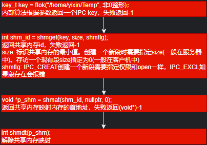

# 语言
## 编译步骤
* 预处理
    * 生成预处理文件
* 编译
    * 生成汇编文件
* 汇编
    * 生成目标文件
* 连接
    * 连接库 系统引导 生成可执行程序
## 
### 作用域生命周期
* static局部变量是在进入函数时被初始化的，生命周期为定义到程序结束
* 全局变量，编译时预留空间(在符号表中，此时并不会分配物理内存)。运行时分配实际物理内存(发生在main函数之前)
* [全局变量初始化需要使用常量表达式](./语言/基础类型/global_variable.cpp)
```cpp
#include <iostream>
#include <math.h> // pow
int g_num = pow(2, 3); // 2的3次幂 c++中居然可以
    std::cout << "g_num: " << g_num << '\n';
```
```c
#include <stdio.h>
#include <math.h> // pow
// int g_num = pow(2, 3); error 常量表达式中不允许使用函数调用
    printf("g_num: %d\n", pow);
```
## 常量
* 整型 1 2 3
* 浮点型 1.1 2.2 3.3
* 字符型 'a' 'b' 'c'
* 字符串型 "a" "b" "c"
### 常量表达式
* 编译期间可以直接求值的表达式
### 宏函数
* [宏函数](./语言/宏/宏函数.cpp)
* 提高效率，普通函数调用会造成额外开销
```cpp
    #define func(x) ((x) * (x) + 11)

    #define print() do { \
    printf("hello "); \
    printf("world\n"); \
    }while(0)

    int i = 2;
    int num = func(++i); // 会加两次
    std::cout << num << "\n"; // 4 * 4 + 11 = 27
    print(); // hello world
```
## 输入输出
### printf格式化输出
* %d:输出十进制整数。 
* %f:输出浮点数。 
* %c:输出字符。 
* %s:输出字符串。 
* %p:输出指针地址。 
* %x:输出十六进制整数。0x开头 
* %o:输出八进制整数。0开头
* %u:输出无符号十进制整数。 
* %e:输出科学计数法表示的浮点数。 
* %g:根据实际情况选择%f或%e格式输出浮点数。
* printf("%05.3f\n");
    * 宽度为5 填充0 显示点后3位小数
### cout格式化输出
#### 进制输出
* std::oct, 八进制
* std::dec,十进制
* std::hex,十六进制
```cpp
    int num = 11;
    std::cout << std::oct << num << "\n"; // 13
    std::cout << num << "\n"; // 13
    std::cout << std::dec << num << "\n"; // 11
```
#### [格式化输出](./语言/输入输出/cout_format.cpp)
```cpp
    double num = 3.14159265358979323846;
    std::cout << "num: ";
    std::cout.precision(3); // 小数包含整数
    std::cout.fill('0');
    std::cout.width(10);
    std::cout << num << '\n'; // 0000003.14
```
### scanf匹配(行缓冲)
* [当scanf中有空白字符时,可以匹配0个或多个](./语言/输入输出/scanf.cpp)
```cpp
    // 输入 num    =   11  ,  num2   =   22
    // num2会匹配失败','前没有空格所以无法匹配后续
    scanf("num   = %d, num2 =   %d", &num, &num2);
    printf("num = %d, num2 = %d\n", num, num2);
```
* [数值匹配时会忽略数值前面的空白字符](./语言/输入输出/scanf2.cpp)
```cpp
    // 输入:    11    22     33
    scanf("%d%d%d", &num, &num2, &num3);
    printf("num = %d, num2 = %d, num3 = %d\n", num, num2, num3);
```
* [%c不会忽略前面的空白字符](./语言/输入输出/scanf3.cpp)
```cpp
    char ch = 0;

    scanf("%c", &ch); // 输入：   a
    printf("[%c]", ch); // [ ]

    while(getchar() != '\n');

    // 空白字符可以匹配0个或多个
    scanf(" %c", &ch); // 输入：   a
    printf("[%c]", ch); // [a]
```
### scanf输入返回值，只有当返回值为空时scanf才会阻塞等待输入
* 返回成功匹配的次数
### 读写字符getchar/putchar
```cpp
    char ch = getchar();
    putchar(ch);
```
#### 舍弃剩余字符
```cpp
    while (getchar() != '\n');
```
## 整形运算默认是int
* [整形运算默认是int](./语言/基础类型/整型运算.cpp)
```cpp
    // 0000 0000 0000 0000 0000 0000 1001 1001
    // 000 0000 0000 0000 0000 0000 1001 1001 0
    // 0000 0000 0000 0000 0000 0000 1001 1001
    unsigned char num = 0x99 << 1 >> 1; // 99
    printf("%x\n", num);

    // 1001 1001
    // 0011 0010 -> 0x32
    // 0001 1001 -> 0x19
    unsigned char num2 = 0x99 << 1;
    num2 = num2 >> 1;
    printf("%x\n", num2); // 19
```
## 浮点数存储IEEE754标准
* float
    * 符号位1位 指数部分8位 小数部分23位
    * 4.5 可以完整的算出
    * 十六进制 0x40900000
    * 二进制 0 10000001 00100000000000000000000
    * 指数部分 10000001 -> 需要转成十进制然后减去127 -> 129 - 127 = 2(结果是2的几次幂) -> 4
    * 小数部分 00100000000000000000000 -> 前面有一个1 -> 1.001(2的0次幂 到 2的-3次幂) -> 1.125
    * 4 * 1.125 = 4.5
### 浮点数有效位(第一个不为0的数开始)
    > 0.0001 1位有效数字
    > 1.0001 5位有效数字
* float 有效位 6-7
* double 有效位 15-16
* long double 有效位 18-19
### 浮点数判断
```cpp
    // 用需要的精度来做判断
    float f = 1.234f;
    if ((f - 1.234) < 0.001 && (f - 1.234) > 0.001) {
        statement
    }
```
## ascii码: A 65, a 97, space 32
## 字符控制 c中需要加头文件ctype.h c++中无需加头文件
* 转大写 toupper(int)
* 转小写 tolower(int)
* 是否为数字 isdigit(int)
* 是否为字母 isalpha(int)
* 是否为字母或数字 isalnum(int)
* 是否为大写字母 isupper(int)
* 是否为小写字母 islower(int)
* 是否是空白字符 isspace(int)
## bool类型 stdbool.h
```cpp
    printf("sizeof(bool): %ld\n", sizeof(bool)); // 1    
```
## 隐式类型转换
> 整型默认int 浮点型double
> char -> short -> int -> long -> long long -> float -> double
* short, char 运算会隐式转换成int
    > 计算机在运算int类型数据最快
    > int 运算注意 int 越界
* 有符号, 无符号 运算会隐式转换成 无符号
    > 有无符号不要一起进行运算
## 别名typedef/using
* 基础类型
```cpp
    typedef int int_type;
    using int_type = int;
```
* 数组
```cpp
    typedef int arr_type[11];
    using arr_type = int[11];
```
* [函数指针](./语言/函数/func_ptr.cpp)
```cpp
    typedef void (*p_func_type)(void);
    using p_func_type = void(*)(void);
```
```cpp
#include <iostream>

void func() {
    std::cout << "func" << std::endl;
}

using p_func_type = void (*) ();
int main(int argc, char *argv[]) {
    p_func_type p_func = func;
    (*p_func)();

    return 0;
}
```
* [成员函数指针](./语言/类/member_func_ptr.cpp)
```cpp
    typedef void (A::*p_m_func_type)(void);
    using p_m_func_type = void(A::*)(void);
```
```cpp
#include <iostream>

class A {
public:
    A(int num) : m_num(num) {}
public:
    void func();
private:
    int m_num;
};

using PA_func = void (A::*) ();

int main(int argc, char *argv[]) {
    PA_func pa_func = &A::func;

    A a(11);

    a.func();
    (a.*pa_func)();

    return 0;
}

void A::func() {
    std::cout << "m_num: " << this->m_num << std::endl;
}
```
## sizeof 编译时期确定 得到的结果是一个常量表达式
## 运算符
### 算术运算符
* 取模运算不能用于浮点数
    * a % b 符号和a相同
### 赋值运算符可能会发生隐式类型转换
* 整型默认int 浮点型double
### 自增自减运算符
```cpp
// 都是未定义行为
i = i++;
j = (i++) + (i++);
arr[i] = arr2[i++];
// 会产生临时值 在赋值
j = i++;        i = i++;
temp = i;       temp = i;
j = temp;       i = temp;
i = i + 1;      i = i + 1;
```
### 关系运算符 > < 从左向右
### 逻辑运算符 &&(优先级高于||) || 会发生短路现象 从左到右
### 位运算
#### 左移 右移 << >>
* i << j 左移 低位补0
* i >> j 右移 高位补符号位
#### 与 & 置1
```cpp
// 一个数为奇偶数
bool is_odd(int num) {
    return num & 0x1;
}
```
```cpp
// 一个数是否为2的幂
    // 2的幂只有一位为1
    // 1000 0000
    // &
    // 0111 1111
    // 0000 0000
bool is_power_of_two(int num) {
    return (num & (num - 1)) == 0;
}
```
```cpp
// 权重最低的位的值
    // 正负数二进制表示只有权重最低位相同
    // 0101 1000
    // &
    // 1010 1000
    // 0000 1000
int weight_lowest_order(int num) {
    return num & (-num);
}
```
#### 异或 ^ 相同数字异或为0
```cpp
    // 找出数组中为一不成对的数字
    int find_single(const std::vector<int>& vec) {
        int num = 0;
        for (const auto& val : vec) {
            num ^= vec[i];
        }
        return num;
    }
```
#### ~num 只有-1取反为0
## 数学math
### [x的y次幂](./语言/数学/pow.cpp)
```cpp
#include <math.h>
    std::cout << pow(2, 3) << std::endl; // 8 2的3次幂
```
### [平方跟](./语言/数学/sqrt.cpp)
```cpp
#include <math.h>
// 两点之间距离
double distance(double x, double y, double x2, double y2) {
    return sqrt(pow(x2 - x, 2) + pow(y2 - y, 2));
}
    std::cout << distance(1, 2, 9, 8) << std::endl;
```
### [四舍五入](./语言/数学/round.cpp)
```cpp
#include <math.h>
    std::cout << round(123.123) << std::endl; // 123
    std::cout << round(123.723) << std::endl; // 124
```
### [向上取整](./语言/数学/ceil.cpp)
```cpp
#include <math.h>
    std::cout << ceil(123.123) << std::endl; // 124
    std::cout << ceil(123.823) << std::endl; // 124
```
### [向下取整](./语言/数学/floor.cpp)
```cpp
#include <math.h>
    std::cout << floor(123.123) << std::endl; // 123
    std::cout << floor(123.823) << std::endl; // 123
```
## 控制语句
### switch 语句
```cpp
    while (true) {
        switch (整型 字符型) {
            case 常量表达式: {
                statement
                break;
            }
            case 常量表达式: {
                statement
                continue; // 会跳到while
            }
            // 多个 case 可以共用一条语句
            case 常量表达式: case 常量表达式2: case 常量表达式3: {
                statement
                break;
            }
            default: {
                statement
                break;
            }
        }
    }
```
#### switch和if else
* switch可读性、效率都高于if else
### 三目运算符 从右向左结合
```cpp
    int i = 1, j = 2, k = 0;
    k = i > j ? ++i : ++j; // 先计算 i > j -> false -> ++j -> k = j
    i : 1, j : 3, k : 3
```
### goto不能跨函数 不能跳过定义
```cpp
    // 这种情况是可以跳过定义的
    #include <iostream>
        if (true) {
            goto fly;
        }
        if (true) {
            int num = 11;
            std::cout << "num: " << num << "\n";
        }
    fly:
        std::cout << "fly\n";
```
## 递归
### 斐波那契数列
* [斐波那契数列](./语言/递归/斐波那契数列.cpp)
```cpp
    long long fibonacci(int n) {
        if (n == 0) { return 0; }
        if (n == 1) { return 1; }
        return fibonacci(n - 1) + fibonacci(n - 2);
    }
```
* [斐波那契数列非递归](./语言/递归/斐波那契数列非递归.cpp)
```cpp
    long long fibonacci(int n) {
        if (n == 0) { return 0; }
        if (n == 1) { return 1; }
        long long num = 0;
        long long num2 = 1;
        for (int i = 2; i <= n; ++i) {
            long long temp = num + num2;
            num = num2;
            num2 = temp;
        }
        return num2;
    }
```
### 汉诺塔
* [汉诺塔](./语言/递归/汉诺塔.cpp)
```cpp
    void hanoi(int n, char a, char b,char c) { // a b c 三个柱子
        if (n == 1) {
            std::cout << a << "->" << c << std::endl;
            return;
        }
        hanoi(n - 1, a, c, b); // a - > b
        std::cout << a << "->" << c << std::endl; // a -> c
        hanoi(n - 1, b, a, c); // b -> c
    }
```
### 约瑟夫环
* 一群个物体，指定间隔，清除
* [约瑟夫环数组实现](./语言/递归/约瑟夫环数组实现.cpp)
```cpp
    #include <vector>
    void joseph(int peoples, int rule, int num) // peoples 人数， rule 规则, num 剩余人数
    {
        std::vector<int> vec(peoples);
        for (int i = 0; i < peoples; ++i) {
            vec[i] = i + 1;
        }
        int index = 0;
        while (vec.size() > num) {
            for (int i = 0; i < rule - 1; ++i) {
                index = (index + 1) % vec.size(); // 移动rule-1次，一次移动一个
            }
            std::cout << "清除的为：" << vec[index] << "\n";
            vec.erase(vec.begin() + index);
        }
        std::cout << "剩余的人：\n";
        for (const int &val : vec) {
            std::cout << val << "\n";
        }
        std::cout << "\n";
    }
```
* [约瑟夫环循环链表实现](./语言/递归/约瑟夫环循环链表实现.cpp)
```cpp
    #include <list>
    void joseph(int peoples, int rule, int num)
    {
        std::list<int> l(peoples);
        std::list<int>::iterator it = l.begin();
        int temp = 0;
        for (std::list<int>::iterator it = l.begin(); it != l.end(); ++it, ++temp) {
            *it = temp;
        }
        while (l.size() > num) {
            for (int i = 0; i < rule - 1; ++i) {
                it = std::next(it);
                if (it == l.end()) {
                    std::advance(it, 1);
                }
            }
            std::cout << "清除的为：" << *it << "\n";
            it = l.erase(it);
        }
        std::cout << "剩余的人：\n";
        for (const int &val : l) {
            std::cout << val << "\n";
        }
        std::cout << "\n";
    }
```
## 字符串
### 通配符sscanf
* 格式化从字符串中输入
* %*s或%*d 跳过数据
* %[width]s 读取指定宽度数据
* %[a-z] 匹配a到z
* %[^a-z] 不匹配a到z
* 条件必须逐一匹配否则直接退出
### 字符串拼接strcat
```cpp
    char buf[20] = "abc";
    char buf2[] = "def";
    strcat(buf, buf2); // 必须已\0结尾的字符串
```
### 查找字符strchr, 拷贝strncpy
```cpp
    char buf[] = "abcdefghijk";
    char buf2[1024] = "243124324324";
    char *p = strchr(buf, 'e');
    if (p != nullptr) {
        strncpy(buf2, buf, p - buf);
        buf2[p - buf] = 0;
    }
    std::cout << buf2 << std::endl; // abcd
```
### 内存拷贝memcpy
```cpp
    #include <cstring>
    char buf[1024] = "abcdefghi";
    char *p = (char*)memcpy(buf, "1234", strlen("1234"));
    std::cout << p << '\n'; // 1234efghi
```
### 内存置空memcpy bzero
```cpp
    #include <string.h>
    char buf[1024];
    memset(buf, 0, sizeof(buf));
```
等价于
```cpp
    #include <strings.h>
    char buf[1024];
    bzero(buf, sizeof(buf));
```
### 忽略大小写比较strcasecmp
```cpp
    char str[] = "abcd";
    char str2[] = "ABCD";
    if (strcasecmp(str, str2) == 0) {
        std::cout << "equal\n"; // 会输出
    }
```
### 处理字符串后空白字符
```cpp
    void right_space(char *str) {
        int temp_size = strlen(str);
        while (isspace(str[temp_size - 1]) && temp_size > 0) {
            str[--temp_size] = 0;
        }
    }
```
### 处理字符串前空白字符
```cpp
    void left_space(char *str) {
        char *temp = str;
        while (isspace(*temp)) {
            ++temp;
        }
        while (*temp != '\0') {
            *str = *temp;
            ++str;
            ++temp;
        }
        *str = '\0';
    }
```
### [字符串转数字 atoi(str) std::stoi(str)](./语言/字符串/string_to_number.cpp)
```cpp
#include <iostream>
#include <string>
    std::string str;
    int sum = 0;
    std::cin >> str;
    for (std::string::iterator it = str.begin(); it != str.end(); ++it) {
        sum = sum * 10 + (*it - '0');
    }
    std::cout << "sum: " << sum << std::endl;
```
## 数组
* 数组下标从0开始
    * 数组地址即是首元素地址,如果从1开始会浪费空间,增加计算量(-1)
* arr[i] == *(arr + i)
```cpp
    // 数组元素不能发生改变
    const int arr[3] {1, 2, 3};
    arr[0] = 11; // error
```
```cpp
    int arr[] = {1, 2, 3, 4, 5};
    std::cout << "arr: " << arr << std::endl; // 0x00
    std::cout << "arr + 1: " << arr + 1 << std::endl; // 0x04
    std::cout << "&arr[0]: " << &arr[0] << std::endl; // 0x00
    std::cout << "&arr[0] + 1: " << &arr[0] + 1 << std::endl; // 0x04
    std::cout << "&arr: " << &arr << std::endl; // 0x00
    std::cout << "&arr + 1: " << &arr + 1 << std::endl; // 0xa4
```
* [数组局部初始化](./语言/数组/member_wise.c)
```cpp
#include <stdio.h>
    int arr[3][4] = {[2][1] = 11, [2][3] = 22}; // c99中可以
    for (int i = 0; i < 3; ++i) {
        for (int j = 0; j < 4; ++j) {
            printf("%d ", arr[i][j]);
        }
    }
    printf("\n");
```
### 两个有序数组相同元素
```cpp
    while (i != vec.size() && j != vec2.size()) {
        if (vec[i] == vec2[j]) {
            v_res.push_back(vec[i]);
            ++i;
            ++j;
        } else if (vec[i] < vec2[j]) {
            ++i;
        } else {
            ++j;
        }
    }
```
### 三个有序数组相同元素
```cpp
    while (i != v_i_vec.size() && j != v_i_vec2.size() && k != v_i_vec3.size()) {
        if (v_i_vec[i] == v_i_vec2[j] && v_i_vec[i] == v_i_vec3[k]) {
            v_i_res.push_back(v_i_vec[i]);
            ++i;
            ++j;
            ++k;
        } else if (v_i_vec[i] < v_i_vec2[j]) {
            ++i;
        } else if (v_i_vec2[j] < v_i_vec3[k]) {
            ++j;
        } else {
            ++k;
        }
    }
```
### 多维数组
```cpp
    // 3组 组元素为 int[4]
    int arr[3][4] {{1, 2, 3, 4}, {5, 6, 7, 8}, {9, 10, 11, 12}};
```
## new/delete
* c++11中可以对new出来的数组进行初始化
```cpp
    char *p = new char[11]{'1', '2', '3', '4', '5', '6', '7', '8', '9', 'a', '\0'};
    std::cout << p << '\n'; // 123456789a
    for (int i = 0; i < 11; ++i) {
        std::cout << '[' << p[i] << ']'; // [1][2][3][4][5][6][7][8][9][a][]
    }
```
## 命令行参数

### 命令行参数后还有环境变量参数
* evriron[] 无需声明，系统定义
### 修改命令行参数，可改变进程标题
* 可以通过strcpy(argv[0], "xxx")修改，但是命令行参数中并不会因为'\0'结束。还可能会影响后续的环境变量
## 随机数
```cpp
    #include <ctime>
    srand((unsigned)time(nullpter));
    for (int i = 0; i < 11; ++i) {
        int num = rand() % 10 + 1; // 1 - 10
    }
```
* c++随机数
```cpp
    #include <random>  
    // 创建一个随机数引擎  
    std::random_device rd;  // 用于获取种子  
    std::mt19937 mt(rd()); // 使用Mersenne Twister算法和随机种子  
    // 创建一个整数分布  
    std::uniform_int_distribution<> dis(1, 100); // 生成1到100之间的随机整数(包括1和100)
    std::uniform_real_distribution<> dis(0.0, 1.0); // 生成0到1之间的随机浮点数
    // 生成并输出10个随机数  
    for (int n = 0; n < 10; ++n) {  
        std::cout << dis(mt) << ' ';  
    }  
```
## 可变参数
### c语言可变参数
* [c语言可变参数](./语言/可变参数/c语言可变参数.cpp)
```cpp
    #include <stdarg.h>
    void func(int count, ...) {
        va_list ap; // 参数列表
        va_start(ap, count); // 初始化参数列表
        for (int i = 0; i < count; ++i) {
            std::cout << va_arg(ap, char*) << " ";
        }
        std::cout << "\n";
        va_end(ap);
    }
    void func2(const char* format, ...) {
        va_list ap;
        va_start(ap, format);

        const char *temp_p = format;

        for (; *temp_p != 0; ++temp_p) {
            if (*temp_p != '%') {
                putchar(*temp_p);
                continue;
            } else {
                switch (*(++temp_p)) {
                case 'd' : {
                    std::cout << va_arg(ap, int);
                    break;
                }
                default : {
                    vprintf(--temp_p, ap);
                    ++temp_p; // 跳过占位符
                    break;
                }
                }
            }
        }
        std::cout << "\n";
        va_end(ap);
    }
    func(3, "aaa", "bbb", "ccc");
    func2("%d %s", 1, "aaa");
```
### c++可变参数
* [c++可变参数](./语言/可变参数/cpp可变参数.cpp)
```cpp
    #include <iostream>
    void func() {}
    template <class T, class...Args>
    void func(T element, Args...args) {
        std::cout << sizeof...(args) << '\n';
        std::cout << element << '\n';
        func(args...);
    }
    func(1, "aaa");
```
## 文件读写
### 缓冲分为三种
* 全缓冲 缓冲区写满，写入文件(普通文件都是如此)
* 行缓冲 缓冲区写满或遇到换行符，写入文件(stdout)
* 无缓冲 直接写入文件(stderr)
#### 刷新缓冲区
* fclose 会刷新缓冲区
* fflush(fd) 会刷新缓冲区
* 设置缓冲方式setvbuf(stdout, NULL, _IONBF, 0) 会禁用缓冲区
    * _IONBF：无缓冲，即不使用缓冲区。
    * _IOLBF：行缓冲，即每次输出操作后会刷新缓冲区，或者在换行符 \n 出现时也会刷新缓冲区。
    * _IOFBF：全缓冲，即整个缓冲区满时才会刷新。
### c文件读写
#### fopen/fclose 打开/关闭文件
* fopen mode
    * r 只读
    * w 只写 创建新文件
    * a 追加 创建文件，如果文件存在追加
    * r+ w+ a+ 读写
    * rb+ wb+ ab+ 二进制读写
* fclose 会刷新缓冲区
#### 字符读写 fgetc/fputc
* [字符读写](./语言/文件读写/字符读写.cpp)
```cpp
    #include <iostream>
    FILE *fp_read = fopen(argv[1], "r");
    FILE *fp_write = fopen(argv[2], "w");
    int ch = 0;
    while ((ch = fgetc(fp_src)) != EOF) // 正常读取换行符，返回读到的字符
    {
        fputc(ch, fp_dest);
    }
```
#### 行读写 fgets(只有文件为空时buf[0] == 0)/fputs
* [行读写](./语言/文件读写/行读写.cpp)
```cpp
    #include <iostream>
    FILE *fp_read = fopen(argv[1], "r");
    FILE *fp_write = fopen(argv[2], "w");
    char buf[1024] = {0};
    while (fgets(buf, 1024, fp_read) != nullptr) { // 正常读取换行符，返回读到的字符串
        fputs(buf, fp_write);
    }
```
#### 格式化读写，文件定位 fprintf/fscanf/seek/ftell
* [格式化读写](./语言/文件读写/格式化读写.cpp)
```cpp
    #include <iostream>
    struct People {
        char m_name[1024];
        int m_age;
    };
    FILE *fp_rw = fopen(argv[1], "w+"); // 读写
    People p {"yixin", 11};
    fprintf(fp_rw, "%s %d", p.m_name, p.m_age);
    // SEEK_SET 开始位置
    // SEEK_CUR 当前位置
    // SEEK_END 结束位置
    // 正负数可以表示向前后移动
    fseek(fp_rw, 0, SEEK_SET); // 文件指针恢复到开始位置 == rewind(fp_rw)
    fscanf(fp_rw, "%s%d", p.m_name, &(p.m_age)); // 空白字符会停止读取
```
* 返回到文件开始位置的偏移量
```cpp
    #include <iostream>
    fseek(fp, 0, SEEK_END);
    int file_size = ftell(fp); // 文件大小
```
#### 二进制序列化读写 fread/fwrite
* [二进制序列化读写](./语言/文件读写/二进制序列化读写.cpp)
```cpp
    #include <iostream>
    #include <string.h>
    FILE *fp_read = fopen(argv[1], "rb");
    FILE *fp_write = fopen(argv[2], "wb");
    char buf[1024] = {0};
    while (fread(buf, 1, sizeof(buf), fp_read)) { // 返回读到的字符数
        fwrite(buf, 1, strlen(buf), fp_write);
        memset(buf, 0, sizeof(buf));
    }
```
### cpp文件读写
#### 读到的字节数fin.gcount()
#### 打开关闭文件 fout.open/fout.close 
* 清空文件，默认值 std::ios::trunc
* 读文件，默认值 std::ios::in
* 写文件不存在创建，默认值 std::ios::out
    * fstream(std::ios::in | std::ios::out)同时存在不会截断文件
* 追加不存在创建 std::ios::app
* 二进制读写 std::ios::binary
#### 文件读写 fin.getline(空行buf[0] == 0)/fin >>/fout <<
* [文件读写](./语言/文件读写/文件读写.cpp)
```cpp
    #include <iostream>
    #include <fstream>
    #include <assert.h>
    std::ifstream fin(argv[1]);
    std::ofstream fout(argv[2]);
    char buf[1024] = {0};
    while (fin >> buf) { // 不能读取空白字符
        fout << buf << std::endl;
    }

    while (fin.getline(buf, sizeof(buf))) { // 不会读取换行符
        fout << buf << std::endl;
    }
```
#### 二进制文件读写 fin.read/fin.readsome/fin.write/
* [二进制文件读写](./语言/文件读写/二进制文件读写.cpp)
```cpp
    #include <iostream>
    #include <string.h>
    #include <fstream>
    #include <assert.h>
    std::ifstream fin(argv[1]);
    std::ofstream fout(argv[2]);
    char            buf[1024]   = {0};
    std::streamsize count       = 0; // long
    while (count = fin.readsome(buf, sizeof(buf))) {
        std::cout << "count: " << count << "\n";
        std::cout << buf;
        fout.write(buf, strlen(buf));
    }
    std::ofstream fout(argv[1], std::ios::binary);
    char buf[] = R"(孤单听雨的猫
往时间裂缝里看到了我
雷电交加之外的另一些我
乌云静止以后 跳进平行时空
那些我 旅行中的你我
回忆胡乱穿梭 坠落
交换余生 是我 非我 苦与乐
阴天之后总有续命的晴空
如果我们几经转折 结局一样不动
也才算无愧这分合
定位心海的锚
让时间停顿的像慢动作
你说命运很坏吧幸好有我
如果没有以后 如果平行失控
那些我 不同人生的我
会以什么方式 哭过
交换余生 是我 非我 苦与乐
阴天之后总有续命的晴空
如果我们几经转折 结局一样不动
也才算无愧这分合
云等风 人等梦 爱辗过时光等什么
记不住 认不出 泪眼中谁一样脸红
等你说 等我说 一等就是一个宇宙
日升换月落 真爱换寂寞
交换余生 也许 忘了 第几梦
那时我们身处第几号时空
因为我们手心紧握 记忆也能紧扣
可不怕前方的虫洞
爱是时间的古董)";
    fout.write(buf, strlen(buf));
    std::ifstream fin(argv[1], std::ios::binary);
    char buf2[1024] = {0};
    fin.read(buf2, sizeof(buf));
    std::cout << buf2;
    fin.close();
```
#### 输入输出重定向
```cpp
    #include <iostream>
    #include <fstream>
    std::ofstream file("output.txt");
    std::streambuf *orig_buf = std::cout.rdbuf(); // 保存cout的原缓冲区
    std::cout.rdbuf(file.rdbuf()); // 将cout输出重定向到文件
    std::cout << "Hello, World!" << std::endl; // 输出到文件
    std::cout.rdbuf(orig_buf); // 恢复cout的原缓冲区
    std::cout << "Back to console!" << std::endl; // 输出到控制台
```
#### 文件定位
* seek(11) 移动到的字节数
* seek(std::ios::end) 文件结尾
* seek(std::ios::beg) 文件开始
* std::ios::cur 文件当前位置
* seek(10, std::ios::beg) 文件开始位置向后移动10个字节
* seek(-10, std::ios::end) 文件结尾位置向前移动10个字节
* tellp 获取文件大小
    * ifstream.seek(0, std::ios::end) 将文件指针移动到尾部
    * int size = ifstream.tell() 获取文件指针当前位置到文件开始的偏移量
## STL
### vector动态数组
#### 初始化
```cpp
#include <vector>
    std::vector<int> v{1, 2, 3};
    std::vector<int> v2(v); // 1 2 3
    std::vector<int> v3(3); // 0 0 0
    std::cout << "v.size = " << v.size() << '\n'; // 3
    std::cout << "v.size = " << v.capacity() << '\n'; // 3
    std::cout << "v2.size = " << v2.size() << '\n'; // 3
    std::cout << "v2.size = " << v2.capacity() << '\n'; // 3
    std::cout << "v3.size = " << v3.size() << '\n'; // 3
    std::cout << "v3.size = " << v3.capacity() << '\n'; // 3
```
#### 大小，空间
```cpp
#include <vector>
    std::vector<int> vec;
    std::cout << vec.size() << "\n"; // 0
    std::cout << vec.capacity() << "\n"; // 0
    //////////////////////////////////////////////////////////////////////////////////
    // 相当于 vector<int> vec2(11);
    std::vector<int> vec2;
    vec2.resize(11);
    std::cout << vec2.size() << "\n"; // 11
    std::cout << vec2.capacity() << "\n"; // 11
    //////////////////////////////////////////////////////////////////////////////////
    std::vector<int> vec3;
    vec3.reserve(11); // 不会改变size的大小
    v[3] = 3;
    std::cout << vec3.size() << "\n"; // 0
    std::cout << vec3.capacity() << "\n"; // 11
```
#### 添加元素
```cpp
#include <vector>
    vec.push_back(element);
    //////////////////////////////////////////////////////////////////////////////////
class Student {
private:
    std::string m_name;
    int m_age;
public:
    Student(const std::string &name, int age) : m_name(name), m_age(age) {}
};
    std::vector<Student> vec;
    vec.emplace_back("yixin", 11);
```
```cpp
// 元素前插入
#include <vector>
    std::vector<int> v{1, 2, 3};
    v.insert(v.begin(), 4); // 4 1 2 3
```
#### 删除元素
```cpp
#include <vector>
    vec.erase(vec.begin() + 2); // 删除第三元素
```
#### 查找元素
```cpp
#include <algorithm>
    std::find(vec.begin(), vec.end(), element); // 未找到返回end()
```
### string字符串
#### [查找](./语言/字符串/find.cpp)
```cpp
#include <string>
    std::string str = "hello world";
    uint64_t    pos = str.find("world");
    if (pos == std::string::npos) {
        std::cout << "not found" << std::endl;
    } else {
        std::cout << "pos: " << pos << std::endl; // 6 字符下标
    }
    pos = str.find('o');
    if (pos == std::string::npos) {
        std::cout << "not found" << std::endl;
    } else {
        std::cout << "pos: " << pos << std::endl; // 4
    }
```
#### [截取](./语言/字符串/substr.cpp)
```cpp
// str2 = str.substr(pos); 截取到字符串结尾
// str3 = str.substr(pos, 2); 截取2个字符
#include <iostream>
#include <string>
    std::string str = "hello world";
    std::string str2;
    std::string str3;
    uint64_t    pos = str.find("world");
    if (pos == std::string::npos) {
        std::cout << "not found" << std::endl;
    } else {
        str2 = str.substr(pos);
        std::cout << "str2: " << str2 << std::endl; // world
        str3 = str.substr(pos, 2);
        std::cout << "str3: " << str3 << std::endl; // wo
    }
```
### list双向链表
#### 大小
```cpp
    std::list<int> l(3);
    std::cout << l.size() << std::endl; // 3
```
#### 循环链表
```cpp
    #include <iostream>
    #include <list>
    std::list<int> l{1, 2, 3, 4, 5};
    std::list<int>::iterator it = l.end();
    std::cout << *it << std::endl; // 5
    std::advance(it, 1); // 1
    it = l.end();
    std::advance(it, -1);
    std::cout << *it << std::endl; // 5
```
#### 删除元素
```cpp
    std::list<int> l {1, 2, 3, 4, 5};
    std::list<int>::iterator it = l.begin();
    it = l.erase(it);
    std::cout << *it << std::endl; // 2 删除位置的下一位置
```
```cpp
    std::list<int> l{1, 2, 3, 4, 5};
    l.pop_back(); // 尾删
    l.pop_front(); // 头删
    for (const int& val : l) {
        std::cout << val << '\n'; // 2 3 4
    }
```
* remove并不会删除元素而是将不需要的元素移动到元素末尾返回新的末尾迭代器
```cpp
#include <algorithm> // remove
    std::list<int> l{1, 2, 3, 3, 4, 5};
    l.erase(std::remove(l.begin(), l.end(), 3), l.begin()); // 删除元素为3的元素
    for (const int& val : l) {
        std::cout << val << '\n'; // 1 2 4 5
    }
```
```cpp
#include <algorithm> // remove_if
    std::list<int> l{1, 2, 3, 3, 4, 5};
    l.erase(std::remove_if(l.begin(), l.end(), [](int num){return num > 3;}), l.end()); // 删除大于3的元素
    for (const int& val : l) {
        std::cout << val << '\n'; // 1 2 3 3
    }
```
#### 增加元素
```cpp
    std::list<int> l;
    l.push_back(11); // 尾插
    l.emplace_back(22); // 尾插
    for (const int& val : l) {
        std::cout << val << '\n'; // 11 22
    }
```
```cpp
    std::list<int> l{1, 2, 3};
    l.push_front(11); // 前插 == l.emplace_front(11);
    for (const int& val : l) {
        std::cout << val << '\n'; // 11 1 2 3
    }
```
```cpp
    std::list<int> l{1, 2, 3};
    std::list<int>::iterator it = l.begin();
    l.insert(it, 11); // 迭代器前插 == l.emplace(it, 11);
    for (const int& val : l) {
        std::cout << val << '\n'; // 11 1 2 3
    }
```
```cpp
    std::list<int> l{1, 2, 3};
    std::list<int> l2{4, 5, 6};
    l.insert(l.begin(), l2.begin(), l2.end()); // 迭代器前插
    for (const int& val : l) {
        std::cout << val << '\n'; // 4 5 6 1 2 3
    }
```
#### 查找元素
```cpp
#include <algorithm> // std::find
    std::list<int> l{1, 2, 3, 4, 5};
    int num = 3;
    std::list<int>::iterator it = std::find(l.begin(), l.end(), num);
    if (it == l.end()) {
        std::cout << "not find\n";
    } else {
        std::cout << "*it: " << *it << ", " << std::distance(l.begin(), it) << '\n'; // 迭代器之间的距离 3 2
    }
```
### queue队列
* [queue](./语言/STL/queue.cpp)
```cpp
    #include <iostream>
    #include <queue>
    // std::queue<int> q{1, 2, 3, 4, 5}; // error
    std::queue<int> q;
    q.push(1);  // 队尾插入元素
    q.emplace(2); // 队尾插入元素
    std::cout << q.front() << '\n'; // 1队头元素
    std::cout << q.back() << '\n'; // 2队尾元素
    std::cout << q.size() << '\n'; // 2元素个数
    q.pop(); // 删除对头元素
    if (!q.empty()) { // 空返回真
        std::cout << "no empty\n";
    }
```
### 迭代器
#### 迭代器移动advance, next返回新的迭代器原迭代器不会改变
```cpp
    std::list<int> l {1, 2, 3, 4, 5};
    std::list<int>::iterator it = l.end();
    std::advance(it, 1);
    std::cout << *it << std::endl; // 1
    std::list<int>::iterator it2 = std::next(it, 1); // 返回新的迭代器，原迭代器不会改变
    std::cout << *it2 << std::endl; // 2
    it = std::next(it);
    std::cout << *it << std::endl; // 3
    std::advance(it2, -1);
    std::cout << *it2 << std::endl; // 2
```
## 说明符 限定符
### constexpr 常量表达式
```cpp
    // 可以做为数组的大小
    constexpr int arraySize = 10;  
    int myArray[arraySize];
```
```cpp
    // 编译时初始化，值必须是常量表达式
    constexpr int num = 11;
    constexpr int num2 = num * 2;
    int num3 = 11;
    constexpr int num4 = num3 * 2; // error num3不是常量表达式
```
```cpp
    // 编译时产生结果，函数内不能包含运行行为(循环，内存分配等)
    constexpr int func(int num) {  
    return num * num;  
    }  
    constexpr int num = fun(5); 
```
```cpp
    // 模板中可以，可以在编译时计算出值
    template<int N>  
    constexpr int func() {  
        return N <= 1 ? 1 : N * func<N - 1>();  
    }  
    constexpr int num = func<5>();
```
```cpp
    // 编译时if c++17
    template<typename T>  
    void foo() {  
        if constexpr (std::is_integral_v<T>) {  
            // 整型特定的代码  
        } else if constexpr (std::is_floating_point_v<T>) {  
            // 浮点型特定的代码  
        } else {  
            // 其他类型的代码  
        }  
    }
```
### restrict(主要作用在函数参数) c99标准 函数内两个或多个指针不会指向同一位置
* 使编译器进行优化，除不必要的内存读写检查，提高程序运行效率
* 必须确保在实际使用中，相关的指针确实不会指向重叠的内存区域。如果违反了这一假设，可能会导致未定义行为。
```cpp
// 使用 restrict 限定符的函数，用于复制数组  
void copy_array(int *restrict src, int *restrict dest, size_t n) {  
    for (size_t i = 0; i < n; i++) {  
        dest[i] = src[i];  
    }  
}
```
### [mutable修饰成员变量使其可以在const成员函数中修改](./语言/说明符/mutable.cpp)
```cpp
#include <iostream>
class A {
public:
    A(int num) : m_num(num) {}
public:
    void func() const {
        std::cout << "num: " << this->m_num << '\n'; // 11
        this->m_num = 22;
        std::cout << "num: " << this->m_num << '\n'; // 22
    }
private:
    mutable int m_num;
};
    A a(11);
    a.func();
```
---
---
---
---
---
---
---
---
---
---
# 算法数据结构
## 时间复杂度
* O(log n)
```cpp
    while (left <= right) {  
        int mid = left + (right - left) / 2; // 防止溢出  
        if (arr[mid] == target) {  
            return true; // 找到目标，返回true  
        } else if (arr[mid] < target) {  
            left = mid + 1; // 目标在右侧  
        } else {  
            right = mid - 1; // 目标在左侧  
        }  
    }  
```
* O(n)
```cpp
    for (int i = 0; i < n; ++i)
```
## 排序
### [插入排序](./数据结构/排序查找/insert_sort.cpp)
```cpp
#include <iostream>
#include <vector>

void insert_sort(std::vector<int> &nums) {
    int size = nums.size();

    for (int i = 1; i < size; ++i) { // 首元素为有序
        int j = i - 1; // 已有序位置

        // nums[j + 1] 为待插入元素
        while (j >= 0 && nums[j] > nums[j + 1]) { // 未有序位置和有序位置逐一比较交换(插入)
            std::swap(nums[j], nums[j + 1]);
            --j;
        }
    }
}

int main(int argc, char *argv[]) {
    std::vector<int> nums = {5, 4, 3, 2, 1};

    insert_sort(nums);

    for (auto num : nums) {
        std::cout << num << " ";
    }
    std::cout << std::endl;

    return 0;
}
```
### [归并排序](./数据结构/排序查找/merge_sort.cpp)
```cpp
#include <iostream>
#include <vector>

void merge(std::vector<int> &nums, int left, int mid, int right) {
    // 两个元素时 left = 0, mid = 0, right = 1
    // mid = 0, left = 0, left_size = 1
    int left_size = mid - left + 1; // 左边临时数组长度
    // right = 1, mid = 0, right_size = 1
    int right_size = right - mid; // 右边临时数组长度

    std::vector<int> left_arr(left_size);
    std::vector<int> right_arr(right_size);

    for (int i = 0; i < left_size; ++i) {
        left_arr[i] = nums[left + i];
    }
    for (int i = 0; i < right_size; ++i) {
        right_arr[i] = nums[mid + 1 + i];
    }

    int i = 0;
    int j = 0;
    int k = left;

    // 小于放入左边元素,否则放入右边元素
    while (i < left_size && j < right_size) {
        if (left_arr[i] < right_arr[j]) {
            nums[k++] = left_arr[i++];
        } else {
            nums[k++] = right_arr[j++];
        }
    }

    // 如果存在剩余元素，拷贝剩余元素
    while (i < left_size) {
        nums[k++] = left_arr[i++];
    }
    while (j < right_size) {
        nums[k++] = right_arr[j++];
    }
}

void merge_sort(std::vector<int> &nums, int left, int right) {
    if (left >= right) { // 一个数不需要排序
        return;
    }

    int mid = (left + right) / 2; // 拿到中间点

    // 两个元素时 left = 0, mid = 0, right = 1
    // left = 0, mid = 0
    merge_sort(nums, left, mid); // 左边排序
    // mid = 1 , right = 1
    merge_sort(nums, mid + 1, right); // 右边排序 

    merge(nums, left, mid, right); // 合并
}
int main(int argc, char *argv[]) {
    // std::vector<int> nums{8, 7, 6, 5, 4, 3, 2, 1};
    std::vector<int> nums{8, 7, 6, 5, 4, 3, 2};

    merge_sort(nums, 0, nums.size() - 1);

    for (const int &val : nums) {
        std::cout << val << " ";
    }
    std::cout << std::endl;

    return 0;
}
```
## 查找
### [二分查找](./数据结构/排序查找/binary_search.cpp)
```cpp
#include <iostream>
#include <vector>

int binary_search(std::vector<int> &nums, int target) {
    int left = 0;
    int right = nums.size() - 1;

    while (left <= right) { // 一个元素时也需要查找
        int mid = (left + right) / 2;
        if (nums[mid] == target) {
            return mid;
        } else if (nums[mid] < target) { // 大于中间元素，在右边查找
            left = mid + 1;
        } else { // 小于中间元素，在左边查找
            right = mid - 1;
        }
    }

    return -1;
}

int main(int argc, char *argv[]) {
    // std::vector<int> nums{1, 2, 3, 4, 5, 6, 7, 8};
    std::vector<int> nums{1, 2, 3, 4, 5, 6, 7, 8, 9};

    // std::cout << binary_search(nums, 5) << std::endl;
    std::cout << binary_search(nums, 11) << std::endl;

    return 0;
}
```
### [迷宫问题深度优先搜索](./数据结构/排序查找/深度优先搜索/dfs.cpp)
## [栈](./数据结构/数据结构/stack.cpp)
## 链表
---
---
---
---
---
---
---
---
---
---
# linux系统编程
* 系统编程速度实际上并不快，用户态切换到内核态需要时间
    * 需要实时操作时使用系统调用
## 睡眠 时间
```cpp
    #include <unistd.h>
    sleep(1); // 秒
    usleep(1); // 微秒
```
* [显示当前时间](./linux/linux系统编程/时间/display_current_time.cpp)
```cpp
    #include <iostream>
    #include <sys/time.h> // gettimeofday
    #include <iomanip> // setw setfill
    timeval tv;
    tm t;
    gettimeofday(&tv, nullptr); // 获取当前时间得到1970-01-01至今的秒和以过去的微妙
    localtime_r(&tv.tv_sec, &t); // 线程安全函数
    std::cout << t.tm_year + 1900 << "-"
        << std::setw(2) << std::setfill('0') << t.tm_mon + 1 << "-"
        << std::setw(2) << std::setfill('0') << t.tm_mday << " "
        << std::setw(2) << std::setfill('0') << t.tm_hour << ":"
        << std::setw(2) << std::setfill('0') << t.tm_min << ":"
        << std::setw(2) << std::setfill('0') << t.tm_sec << '\n';
```
* [显示当前时间](./linux/linux系统编程/时间/display_current_time2.cpp)
```cpp
    #include <iostream>
    #include <time.h>
    #include <string.h>
    time_t      tt      = time(nullptr);
    char        buf[88] = {0};
    struct tm   p_t;
    memset(&p_t, 0, sizeof(p_t));
    localtime_r(&tt, &p_t);
    strftime(buf, sizeof(buf), "%Y-%m-%d %H:%M:%S", &p_t);
    std::cout << buf << std::endl;
```
* [时间转为tm结构体在转为秒](./linux/linux系统编程/时间/time_to_tm_to_sec.cpp)
```cpp
    #include <iostream>
    tm t;
    t.tm_year = 2024 - 1900;
    t.tm_mon  = 5 - 1;
    t.tm_mday = 13;
    t.tm_hour = 19;
    t.tm_min  = 47;
    t.tm_sec  = 0;
    time_t tt = mktime(&t);
    std::cout << tt << "\n";
    tt = time(nullptr); // 获取当前时间秒数
    std::cout << tt << "\n";
```
### tm结构体
```cpp
    struct tm 
    { 　
        int tm_sec;     // 秒 [0,59]
        int tm_min; 	// 分 [0,59]
        int tm_hour;    // 时 [0,23]
        int tm_mday;    // 一个月中的日期 [1,31]
        int tm_mon;     // 月份（0代表一月）[0,11] +1
        int tm_year;    // 年份从1900开始 +1900
        int tm_wday;    // 星期 (0代表星期天) [0,6]
        int tm_yday;    // 一年中的第几天 (0代表1月1日) [0,365]
    }; 
```
* [用来表示时间点或时间间隔](./linux/linux系统编程/时间/timespec.cpp)
```cpp
    #include <time.h>
    struct timespec ts; // 用于表示时间点或时间间隔
    clock_gettime(CLOCK_REALTIME, &ts); // 获取当前时间
    ts.tv_sec   += 3; // 设置超时时间3秒
    ts.tv_nsec  += 0; // 设置时间纳秒
    std::cout << "sec: " << ts.tv_sec << ", nsec: " << ts.tv_nsec << '\n';
```
## 文件读写
* 文件描述符
    * linux中有三个特殊的文件描述符(程序运行会被自动打开)
        * 0(STDIN_FILENO)、1(STDOUT_FILENO)、2(STDERR_FILENO)
        * 分别对应：标准输入、标准输出，标准错误
* 输入输出重定向(shell是在程序运行之前改变重定向的)
    * 输入重定向 <
        * cat < test.txt
    * 输出重定向 >
        * ll > test.txt
    * 将标准输出重定向
        * ./a.out 1 1 > test.txt
    * 将输入重定向
        * ./a.out 3 3 <> test.txt
    * [将文件描述符3重定向到标准输出](./linux/linux系统编程/文件读写/文件描述符定位到标准输出.cpp)
    ```cpp
        #include <unistd.h>
        write(3, "yixin\n", 6);
    ```
        * ./a.out 3>&1 == ./a.out 3<&1
        * ./a.out 1>test.txt 3>&1 将标准输出定位到test.txt 将文件描述符3定位到标准输出
* /dev/null 写不满
* /dev/zero 读不完
### 缓存同步
* sync(void)    将缓冲区内容同步到磁盘，但不会等待写入完成就会返回(不保证写入完成)
* fsync(fd)     将文件数据和元素据(文件属性)同步到磁盘，待数据写入完成返回
* fdatasync(fd) 将文件数据同步到磁盘，待数据写入完成返回
### **umask(0)表示没有设置任何权限屏蔽，所设即所得**
    * 新文件权限和默认的umask进行按位与，得到最终新文件权限
* [umask](./linux/linux系统编程/文件读写/umask.cpp)
```cpp
    #include <fcntl.h> // open
    #include <sys/stat.h> // umask
    #include <iostream>
    // 读写方式打开文件不存在创建文件存在截断
        // 未umask权限为rwxr-xr-x
    mode_t uk = umask(0); // 添加umask后会是rwxrwxrwx
    int fd = open("./umask.txt", O_RDWR | O_CREAT | O_TRUNC, 0777);
    umask(uk);
```
### 设置光标位置
```cpp
    #include <unistd.h>  
    #include <string.h>
    #include <iostream>
    void set_cursor_position(int x, int y) {  
        system("clear");
        char buf[32] = {0};
        snprintf(buf, sizeof(buf), "\033[%d;%dH", y, x); // \033[%d;%dH是一个ANSI转义序列，用于设置光标位置。%d;%d 会被替换为行号和列号，行号和列号的起始值通常是 1，不是 0。
        // write(STDOUT_FILENO, buf, strlen(buf));  
        std::cout << buf;
    }  
    // 将光标移动到第 10 行，第 20 列  
    set_cursor_position(20, 10);  
    printf("Hello, world!\n"); // 这行文本将在指定位置显示  
```
### 打开文件open
```cpp
    #include <fcntl.h> // open
    #include <unistd.h> // write, close
    // int fd = open("test.txt", O_RDONLY | O_CREAT, S_IRUSR | S_IWUSR);
    // int fd = open("test.txt", O_RDONLY | O_CREAT, 0644);
    int fd = open("62.txt", O_WRONLY | O_CREAT); // 不会截断文件 文件指针会在文件开始处
    if (fd == -1) {
        perror("7, open");
        exit(1);
    }
    write(fd, "asd", 3);
    close(fd);
```
* 参数2
    * O_RDONLY:   只读打开文件。
    * O_WRONLY:   只写打开文件。
    * O_RDWR:     读写打开文件。
    * O_TRUNC:    文件已存在并为写打开或创建，截断为0。
    * O_APPEND:   追加。
    * O_CREAT:    文件不存在，创建。需要第三个参数指定新文件的权限。
        * 0644
        * S_IRUSR: 用户读。
        * S_IWUSR: 用户写。
        * S_IXUSR: 用户执行。
        * S_IRGRP: 组读。
        * S_IWGRP: 组写。
        * S_IXGRP: 组执行。
        * S_IROTH: 其他人读。
        * S_IWOTH: 其他人写。
        * S_IXOTH: 其他人执行。
    * O_NONBLOCK: 对于设备文件，此标志指示打开应该在非阻塞模式下进行。
    * O_EXCL:     与O_CREAT一起使用时，文件存在，打开失败。
    * O_SYNC:     写入时同步数据，直接将内核缓冲区的数据写入到磁盘
    * O_DSYNC:    类似 O_SYNC，但仅同步写入的数据。
    * O_DIRECT:   绕过内核缓冲区直接从应用缓冲区写入磁盘
### 文件读写read write
#### read返回读到的字节数，失败返回-1。write返回写入字节数，失败返回-1，0读到文件结尾
* write写入的时候是原子操作
* write调用返回时，内核已将应用缓冲区中的数据放入了内核缓冲区
* [read write](./linux/linux系统编程/文件读写/read.cpp)
    * 读取标准输入时是行缓冲，并会将换行符读取
    * 当读取字符数量大于实际字符时会截断
```cpp
    #include <unistd.h>
    char buf[11] = {0};
    ssize_t count = read(STDIN_FILENO, buf, 11); // 输入abcd
    std::cout << "count: " << count << ", " << buf; // 输出5 abcd换行
    write(STDOUT_FILENO, buf, count); // 输出abcd换行
```
* [阻塞读](./linux/linux系统编程/文件读写/阻塞读.cpp)
```cpp
    #include <fcntl.h> // open
    #include <unistd.h> // read write
    int fd = open("/dev/tty", O_RDONLY | O_NONBLOCK); // 终端 非阻塞读终端
    char buf[1024] = {0};
    int count = 0;
    while (true) { // 不断的从终端读
        count = read(fd, buf, sizeof(buf));
        if (count != -1) {
            std::cout << "读取成功:\n";
            write(STDOUT_FILENO, buf, count);
            break;
        }
        if (errno != EAGAIN) { //不是非阻塞错误 errno设置为 EAGAIN == EWOULDBLOCK == 11
            perror("不是非阻塞错误 报错退出");
            exit(1);
        } else { // 是非阻塞错误导致的 开始循环
            write(STDOUT_FILENO, "未读到信息\n", strlen("未读到信息\n"));
        }
        sleep(1);
    }
```
### 重定向dup、dup2，复制文件描述符使两个文件描述符指向同一个file结构体
* [保存，重定向，恢复文件描述符](./linux/linux系统编程/文件读写/dup.cpp)
```cpp
#include <iostream>
#include <string.h>
#include <fcntl.h> // open
#include <unistd.h> // write
// #include <sys/stat.h> // umask
    int fd = 0;
    // umask(0);
    if ((fd = open("./test", O_WRONLY | O_CREAT, 0644)) < 0) {
        perror("open fail");
        exit(1);
    }
    int copy_fd = dup(STDOUT_FILENO); // 复制文件描述符 copy_fd -> STDOUT_FILENO
    dup2(fd, STDOUT_FILENO); // 重定向 STDOUT_FILENO -> fd
    close(fd);
    write(STDOUT_FILENO, "hello world", strlen("hello world"));
    dup2(copy_fd, STDOUT_FILENO); // STDOUT_FILENO -> copy_fd
    close(copy_fd);
    write(STDOUT_FILENO, "hello world", strlen("hello world"));
```

### 文件定位lseek
* [文件定位](./linux/linux系统编程/文件读写/lseek.cpp)
```cpp
    #include <iostream>
    #include <fcntl.h>
    #include <unistd.h>
    int fd = 0;
    if ((fd = open("lseek.txt", O_CREAT | O_RDWR, 0664)) == -1) {
        perror("open lseek fail");
        exit(1);
    }
    write(fd, "123456789", 9);
    // 返回距离文件开始处的位置 == ftell
        // 位置是0开始的，seek_end 是在最后字符后
    int pos = lseek(fd, SEEK_SET, 0);
    std::cout << "pos: " << pos << "\n"; // 0
    char ch = 0;
    read(fd, &ch, 1);
    std::cout << ch << "\n"; // 1
    pos = lseek(fd, 2, SEEK_CUR);
    read(fd, &ch, 1);
    std::cout << ch << "\n"; // 4
    std::cout << "pos: " << pos << "\n"; // 3
    pos = lseek(fd, 0, SEEK_END);
    std::cout << "pos: " << pos << "\n"; // 9
```
### fcntl对文件描述符进行操作
#### 文件描述符权限
* [文件描述符权限](./linux/linux系统编程/文件读写/文件描述符权限.cpp)
```cpp
    #include <iostream>
    #include <fcntl.h>
    #include <unistd.h>
    //  O_ACCMODE->0x3->0011(表示读写执行) o_rdonly->0x0->0000 O_WRONLY->0x1->0001 O_RDWR->0x2->0010
    if (argc < 2) {
        perror("eg: ./a.out 1");
        exit(1);
    }
    int flag = 0;
    // if ((flag = fcntl(std::stoi(argv[1]), F_GETFL)) == -1) {
    if ((flag = fcntl(atoi(argv[1]), F_GETFL)) == -1) {
        perror("fcntl f_getfl");
        exit(1);
    }
    std::cout << std::hex << "hex: " << flag << "\n"; // 402->0100 0000 0010
    std::cout << std::dec << "dec: " << flag << "\n"; // 1024
    if (flag & O_WRONLY) {
        std::cout << "exist O_WRONLY: " << O_WRONLY << "\n"; // 1
    }
    if (flag & O_RDWR) {
        std::cout << "exist O_RDWR: " << O_RDWR << "\n"; // 2
    }
    if (flag & O_APPEND) {
        std::cout << "exist O_APPEND: " << O_APPEND << "\n"; // 1024
    }
    std::cout << "O_ACCMODE: " << O_ACCMODE << "\n"; // 3
```
#### 修改为非阻塞
* [修改非阻塞](./linux/linux系统编程/文件读写/修改非阻塞.cpp)
```cpp
    #include <iostream>
    #include <unistd.h>
    #include <fcntl.h>
    int flag = fcntl(STDIN_FILENO, F_GETFL); // 拿到原标志位
    if (flag == -1) {
        perror("fcntl f_getfl");
        exit(1);
    }
    if (fcntl(STDIN_FILENO, F_SETFL, flag | O_NONBLOCK) == -1) { // 设置新的标志位
        perror("fcntl f_setfl");
        exit(1);
    }
    ssize_t count   = 0;
    char    buf[20] = {0};
    while (true) {
        count = read(STDIN_FILENO, buf, sizeof(buf));
        if (errno != EAGAIN) {
            perror("非阻塞错误");
            exit(1);
        }
        if (count > 0) {
            std::cout << buf << "\n";
            break;
        }
        std::cout << "wait input\n";
        sleep(1);
    }
```
### ioctl向设备发送控制和配置命令
#### 查看窗口大小
* [查看窗口大小](./linux/linux系统编程/文件读写/ioctl_winsize.cpp)
```cpp
    #include <iostream>
    #include <unistd.h>
    #include <sys/ioctl.h>
    struct winsize ws; // 窗口大小
    if (isatty(STDIN_FILENO) == false) { // 是否为终端
        perror("STDIN_FILENO not tty");
        exit(1);
    }
    if (ioctl(STDIN_FILENO, TIOCGWINSZ, &ws) == -1) {
        perror("ioctl fail");
        exit(1);
    }
    std::cout << "row: " << ws.ws_row << ", col: " << ws.ws_col << "\n";
```
### mmap可以把磁盘文件直接映射到内存，然后直接对该内存进行操作(相比read/write效率更高)
* 返回地址空间 失败返回MAP_FAILED
* addr: nullptr 自动选择，否则会在传入地址之上的一段合适空间
* len: 映射的内存长度
* prot:
    * PROT_EXEC 映射的这段可执行 例如动态库
    * PROT_READ 映射的这段可读
    * PROT_WRITE 映射的这段可写
    * PROT_NONE 映射的这段不可访问
* flag: 
    * MAP_SHARED 多个进程对相同文件映射共享
    * MAP_PRIVATE 多个进程对相同文件映射不共享
* filedes: 文件描述符
* off: 0 从文件什么位置开始映射，必须是页大小的整数倍
* [mmap修改文件](./linux/linux系统编程/文件读写/mmap.cpp)
```cpp
    #include <iostream>
    #include <unistd.h>
    #include <fcntl.h>
    #include <string.h>
    #include <sys/mman.h>
    int write_fd = open("./test.txt", O_RDWR); // 需要可读可写 否则mmap -> permission denied
    if (write_fd == -1) {
        perror("open fail");
        exit(1);
    }
    // int *p = (int*)mmap(nullptr, 9, PROT_WRITE, MAP_SHARED, write_fd, 0);
    char *p = (char*)mmap(nullptr, 9, PROT_WRITE, MAP_SHARED, write_fd, 0);
    if (p == MAP_FAILED) {
        perror("mmap fail");
        close(write_fd);
        exit(1);
    }
    // 文件中数据 123456789 -> DCBA56789
        // 41(A)高位，9高地址 小端低存低高存高
    // p[0] = 0x41424344;
    // 文件中数据 DCBA56789 -> abcd56789
    strcpy(p, "abcd");
    munmap((void*)p, 9);
    close(write_fd);
```
## 进程(资源管理的最小单位，有自己的数据段、代码段、堆栈段) 不能保证新进程和调用进程的执行顺序
* ps -eo pid,ppid,sid,pgrp,cmd,stat | grep -E 'PID|a.out'
### 进程控制块(PCB)
* 进程控制块(PCB)具体实现是task_struct结构体。它包含了进程的所有信息，如进程标识符(PID)、进程状态(运行、就绪、阻塞等)、内存管理信息(虚拟内存映射等)、文件系统信息、信号处理信息、调度信息(优先级、调度策略等)等
### 进程状态模型
#### 三态

#### 五态

#### 七态

### 实际用户ID可创建的最大进程数
```cpp
    #include <unistd.h>
    std::cout << sysconf(_SC_CHILD_MAX) << "\n";
```
### 进程终止状态
* bash 中 echo $?
* fish 中 echo $status
* exit(num) 是num & 0377后的结果 0377 == 11111111 8个1
### 创建子进程 fork父进程中返回子进程pid
* [创建子进程](./linux/linux系统编程/进程/创建子进程.cpp)
```cpp
    #include <iostream>
    #include <unistd.h>
    pid_t pid;
    pid = fork();
    // 失败返回一个负数，等于0子进程pid，大于0为父进程
    if (pid < 0) {
        exit(1);
    } else if (pid == 0) { // 子进程
        std::cout << "son process pid: " << getpid() << ", ppid: " << getppid() << "\n";
    } else { // 父进程中的pid就是子进程pid
        std::cout << "father process pid: " << getpid() << ", son pid: " << pid << "\n";
        sleep(1);
    }
```
### 创建10个子进程
* [创建10个子进程](./linux/linux系统编程/进程/fork.cpp)
```cpp
#include <iostream>
#include <unistd.h> // fork
#include <sys/wait.h> // waitpid
    pid_t pid = 0;
    for (int i = 0; i < 10; ++i) {
        pid = fork();
        if (pid == 0) {
            std::cout << "child " << i + 1 << ": " << getpid() << ", " << getppid() << '\n';
            exit(0); // 该子进程执行完退出，由父进程继续创建子进程
        }
    }
    std::cout << "parent: "  << getpid() << "\n";
    waitpid(-1, nullptr, 0);
```
### fork()写的时候会复制一份给该进程单独使用(其他进程不会受到影响)，读的时候所有进程共享
* [写时复制](./linux/linux系统编程/进程/写时复制.cpp)
```cpp
    #include <unistd.h>
    #include <sys/wait.h>
        int g_num = 11;
        pid_t pid = fork();
        if (pid == 0) {
            g_num = 22;
            std::cout << "child g_num: " << g_num << ", &g_num: " << &g_num  << std::endl; // 22 0xb050
            g_num = 33;
            std::cout << "child g_num: " << g_num << ", &g_num: " << &g_num  << std::endl; // 33 0xb050
            g_num = 44;
            std::cout << "child g_num: " << g_num << ", &g_num: " << &g_num  << std::endl; // 44 0xb050
        } else if (pid > 0) {
            wait(nullptr);
            std::cout << "parent g_num: " << g_num << ", &g_num: " << &g_num << std::endl; // 11 0xb050
        }
```
* g_num的地址相同，只是在各自的地址空间中偏移量相同。
    * 只是在映射的内存地址偏移量相同，物理内存中实际上是不同位置
### 环境变量**environ 查询环境变量getenv(name得到value) 设置环境变量setenv(参数3 true覆盖已有的，false不覆盖)
* [打印、查询、设置、环境变量](./linux/linux系统编程/进程/setenv.cpp)
```cpp
#include <iostream>
#include <unistd.h>
    for (int i = 0; environ[i] != nullptr; ++i) { // **environ以nullptr结尾
        std::cout << environ[i] << '\n';
    }
    std::cout << '\n';
    char *buf = getenv("HOME"); // 查询环境变量
    std::cout << buf << "\n";
    // 设置环境变量，没有添加，有覆盖
        // 参数三 true覆盖 false不覆盖
    // shell中的环境变量传递给了./a.out，修改的是./a.out中的环境变量并不会影响shell中的环境变量
    setenv("yixin", "hello yixin", true);
    buf = getenv("yixin");
    std::cout << buf << "\n";
    setenv("HOME", "hello world", true);
    buf = getenv("HOME");
    std::cout << buf << "\n";
```
### exec函数族 在进程中启动一个新程序 除了进程号(PID)之外，其他所有内容(包括代码、数据、堆栈等)都会被新的程序替换
* [启动一个新程序](./linux/linux系统编程/进程/execlp.cpp)
```cpp
#include <iostream>
#include <unistd.h> // execlp
    // if (execlp("ls", "ls -la", nullptr) == -1) { // error 并不会正确解析ls -la
    // if (execlp("ls", "ls", "-l", "-a", nullptr) == -1) {
    if (execlp("ls", "ls", "-la", nullptr) == -1) {
        perror("execlp fail");
        exit(1);
    }
```
 
* [重定向文件使用exec调用一个新程序读写](./linux/linux系统编程/进程/execlp_dup2.cpp)
```cpp
#include <iostream>
#include <unistd.h>
#include <fcntl.h>
    if (argc < 3) {
        std::cout << "eg ./a.out test test2\n";
        exit(1);
    }
    int fd = open(argv[1], O_RDONLY);
    if (fd == -1) {
        perror("open read fail");
        exit(1);
    }
    dup2(fd, STDIN_FILENO);
    close(fd);
    fd = open(argv[2], O_WRONLY | O_CREAT, 0644);
    if (fd == -1) {
        perror("open write fail");
        exit(1);
    }
    dup2(fd, STDOUT_FILENO);
    close(fd);
    if (execl("./toupper", "./toupper", nullptr) == -1) {
        perror("execl fail");
        exit(1);
    }
```
* [toupper](./linux/linux系统编程/进程/toupper.cpp)
```cpp
```
|函数名|描述|
|-----|----|
|execl|通过指定程序路径和命令行参数列表（以可变参数形式）来执行程序。|
|execle|与execl类似，但允许指定环境变量数组。|
|execlp|通过指定程序名和命令行参数列表（以可变参数形式）来执行程序，程序名会自动在环境变量PATH指定的路径中查找。|
|execv|通过指定程序路径和命令行参数数组（以指针数组形式）来执行程序。|
|execve|与execv类似，但允许指定环境变量数组。|
|execvp|通过指定程序名和命令行参数数组（以指针数组形式）来执行程序，程序名会自动在环境变量PATH指定的路径中查找。|
* **l(l时参数而需要以nullptr(哨兵)结尾) -> list v -> vector p -> PATH**
### 孤儿进程(父进程先终止，由init进程接管的子进程)
* [忽略sighub信号可以在终端关闭后，进程可以继续执行(孤儿进程)](./linux/linux系统编程/信号/孤儿进程.cpp)
```cpp
#include <signal.h>
    signal(SIGHUP, SIG_IGN); // 忽略sighub信号
    while (true) {
        std::cout << "sleep\n";
        sleep(1); // 秒
    }
    std::cout << "main end\n";
```
### 僵尸进程(子进程先终止,父进程没有使用wait/waitpid等待回收资源,STAT为Z)
* 进程结束会关闭所有文件描述符，释放分配的内存。
    * PCB(进程控制块)还会存在,父进程调用wait/waitpid查看信息,并清除子进程
* 僵尸进程无法使用kill -9 终止，只能终止正在运行的程序
#### 父进程可以通过处理SIGCHLD信号,在信号处理函数中调用waitpid来解决僵尸进程
#### waitpid(pid_t pid, int &status, int option)与WNOHANG一起使用返回0表示没有子进程退出,返回-1失败,成功返回子进程pid
* [wait(&stat)==waitpid(-1, &stat, 0)](./linux/linux系统编程/进程/等待子进程.cpp)
* pid
    * **-1, 等待所有子进程**
    * **大于0，等待指定进程**
    * 0,等待同组子进程
    * 小于-1,等待以-pid为组长的子进程
* status
    * null,不关心返回状态
    * 非null
        * WIFEXITED(status) 正常退出返回true
            * WEXITSTATUS(status) 返回状态码(return或exit中的数字)
        * WIFSIGNALED(status) 被signal结束的,返回true
            * WTERMSIG(status) 返回被信号结束的信号编号
* option
    * 0,会阻塞等待子进程结束
    * WNOHANG,不会阻塞等待子进程结束
* 返回-1
    * **errno == EINTR 调用被某个信号中断**
    * **errno == GCHILD 没有子进程**
### 守护进程(一般后台长期运行，不和控制终端相关联)
* ppid为0的进程是内核进程,跟随系统启动关闭
* tty是?为守护进程
    * 带中括号的为内核守护进程，不带中括号的为用户守护进程
* 守护进程脱离终端，后台进程并没有脱离终端
### 守护进程信号
|信号名|信号值|发出信号原因|描述|
|-----|-----|----------|---|
|SIGHUP|1|关闭终端|不会收到来至内核发送，可以是其他进程发送的。很多守护进程使用该信号通知配置文件变动，守护进程需重新读入配置文件|
|SIGINT|2|ctrl + c||
|SIGWINCH|28|改变终端大小||
### 守护进程创建
1. **fork后，父进程退出，则不会继续占用终端可以正常使用命令**
    1. fork是为了在子进程中调用setsid()脱离终端
        1. 创建新会话，并称为进程组组长，如果该进程本身就是组长创建失败
1. **umask(0)表示不设置任何权限屏蔽，所设即所得**
    1. 新文件权限和默认的umask进行按位与，得到最终新文件权限
1. **守护进程在后台执行，不需要键盘的输入和屏幕的显示，需要把输入输出重定向到/dev/null中**
* dup2(fd, STDIN_FILENO); // 标准输入从键盘改为fd，dup2会先关闭STDIN_FILENO文件描述
```cpp
    #include <fcntl.h>
    #include <unistd.h>
    int fd = open("/dev/null", O_RDWR); // 读写模式打开
    dup2(fd, STDIN_FILENO); // 标准输入重定向到fd
    dup2(fd, STDOUT_FILENO); // 标准输出重定向到fd
    if (fd > STDERR_FILENO) { // fd先复制一份，复制的fd = STDIN_FILENO，fd本身不再需要了，关闭fd以免占用改文件描述符
        close(fd);
    }
```
* [守护进程](./linux/linux系统编程/进程/守护进程.cpp)
```cpp
    #include <sys/stat.h> // umask
    #include <unistd.h>
    #include <fcntl.h> // open
    int daemon_process() {
        switch (fork()) { // 创建子进程以便调用setsid()
            case -1: {
                perror("19, fork error");
                return -1;
            }
            case 0: { // 子进程，脱离终端会话
                if (setsid() == -1) { // 创建新会话进程成为该组组长，进程为当前进程组组长时创建失败
                    perror("24, setsid error");
                    exit(1);
                }
                umask(0); // 解除文件权限限制
                int fd = open("/dev/null", O_RDWR);
                if (fd == -1) {
                    perror("31, open error");
                    exit(1);
                }
                if (dup2(fd, STDIN_FILENO) == -1) { // 复制一份fd，将标准输入赋值给复制的fd
                    perror("37, dup2 error");
                    exit(1);
                }
                if (dup2(fd, STDOUT_FILENO) == -1) {
                    perror("42, dup2 error");
                    exit(1);
                }
                if (fd > STDERR_FILENO) {
                    close(fd); // 关闭fd，释放文件描述符，避免造成资源浪费
                }
                break;
            }
            default: { // 父进程直接退出
                exit(0);
            }
        }
        return 0;
    }
```
#### 新建会话，并成为进程组组长(可以在关闭终端后进程仍能继续执行)
* [新建会话，并成为进程组组长(可以在关闭终端后进程仍能继续执行)](./linux/linux系统编程/进程/新建会话.cpp)
```cpp
    #include <unistd.h>
    int main() {
        pid_t pid = fork(); // 创建子进程
        if (pid < 0) {
            perror("11, fork error");
        }
        else if (pid > 0) {
            while (true) {
                std::cout << getpid() << " -- " << getpgid(0) << ", father wait...\n";
                sleep(1);
            }
        }
        else if (pid == 0) {
            setsid(); // 新建会话，并成为进程组组长
            while (true) {
                std::cout << getpid() << " -- " << getpgid(0) << ", son wait...\n";
                sleep(1);
            }
        }
        std::cout << "main end" << std::endl;
        return 0;
    }
```
* ps -eo pid,ppid,sid,pgid,cmd | grep -E 'PID|a.out|fish'
    * o 指定输出选项
* 组长进程调用setsid() 无效，pid==pgid 就是组长
    * setsid 创建一个新的会话，并成为新会话的组长
        * 进程已经是组长进程。会返回错误，不会创建新会话。
    * 可以在子进程调用 setsid 之前，使用 setpgid 将子进程的进程组 ID 设置为其父进程的进程组 ID。
```cpp
    setpgid(0, getpgid(getppid())); // 0该进程pid
```
#### atexit在main函数执行后执行 可作进程清理函数
* [atexit](./linux/linux系统编程/进程/atexit.cpp)
```cpp
    #include <iostream>
    #include <unistd.h> // fork
    void func() {
        std::cout << "clean\n";
    }
    pid_t pid = fork();
    if (pid > 0) {
        std::cout << "father process exit\n";
        exit(1);
    }
    if (pid == 0) {
        atexit(func);
        std::cout << "son process start\n";
        std::cout << "son process exit\n";
    }
```
### 进程间通信(IPC)
* 不同进程有不同的用户地址空间，任何一个进程的全局变量在另一个进程中都看不到，所以进程之间要交换数据必须通过内核
#### 无名管道 pipe(int fd[2]) 两个文件描述符一个用于读(fd[0])一个用于写(fd[1]) 管道是单项的
* fork后子进程会复制父进程的文件描述符表 一个进程关闭读端，一个进程关闭写端
* **两个进程写端关闭，读端会读取管道中的剩余数据，再次读取read会返回0**
* **写端进程没有关闭写端，读端会读取管道中的剩余数据，再次读会阻塞直到管道中有数据可读**
* **两个进程读端关闭，写端写入数据会收到SIGPIPE信号，导致程序异常终止**
* **读端未关闭，还没开始读，写端一直写入数据如果管道写满，会阻塞。直到读端把数据读走，有空余空间可以继续写入**
* [无名管道](./linux/linux系统编程/进程/pipe.cpp)
```cpp
#include <iostream>
#include <sys/wait.h> // waitpid
#include <unistd.h> // pipe fork close write read
#include <string.h>

int main(int argc, char *argv[]) {
    int fds[2] = {0};
    if (pipe(fds) == -1) {
        perror("pipe fail");
        exit(1);
    }

    pid_t pid = fork();

    if (pid == -1) {
        perror("fork fail");
        exit(1);
    } else if (pid == 0) {
        close(fds[1]); // 关闭写端

        char buf[20] = {0};

        read(fds[0], buf, 20);

        std::cout << buf << '\n';

        close(fds[0]);

        std::cout << "child end\n";
    } else {
        close(fds[0]); // 关闭读端

        write(fds[1], "hello world", strlen("hello world"));

        waitpid(-1, nullptr, 0);

        close(fds[1]);

        std::cout << "parent end\n";
    }

    return 0;
}
```
##### 管道 popen(创建一个管道，fork一个子进程，关闭管道不使用的端，exec执行一个命令，返回一个FILE指针) pclose
* 参数二: r 读、w 写
* [读取另一个程序输出](./linux/linux系统编程/进程/popen.cpp)
```cpp
#include <iostream>
    FILE *p_fp = popen("cat ./test", "r");
    if (p_fp == nullptr) {
        perror("popen fail");
        exit(1);
    }
    int ch = 0;
    while ((ch = fgetc(p_fp)) != EOF) {
        std::cout << (char)toupper(ch);
    }
    pclose(p_fp);
```
* [做为另一个程序的输入](./linux/linux系统编程/进程/popen2.cpp)
```cpp
#include <iostream>
#include <unistd.h>
    FILE *p_fp = popen("./toupper", "w");
    if (p_fp == nullptr) {
        perror("popen fail");
        exit(1);
    }
    fputs("hello world", p_fp);
    pclose(p_fp);
```
#### 有名管道 mkfifo命令创建一个管道 管道文件在磁盘上没有数据块，只是在内核中标识一条通道，各进程可以打开进行read和write
* 只有读写单独一个进程时 open打开管道文件时会阻塞
* [有名管道读进程](./linux/linux系统编程/进程/FIFO/fifo_read.cpp)
```cpp
#include <iostream>
#include <fcntl.h> // open
#include <unistd.h> // read
    int fd = open("./linux/linux系统编程/进程/FIFO/p_fifo", O_RDONLY);
    if (fd == -1) {
        perror("open fail");
    }
    char buf[20] = {0};
    read(fd, buf, 20);
    std::cout << buf << '\n';
    close(fd);
```
* [有名管道写进程](./linux/linux系统编程/进程/FIFO/fifo_write.cpp)
```cpp
#include <iostream>
#include <fcntl.h> // open
#include <unistd.h> // write close
#include <string.h>
    int fd = open("./linux/linux系统编程/进程/FIFO/p_fifo", O_WRONLY);
    if (fd == -1) {
        perror("open fail");
    }
    write(fd, "hello world", strlen("hello world"));
    close(fd);
```
#### 共享内存(在内核中映射一段内存) ipcs命令 查看共享内存，ipcrm -m 编号 删除共享内存

* [共享内存](./linux/linux系统编程/进程/shared_memory.cpp)
```cpp
#include <iostream>
#include <string.h>
#include <sys/shm.h> // shmget shmat
#include <wait.h> // waitpid
#include <sys/ipc.h> // ftok
#include <unistd.h> // fork
    key_t key = ftok("/home/yixin/Temp", 22);
    if (key == -1) {
        perror("ftok fail");
        exit(1);
    }
    int shm_id = shmget(key, 1024, IPC_CREAT | 0664);
    if (shm_id == -1) {
        perror("shmget fail");
        exit(1);
    }
    char *p_shm = (char*)shmat(shm_id, nullptr, 0);
    if (p_shm == (char*)-1) {
        perror("shmat fail");
        exit(1);
    }
    pid_t pid = fork();
    switch (pid) {
    case -1: {
        perror("fork fail");
        exit(1);
    }
    case 0: { // 子进程
        while (true) {
            if (strcasecmp(p_shm, "quit") == 0) {
                break;
            }
            if (*p_shm != 0) {
                std::cout << "son thread: " << '[' << p_shm << ']' << '\n';
            }
            memset(p_shm, 0, 1024);
        }
    }
    default: { // 父进程
        while (true) {
            scanf("%s", p_shm);
            if (strcasecmp(p_shm, "quit") == 0) {
                break;
            }
        }
        waitpid(-1, nullptr, 0);
    }
    }
    shmdt(p_shm);
```
#### 消息队列(映射一段内存，按照队列形式添加存储) ipcs命令 查看消息队列，ipcrm -q 编号 删除消息队列

* [消息队列](./linux/linux系统编程/进程/msg.cpp)
```cpp
#include <iostream>
#include <sys/wait.h> // waitpid
#include <sys/ipc.h> // ftok
#include <sys/msg.h> // msgget msgsnd msgrcv
#include <string.h>
#include <unistd.h> // fork
    pid_t pid = fork();
    switch (pid) {
    case -1: {
        perror("fork fail");
        exit(1);
    }
    case 0: {
        key_t msg_key = ftok("/home/yixin/Temp", 11);
        if (msg_key == -1) {
            perror("child ftok fail");
            exit(1);
        }
        int msg_id = msgget(msg_key, IPC_CREAT | 0664);
        if (msg_id == -1) {
            perror("child msgget fail");
            exit(1);
        }
        struct msgbuf {
            long m_type;
            char m_text[20];
        } msg;
        msg.m_type = 1;
        strncpy(msg.m_text, "yixin", 6);
        if (msgsnd(msg_id, &msg, sizeof(msg.m_text), 0) == -1) {
            perror("child msgsnd fail");
            exit(1);
        }
        msg.m_type = 2;
        strncpy(msg.m_text, "hello world", 12);
        if (msgsnd(msg_id, &msg, sizeof(msg.m_text), 0) == -1) {
            perror("child msgsnd fail");
            exit(1);
        }
        break;
    }
    default: {
        key_t msg_key = ftok("/home/yixin/Temp", 11);
        if (msg_key == -1) {
            perror("parent ftok fail");
            exit(1);
        }
        int msg_id = msgget(msg_key, IPC_CREAT | 0664);
        if (msg_id == -1) {
            perror("parent msgget fail");
            exit(1);
        }
        struct msgbuf {
            long m_type;
            char m_text[20];
        } msg;
        if (msgrcv(msg_id, &msg, sizeof(msg.m_text), 1, 0) == -1) {
            perror("parent msgrcv fail");
            exit(1);
        }
        std::cout << "recv: " << msg.m_text << '\n';
        if (msgrcv(msg_id, &msg, sizeof(msg.m_text), 2, 0) == -1) {
            perror("parent msgrcv fail");
            exit(1);
        }
        std::cout << "recv: " << msg.m_text << '\n';
        waitpid(-1, nullptr, 0);
        break;
    }
    }
```
## 线程(程序执行的最小单位，共享所属进程的资源) 不能保证新线程和调用线程的执行顺序
### 线程栈区分配

### 线程状态转换

### 创建线程pthread_create 退出线程pthread_exit 阻塞等待线程结束回收资源pthread_join 线程分离自动释放资源pthread_detach(并不会阻塞等待子线程) 比较两个线程id pthread_equal(相等返回0)
* [创建退出回收资源](./linux/linux系统编程/线程/创建退出回收资源.cpp)
```cpp
#include <iostream>
#include <pthread.h>
void* func(void *arg) {
    int64_t *p = (int64_t*)arg;
    std::cout << "func: " << *p << std::endl;
    ++(*p);
    pthread_exit((void*)p); // pthread_join可接收返回值 不关心可以nullpter
}
    pthread_t tid = 0;
    int64_t num = 11;
    // 成功返回0 失败返回errno
        // 参数2设置线程属性，nullptr为默认
    pthread_create(&tid, nullptr, func, (void*)&num);
    void *p_exit = nullptr;
    pthread_join(tid, &p_exit); // 阻塞等待线程结束回收资源
    std::cout << "main: " << *(int64_t*)p_exit << std::endl;
```
* 不关心线程返回结果，也无需等待线程结束可以使用pthread_detach
### 退出线程 pthread_cancel取消线程 return\pthread_exit退出线程
* [退出线程](./linux/linux系统编程/线程/quit_thread.cpp)
```cpp
#include <iostream>
#include <unistd.h>
#include <pthread.h>
void *thread_return(void *arg) {
    std::cout << "thread_return: " << *(int*)arg + 11 << '\n';
    return arg;
}
void *thread_exit(void *arg) {
    std::cout << "thread_exit: " << *(int*)arg + 11 << '\n';
    pthread_exit(arg);
}
void *thread_cancel(void *arg) {
    while (true) {
        std::cout << "thread_cancel: " << *(int*)arg + 11 << '\n';
        sleep(1);
    }
    pthread_exit(arg);
}
    pthread_t   tid     = 0;
    int         num     = 11;
    void        *p_res  = nullptr;
    if (pthread_create(&tid, nullptr, thread_return, &num) != 0) {
        perror("pthread_create thread_return");
        exit(1);
    }
    pthread_join(tid, &p_res);
    std::cout << "p_res: " << *(int*)p_res << '\n';
    if (pthread_create(&tid, nullptr, thread_exit, &num) != 0) {
        perror("pthread_create thread_exit");
        exit(1);
    }
    pthread_join(tid, &p_res);
    std::cout << "p_res: " << *(int*)p_res << '\n';
    if (pthread_create(&tid, nullptr, thread_cancel, &num) != 0) {
        perror("pthread_create thread_cancel");
        exit(1);
    }
    sleep(5);
    pthread_cancel(tid);
    std::cout << "p_res: " << *(int*)p_res << '\n';
```
* [线程分离，pthread_self得到线程id](./linux/linux系统编程/线程/pthread_detach.cpp)
```cpp
#include <iostream>
#include <unistd.h>
#include <pthread.h>
void* func(void *arg) {
    pthread_detach(pthread_self());
    std::cout << "func...\n";
    pthread_exit(nullptr);
}
    std::cout << "main...\n";
    pthread_t tid = 0;
    pthread_create(&tid, nullptr, func, nullptr);
    sleep(1);
```
#### 线程属性设置pthread_attr_t
* [线程属性设置](./linux/linux系统编程/线程/pthread_attribute.cpp)
```cpp
#include <iostream>
#include <unistd.h>
#include <pthread.h>
void print_state(pthread_attr_t *attribute) {
    int state = 0;
    if (pthread_attr_getdetachstate(attribute, &state) != 0) { // 获取线程分离状态，成功返回 0, 失败返回errno
        perror("pthread_attr_getdetachstate");
        exit(1);
    } else { 
        if (state == PTHREAD_CREATE_DETACHED) {
            std::cout << "thread detached\n";
        } else if (state == PTHREAD_CREATE_JOINABLE) {
            std::cout << "thread joinable\n";
        }
    }
}
void *thread_func(void *arg) {
    int64_t num = (int64_t)arg;
    for (int i = 0; i < num; ++i) {
        std::cout << i << "\n";
    }
    pthread_exit(nullptr);
}
    pthread_attr_t attribute;
    pthread_attr_init(&attribute); // 初始化
    pthread_attr_setdetachstate(&attribute, PTHREAD_CREATE_DETACHED); // 设置分离
    print_state(&attribute);
    pthread_t tid = 0;
    int64_t num = 11;
    if (pthread_create(&tid, &attribute, thread_func, (void*)num) != 0) {
        perror("pthread_create thread_func");
        exit(1);
    }
    sleep(1);
    std::cout << "main end\n";
    pthread_attr_destroy(&attribute);
```
### 取消同进程中的线程pthread_cancel pthread_cleanup_push pthread_cleanup_pop可做线程清理函数类似atexit
* [取消同进程中的线程](./linux/linux系统编程/线程/pthread_cancel.cpp)
```cpp
#include <iostream>
#include <unistd.h>
#include <pthread.h>
void cleanup_func(void *arg) {
    std::cout << "cleanup func\n";
    return;
}
void *thread_func(void *arg) {
    pthread_cleanup_push(cleanup_func, nullptr); // 取消时会调用cleanup_func
    while (1) {
        pthread_testcancel(); // 测试是否为其他线程取消
        std::cout << "thread_func\n";
        sleep(1);
    }
    pthread_cleanup_pop(0); // 非零调用cleanup_func
    pthread_exit(nullptr);
}
    pthread_t tid = 0;
    if (pthread_create(&tid, nullptr, thread_func, nullptr) != 0);
    sleep(3);
    if (pthread_cancel(tid) != 0);
    pthread_join(tid, nullptr);
```
### 保证数据的一致性 防止竞态条件(执行顺序不当) 死锁(一个线程拿a锁要b锁，一个线程拿b锁要a锁，pthread_mutex_trylock可以解决)
#### 互斥锁(独占访问) 保护共享资源一致性 pthread_mutex_init_destroy初始化销毁 pthread_mutex_lock_trylock阻塞非阻塞(EBUSY(没有拿到锁))
* [互斥锁阻塞pthread_mutex_lock](./linux/linux系统编程/线程/pthread_mutex_lock.cpp)
```cpp
#include <iostream>
#include <unistd.h>
#include <pthread.h>
class Account {
public:
    Account(int number, double balance);
    ~Account();
public:
    double  withdraw_money(const double money);    // 取钱
    double  get_balance(void);                     // 余额
private:
    int            m_number;   // 编号
    double         m_balance;  // 余额
    pthread_mutex_tm_mutex;    // 互斥锁
};
struct User {
    std::string m_name;
    Account*    m_p_account;
};
void *thread_func(void *arg) {
    if (arg == nullptr) {
        perror("argis nullptr");
        exit(1);
    }
    User* p = (User*)arg;
    p->m_p_account->withdraw_money(1111.1111);
    std::cout << p->m_name << " balance: " << p->m_p_account->get_balance() << std::endl;
    pthread_exit(nullptr);
}
    Account account{1234, 1111.1111};
    User user;
    user.m_name         = "aaa";
    user.m_p_account    = &account;
    User    user2;
    user2.m_name        = "bbb";
    user2.m_p_account   = &account;
    pthread_t tid   = 0;
    pthread_t tid2  = 0;
    if (pthread_create(&tid, nullptr, thread_func, (void*)&user) != 0) {
        perror("pthread_create tid");
        exit(1);
    }
    if (pthread_create(&tid2, nullptr, thread_func, (void*)&user2) != 0) {
        perror("pthread_create tid2");
        exit(1);
    }
    pthread_join(tid, nullptr);
    pthread_join(tid2, nullptr);
Account::Account(int number, double balance) : m_number(number), m_balance(balance) {
    pthread_mutex_init(&this->m_mutex, nullptr);
}
Account::~Account() {
    pthread_mutex_destroy(&this->m_mutex);
}
double Account::withdraw_money(const double money) {
    pthread_mutex_lock(&this->m_mutex);
    if (this->m_balance < money) {
        std::cout << "balance greater money\n";
        pthread_mutex_unlock(&this->m_mutex);
        return 0.0;
    }
    // 模拟存储操作
    double temp_balance = this->m_balance;
    sleep(1);
    temp_balance -= money;
    this->m_balance = temp_balance;
    pthread_mutex_unlock(&this->m_mutex);
    return money;
}
double Account::get_balance(void) {
    pthread_mutex_lock(&this->m_mutex);
    double temp_balance = this->m_balance;
    pthread_mutex_unlock(&this->m_mutex);
    return temp_balance;
}
```
* [互斥锁非阻塞pthread_mutex_trylock](./linux/linux系统编程/线程/pthread_mutex_trylock.cpp)
```cpp
#include <iostream>
#include <string>
#include <pthread.h>
#include <assert.h>
class Account {
public:
    Account(int number, double balance);
    ~Account();
public:
    const double deposit(double money);
    const double get_balance(void);
private:
    int             m_number;
    double          m_balance;
    pthread_mutex_t m_mutex;
};
struct User {
    std::string m_name;
    Account*    m_p_account;
};
void *thread_func(void *arg) {
    assert(arg != nullptr);

    User *p = (User*)arg;
    std::cout << p->m_name << " deposit " << p->m_p_account->deposit(1111.1111) << ", balance "
                << p->m_p_account->get_balance() << "\n";
    pthread_exit(nullptr);
}
    Account account(1234, 1111.1111);
    pthread_t tid = 0;
    User user;
    user.m_name         = "aaa";
    user.m_p_account    = &account;
    if (pthread_create(&tid, nullptr, thread_func, (void*)&user) != 0) {
        perror("tid pthread_create fail");
        exit(1);
    }
    pthread_t tid2 = 0;
    User user2;
    user2.m_name         = "bbb";
    user2.m_p_account    = &account;
    if (pthread_create(&tid2, nullptr, thread_func, (void*)&user2) != 0) {
        perror("tid2 pthread_create fail");
        exit(1);
    }
    pthread_join(tid, nullptr);
    pthread_join(tid2, nullptr);
Account::Account(int number, double balance) : m_number(number), m_balance(balance) {
    pthread_mutex_init(&this->m_mutex, nullptr);
}
Account::~Account() {
    pthread_mutex_destroy(&this->m_mutex);
}
const double Account::deposit(double money) {
    int ret = pthread_mutex_trylock(&this->m_mutex);
    if (ret == 0) {
        if (this->m_balance < money) {
            std::cout << "balance greater money\n";
            return this->m_balance;
        }
        this->m_balance -= money;
        pthread_mutex_unlock(&this->m_mutex);
        return money;
    } else if (ret == EBUSY) { // 锁被其他线程占用
        std::cout << "deposit wait lock\n";
    } else {
        perror("pthread mutex trylock fail");
        exit(1);
    }
    return 0.0;
}
const double Account::get_balance(void) {
    int ret = pthread_mutex_trylock(&this->m_mutex);
    if (ret == 0) {
        double temp_balance = this->m_balance;
        pthread_mutex_unlock(&this->m_mutex);
        return temp_balance;
    } else if (ret == EBUSY) { // 锁被其他线程占用
        std::cout << "get balance wait lock\n";
    } else {
        perror("pthread mutex trylock fail");
        exit(1);
    }
    return 0.0;
}
```
##### 互斥锁属性和类型设置 EDEADLK(检测锁判断失败)
* [互斥锁属性](./linux/linux系统编程/线程/mutex_attribute.cpp)
```cpp
#include <iostream>
#include <pthread.h>
    pthread_mutexattr_t mutexattr;
    pthread_mutexattr_init(&mutexattr);   // 初始化互斥锁属性 成功0 失败errno
    int res = 0;
    pthread_mutexattr_getpshared(&mutexattr, &res);   // 获得锁属性
    // PTHREAD_PROCESS_SHARED 用于不同进程中的线程互斥
    // PTHREAD_PROCESS_PRIVATE 用于同进程中的线程互斥(默认值)
    pthread_mutexattr_setpshared(&mutexattr, PTHREAD_PROCESS_SHARED);    // 设置可用于不同进程中线程互斥
    pthread_mutexattr_getpshared(&mutexattr, &res);   // 获得锁属性
    std::cout << "--------------------------------------------------\n";
    pthread_mutexattr_gettype(&mutexattr, &res); // 获得锁类型
    // PTHREAD_MUTEX_NORMAL(标准互斥锁) 大多系统中等同于 PTHREAD_MUTEX_DEFAULT默认值(默认互斥锁)
    // PTHREAD_MUTEX_RECURSIVE(递归互斥锁) 第一次上锁成功 第二次上锁成功 内部计数
    // PTHREAD_MUTEX_ERRORCHECK(检错互斥锁) 第一次上锁成功 第二次上锁失败
    pthread_mutexattr_settype(&mutexattr, PTHREAD_MUTEX_ERRORCHECK); // 设置锁类型
    pthread_mutexattr_gettype(&mutexattr, &res); // 获得锁类型
    pthread_mutex_t mutex;
    pthread_mutex_init(&mutex, &mutexattr);
    // pthread_mutex_lock(&mutex);
    res = pthread_mutex_lock(&mutex);
    if (res == EDEADLK) {
        std::cout << "上锁失败\n";
        pthread_mutex_destroy(&mutex);
        pthread_mutexattr_destroy(&mutexattr); // 销毁互斥锁属性 成功0 失败errno
        exit(1);
    }
    pthread_mutex_destroy(&mutex);
    std::cout << "--------------------------------------------------\n";
    pthread_mutexattr_destroy(&mutexattr); // 销毁互斥锁属性 成功0 失败errno
```
#### 读写锁(读多写少)(当一个线程有写锁的时候其他获取读锁写锁都会阻塞) 保护共享资源一致性 pthread_rwlock_init_destroy初始化销毁 pthread_rwlock_rdlock_wrlock(读锁写锁)
* [读写锁](./linux/linux系统编程/线程/pthread_rwlock.cpp)
```cpp
    #include <iostream>
    #include <pthread.h>
    #include <string.h>
    // r r两次都可以成功拿到锁
    // r w拿写锁的时候会阻塞
    // w r拿读锁的时候会失败
    // w w第二次拿写锁的时候会失败
    if (argc < 3) {
        perror("example: ./a.out r w");
        exit(1);
    }
    pthread_rwlock_t rwlock;
    pthread_rwlock_init(&rwlock, nullptr);
    if (strcmp(argv[1], "r") == 0) {
        if (pthread_rwlock_rdlock(&rwlock) == 0) {
            std::cout << "first rdlock success\n";
        } else {
            std::cout << "first rdlock fail\n";
        }
    }
    if (strcmp(argv[1], "w") == 0) {
        if (pthread_rwlock_wrlock(&rwlock) == 0) {
            std::cout << "first wrlock success\n";
        } else {
            std::cout << "first wrlock fail\n";
        }
    }
    if (strcmp(argv[2], "r") == 0) {
        if (pthread_rwlock_rdlock(&rwlock) == 0) {
            std::cout << "second rdlock success\n";
        } else {
            std::cout << "second rdlock fail\n";
        }
    }
    if (strcmp(argv[2], "w") == 0) {
        if (pthread_rwlock_wrlock(&rwlock) == 0) {
            std::cout << "second wrlock success\n";
        } else {
            std::cout << "second wrlock fail\n";
        }
    }
    pthread_rwlock_unlock(&rwlock);
    pthread_rwlock_unlock(&rwlock);
    pthread_rwlock_destroy(&rwlock);
```
#### 条件变量(防止竟态条件(执行顺序不当)) pthread_cond_init_destroy初始化销毁 pthread_cond_wait_timedwait等待超时等待(会先释放拿到的锁，等待被唤醒后会在加锁) pthread_cond_signal_broadcast唤醒一个所有
* [生产者消费者](./linux/linux系统编程/线程/producer_consumer.cpp)
```cpp
#include <iostream>
#include <pthread.h> // pthread_mutex_t pthread_cond_t pthread_exit 
#include <time.h> // time
#include <unistd.h> // sleep
struct Commodity {
    int         m_data;
    Commodity*  m_p_next;
};
Commodity* p_head  = nullptr;
pthread_mutex_t mutex = PTHREAD_MUTEX_INITIALIZER; // 静态初始化
pthread_cond_t cond = PTHREAD_COND_INITIALIZER;
void* producer(void*) {
    Commodity* p_temp = nullptr;
    while (true) {
        p_temp = new Commodity;
        p_temp->m_data = rand() % 100;
        pthread_mutex_lock(&mutex);
        p_temp->m_p_next = p_head; // 头插
        p_head = p_temp;
        pthread_cond_broadcast(&cond); // 数据写入完成唤醒
        pthread_mutex_unlock(&mutex);
        std::cout << "producer: " << p_temp->m_data << '\n';
    }
    pthread_exit(nullptr);
}
void* consumer(void*) {
    Commodity* p_temp = nullptr;
    while (true) {
        pthread_mutex_lock(&mutex);
        while (p_head == nullptr) {
            pthread_cond_wait(&cond, &mutex); // 会先解锁，被唤醒后在加锁
        }
        p_temp = p_head; // 头删
        p_head = p_head->m_p_next;
        pthread_mutex_unlock(&mutex);
        std::cout << "consumer: " << p_temp->m_data << '\n';
        delete p_temp;
        p_temp = nullptr;
    }
    pthread_exit(nullptr);
}
    srand((unsigned)time(nullptr));
    pthread_t producer_id = 0;
    if (pthread_create(&producer_id, nullptr, producer, nullptr) != 0) {
        perror("pthread_create producer_id fail");
        exit(1);
    }
    pthread_t consumer_id = 0;
    if (pthread_create(&consumer_id, nullptr, consumer, nullptr) != 0) {
        perror("pthread_create consumer_id fail");
        exit(1);
    }
    pthread_join(producer_id, nullptr);
    pthread_join(consumer_id, nullptr);
```
* [条件变量](./linux/linux系统编程/线程/pthread_cond.cpp)
```cpp
#include <iostream>
#include <unistd.h>
#include <pthread.h>
class CCalc {
public:
    CCalc();
    ~CCalc();
public:
    void    calc(void);
    void    get_res(void);
private:
    int             m_res;
    pthread_mutex_t m_mutex;
    pthread_cond_t  m_cond;
};
void *func(void *arg) {
    CCalc *p = (CCalc*)arg;
    p->calc();

    pthread_exit(nullptr);
}
void *func2(void *arg) {
    CCalc *p = (CCalc*)arg;
    p->get_res();

    pthread_exit(nullptr);
}
    CCalc calc;
    pthread_t tid;
    if (pthread_create(&tid, nullptr, func, (void*)&calc) != 0) {
        perror("tid pthread_create");
        exit(1);
    }
    pthread_t tid2;
    if (pthread_create(&tid2, nullptr, func2, (void*)&calc) != 0) {
        perror("tid2 pthread_create");
        exit(1);
    }
    pthread_join(tid, nullptr);
    pthread_join(tid2, nullptr);
CCalc::CCalc() : m_res(0) {
    pthread_mutex_init(&this->m_mutex, nullptr);
    pthread_cond_init(&this->m_cond, nullptr);
}
CCalc::~CCalc() {
    pthread_mutex_destroy(&this->m_mutex);
    pthread_cond_destroy(&this->m_cond);
}
void CCalc::calc(void) {
    for (int i = 1; i <= 10; ++i) {
        pthread_mutex_lock(&this->m_mutex);
        this->m_res = i;
        pthread_cond_broadcast(&this->m_cond);
        pthread_mutex_unlock(&this->m_mutex);
        sleep(1);
    }
    return;
}
void CCalc::get_res(void) {
    while (1) {
        pthread_mutex_lock(&this->m_mutex);
        while (this->m_res == 0) {
            // 会先释放拿到的锁，阻塞等待被唤醒后，在加锁执行后续代码
            pthread_cond_wait(&this->m_cond, &this->m_mutex);
        }
        int temp = this->m_res;
        this->m_res = 0;
        std::cout << temp << std::endl;
        pthread_mutex_unlock(&this->m_mutex);
        if (temp == 10) {
            break;
        }
    }
    return;
}
```
* [条件变量timewait](./linux/linux系统编程/线程/pthread_cond_timedwait.cpp)
```cpp
#include <iostream>
#include <unistd.h>
#include <pthread.h>
#include <time.h>
class CCalc {
public:
    CCalc();
    ~CCalc();
public:
    void    calc(void);
    void    get_res(void);
private:
    int             m_res;
    bool            m_flag;
    pthread_mutex_t m_mutex;
    pthread_cond_t  m_cond;
};
void *func(void *arg) {
    CCalc *p = (CCalc*)arg;
    p->calc();
    pthread_exit(nullptr);
}
void *func2(void *arg) {
    CCalc *p = (CCalc*)arg;
    p->get_res();
    pthread_exit(nullptr);
}
    CCalc calc;
    pthread_t tid;
    if (pthread_create(&tid, nullptr, func, (void*)&calc) != 0) {
        perror("tid pthread_create");
        exit(1);
    }
    pthread_t tid2;
    if (pthread_create(&tid2, nullptr, func2, (void*)&calc) != 0) {
        perror("tid2 pthread_create");
        exit(1);
    }
    pthread_t tid3;
    if (pthread_create(&tid3, nullptr, func2, (void*)&calc) != 0) {
        perror("tid3 pthread_create");
        exit(1);
    }
    pthread_join(tid, nullptr);
    pthread_join(tid2, nullptr);
    pthread_join(tid3, nullptr);
CCalc::CCalc() : m_res(0), m_flag(false) {
    pthread_mutex_init(&this->m_mutex, nullptr);
    pthread_cond_init(&this->m_cond, nullptr);
}
CCalc::~CCalc() {
    pthread_mutex_destroy(&this->m_mutex);
    pthread_cond_destroy(&this->m_cond);
}
void CCalc::calc(void) {
    for (int i = 1; i <= 10; ++i) {
        pthread_mutex_lock(&this->m_mutex);
        this->m_res = i;
        if (i == 10) {
            this->m_flag = true;
        }
        pthread_cond_broadcast(&this->m_cond);
        pthread_mutex_unlock(&this->m_mutex);
        usleep(5000);
    }
    return;
}
void CCalc::get_res(void) {
    while (1) {
        struct timespec ts; // 用于表示时间点或时间间隔，几秒后
        clock_gettime(CLOCK_REALTIME, &ts); // 获取当前时间
        ts.tv_sec += 3; // 设置超时时间3秒
        pthread_mutex_lock(&this->m_mutex);
        while (this->m_res == 0 && this->m_flag == false) {
            // 会先释放拿到的锁，阻塞等待被唤醒后，在加锁执行后续代码
            int ret = pthread_cond_timedwait(&this->m_cond, &this->m_mutex, &ts);
            if (ret == ETIMEDOUT) { // 判断超时
                std::cout << "time out\n";
                return;
            }
        }
        if (this->m_flag == true && this->m_res == 0) {
            pthread_mutex_unlock(&this->m_mutex);
            break;
        }
        std::cout << "tid: " << pthread_self() << " " << this->m_res << std::endl;
        this->m_res = 0;
        pthread_mutex_unlock(&this->m_mutex);
    }
    return;
}
```
#### 读者写者问题
* [单读者单写者](./linux/linux系统编程/线程/read_write.cpp)
```cpp
    #include <iostream>
    #include <pthread.h>
    class CReadWrite {
    public:
        CReadWrite();
        ~CReadWrite();
    public:
        void write(void);
        void read(void);
    public:
        bool            m_flag_r;
        bool            m_flag_w;
        int             m_data;
        pthread_mutex_t m_mutex_r;
        pthread_mutex_t m_mutex_w;
        pthread_cond_t  m_cond_r;
        pthread_cond_t  m_cond_w;
    };
    void *thread_write(void *arg) {
        CReadWrite *p = (CReadWrite*)arg;
        p->write();
        pthread_exit(nullptr);
    }
    void *thread_read(void *arg) {
        CReadWrite *p = (CReadWrite*)arg;
        p->read();
        pthread_exit(nullptr);
    }
    CReadWrite  read_write;
    pthread_t   tid_w;
    if (pthread_create(&tid_w, nullptr, thread_write, (void*)&read_write) != 0) {
        perror("pthread create tid w fail");
        exit(1);
    }
    pthread_t   tid_r;
    if (pthread_create(&tid_r, nullptr, thread_read, (void*)&read_write) != 0) {
        perror("pthread create tid r fail");
        exit(1);
    }
    pthread_join(tid_w, nullptr);
    pthread_join(tid_r, nullptr);
    return 0;
    CReadWrite::CReadWrite() : m_flag_r(false), m_flag_w(false), m_data(0) {
        pthread_mutex_init(&this->m_mutex_r, nullptr);
        pthread_mutex_init(&this->m_mutex_w, nullptr);
        pthread_cond_init(&this->m_cond_r, nullptr);
        pthread_cond_init(&this->m_cond_w, nullptr);
    }
    CReadWrite::~CReadWrite() {
        pthread_mutex_destroy(&this->m_mutex_r);
        pthread_mutex_destroy(&this->m_mutex_w);
        pthread_cond_destroy(&this->m_cond_r);
        pthread_cond_destroy(&this->m_cond_w);
    }
    void CReadWrite::write(void) {
        for (int i = 1; i <= 11; ++i) {
            pthread_mutex_lock(&this->m_mutex_r);
            this->m_data    = i;
            this->m_flag_r  = true;
            std::cout << "make data: " << this->m_data << std::endl;
            pthread_cond_broadcast(&this->m_cond_r);
            pthread_mutex_unlock(&this->m_mutex_r);

            pthread_mutex_lock(&this->m_mutex_w);
            while (this->m_flag_w == false) {
                pthread_cond_wait(&this->m_cond_w, &this->m_mutex_w);
            }
            this->m_flag_w  = false;
            pthread_mutex_unlock(&this->m_mutex_w);
        }
        return;
    }
    void CReadWrite::read(void) {
        for (int i = 1; i <= 11; ++i) {
            pthread_mutex_lock(&this->m_mutex_r);
            while (this->m_flag_r == false) {
                pthread_cond_wait(&this->m_cond_r, &this->m_mutex_r);
            }
            this->m_flag_r = false;
            std::cout << "process data: " << this->m_data << std::endl;
            pthread_mutex_unlock(&this->m_mutex_r);

            pthread_mutex_lock(&this->m_mutex_w);
            this->m_flag_w = true;
            pthread_cond_broadcast(&this->m_cond_w);
            pthread_mutex_unlock(&this->m_mutex_w);
        }
        return;
    }
```
#### 线程信号量(无符号整数计数器) 信号量加1(sem_post) 信号量减1(sem_wait)(信号量为0时，再次调用会阻塞等待) 非阻塞sem_trywait sem_destroy_init销毁初始化(参数2 0进程间不共享 1进程间共享，参数3 信号量初值)
* [信号量生产者消费者](./linux/linux系统编程/线程/sem_producer_consumer.cpp)
```cpp
#include <iostream>
#include <vector>
#include <random>
#include <string.h>
#include <semaphore.h> // sem_wait
#include <pthread.h>
#include <unistd.h>
class ProducerConsumer {
private:
    enum {MAXSIZE = 5};
public:
    ProducerConsumer();
    ~ProducerConsumer();
public:
    void producer();
    void consumer();
private:
    sem_t               m_producer; // 生产者
    sem_t               m_consumer; // 消费者
    std::vector<int>    m_s_tore;   // 仓库
    std::mt19937        m_mt;       // 随机数算法和种子
};
void* producer_work(void *arg) {
    ProducerConsumer *p = (ProducerConsumer*)arg;
    p->producer();
    pthread_exit(nullptr);
}
void* consumer_work(void *arg) {
    ProducerConsumer *p = (ProducerConsumer*)arg;
    p->consumer();
    pthread_exit(nullptr);
}
    ProducerConsumer pc;
    pthread_t pid = 0;
    if (pthread_create(&pid, nullptr, producer_work, (void*)&pc) != 0) {
        perror("pthread_create pid fail");
        exit(1);
    }
    pthread_t pid2 = 0;
    if (pthread_create(&pid2, nullptr, consumer_work, (void*)&pc) != 0) {
        perror("pthread_create pid2 fail");
        exit(1);
    }
    pthread_join(pid, nullptr);
    pthread_join(pid2, nullptr);
ProducerConsumer::ProducerConsumer() : m_mt(std::random_device{}()) {
    sem_init(&this->m_producer, 0, MAXSIZE);
    sem_init(&this->m_consumer, 0, 0);
}
ProducerConsumer::~ProducerConsumer() {
    sem_destroy(&this->m_producer);
    sem_destroy(&this->m_consumer);
}
void ProducerConsumer::producer() {
    while(true) {
        std::uniform_int_distribution<int> dis(1, 100); // 包含1和100
        sem_wait(&this->m_producer); // 仓库中位置减一 为0时阻塞
        this->m_s_tore.push_back(dis(this->m_mt));
        std::cout << "producer: " << this->m_s_tore.back() << std::endl;
        sem_post(&this->m_consumer); // 通知消费者仓库中有货物
        sleep(1);
    }
}
void ProducerConsumer::consumer() {
    while (true) {
        sem_wait(&this->m_consumer);
        std::cout << "consumer: " << this->m_s_tore.front() << std::endl;
        this->m_s_tore.erase(this->m_s_tore.begin());
        sem_post(&this->m_producer);
        sleep(1);
    }
}
```
* [信号量控制线程执行顺序](./linux/linux系统编程/线程/sem.cpp)
```cpp
#include <iostream>
#include <semaphore.h>
#include <pthread.h>
sem_t   sem;
sem_t   sem2;
void *thread_func(void* arg) {
    std::cout << pthread_self() << " thread func\n";
    sem_post(&sem);
    pthread_exit(nullptr);
}
void *thread_func2(void* arg) {
    sem_wait(&sem);
    std::cout << pthread_self() << " thread func2\n";
    sem_post(&sem2);
    pthread_exit(nullptr);
}
void *thread_func3(void* arg) {
    sem_wait(&sem2);
    std::cout << pthread_self() << " thread func3\n";
    pthread_exit(nullptr);
}
    // 参数2 0 其他进程不共享 1 其他进程共享
    // 参数3 信号量初始值
    sem_init(&sem, 0, 0);
    sem_init(&sem2, 0, 0);
    pthread_t   pthread;
    pthread_t   pthread2;
    pthread_t   pthread3;
    if (pthread_create(&pthread, nullptr, thread_func, nullptr) != 0) {
        perror("pthread create pthread fail");
        exit(1);
    }
    if (pthread_create(&pthread2, nullptr, thread_func2, nullptr) != 0) {
        perror("pthread create pthread fail");
        exit(1);
    }
    if (pthread_create(&pthread3, nullptr, thread_func3, nullptr) != 0) {
        perror("pthread create pthread fail");
        exit(1);
    }
    pthread_join(pthread, nullptr);
    sem_destroy(&sem);
    sem_destroy(&sem2);
```
* [pv操作 p减法操作 v加法操作, sem_wait == p(1) sem_post == v(1)](./linux/linux系统编程/线程/取款操作.cpp)
```cpp
    #include <iostream>
    #include <semaphore.h>
    #include <pthread.h>
    class CBank {
    public:
        CBank(double deposit);  // 存款
        ~CBank();
    public:
        double get_withdrawal_total();      // 返回取款总数
        double withdrawal(double money);    // 取款 返回余额
    private:
        double  m_balance;          // 余额
        double  m_withdrawal_total; // 取款总数
        sem_t   sem;
    };
    void *thread_func(void *arg) {
        CBank *p = (CBank*)arg;
        p->withdrawal(9999);
        pthread_exit(nullptr);
    }
    CBank bank(11111);
    pthread_t   pthread;
    if (pthread_create(&pthread, nullptr, thread_func, (void*)&bank) != 0) {
        perror("pthread create pthread fail");
        exit(1);
    }
    pthread_t   pthread2;
    if (pthread_create(&pthread2, nullptr, thread_func, (void*)&bank) != 0) {
        perror("pthread create pthread2 fail");
        exit(1);
    }
    pthread_join(pthread, nullptr);
    pthread_join(pthread2, nullptr);
    std::cout << "withdrawal: " << bank.get_withdrawal_total() << "\n";
    CBank::CBank(double deposit) : m_balance(deposit), m_withdrawal_total(0) {
        sem_init(&sem, 0, 1);
    }
    CBank::~CBank() {
        sem_destroy(&sem);
    }
    double CBank::get_withdrawal_total() {
        return this->m_withdrawal_total;
    }
    double CBank::withdrawal(double money) {
        sem_wait(&sem);
        double  temp = 0;
        if (this->m_balance == 0 || this->m_balance < money) {
            this->m_withdrawal_total += this->m_balance;
            std::cout << pthread_self() << " balance: " << temp << ", withdrawal: " << this->m_balance << "\n";
            this->m_balance = 0;
            temp = this->m_balance;
        } else {
            this->m_withdrawal_total += money;
            this->m_balance -= money;
            temp = this->m_balance;
            std::cout << pthread_self() << " balance: " << temp << ", withdrawal: " << money << "\n";
        }
        sem_post(&sem);
        return temp;
    }
```
### 线程和信号
* 每个线程都会有自己的信号屏蔽字(控制哪些信号应该被阻塞)和信号未决字(信号已经产生未被接收)
* 信号只会传递到单一线程中，定时器是进程资源(子线程调用alarm产生的信号仍然会发给主控线程)
* [任何线程产生SIGALRM信号都会被主控线程接收，sleep会被SIGALRM终止](./linux/linux系统编程/线程/alarm.cpp)
```cpp
    #include <iostream>
    #include <signal.h>
    #include <unistd.h>
    #include <pthread.h>
    void sig_catch(int sig) {
        std::cout << "sig_catch: " << pthread_self() << ", received signal: " << sig << "\n";
        alarm(2);
        return;
    }
    void *thread_receive_signal(void *arg) {
        pthread_detach(pthread_self());
        struct sigaction sa;
        sa.sa_handler   = sig_catch;
        sa.sa_flags     = 0;
        sigemptyset(&sa.sa_mask);
        if (sigaction(SIGALRM, &sa, nullptr) == -1) {
            perror("sigaction fail");
            exit(1);
        }
        alarm(2);
        for (int i = 1; i < 111; ++i) {
            std::cout << "thread_receive_signal: " << pthread_self() << ": " << i << "\n";
            sleep(1);
        }
        pthread_exit(nullptr);
    }
    pthread_t   pthread;
    if (pthread_create(&pthread, nullptr, thread_receive_signal, nullptr) != 0) {
        perror("pthread_create pthread");
        exit(1);
    }
    while (true) {
        std::cout << "main: " << pthread_self() << "wait...\n";
        sleep(10);
    }
```
#### pthread_sigmask可以屏蔽线程中的信号
* 参数1
    * SIG_BLOCK 设置阻塞信号
    * SIG_UNBLOCK 移除阻塞信号
    * SIG_SETMASK 设置当前信号集为第二参数指向
* [pthread_sigmask屏蔽主线信号，让子线程接收信号](./linux/linux系统编程/线程/pthread_sigmask.cpp)
```cpp
    #include <iostream>
    #include <string.h>
    #include <pthread.h>
    #include <signal.h>
    #include <unistd.h>
    void catch_alarm_signal(int sig) {
        std::cout << pthread_self() << ", catch alarm signal: " << sig << "\n";
        alarm(2);
        return;
    }
    void *thread_rece_signal(void *arg) {
        pthread_detach(pthread_self());
        struct sigaction sa;
        memset(&sa, 0, sizeof(sa));
        sa.sa_handler   = catch_alarm_signal;
        sa.sa_flags     = 0;
        sigemptyset(&sa.sa_mask);
        if (sigaction(SIGALRM, &sa, nullptr) == -1) {
            perror("sigaction fail");
            exit(1);
        }
        alarm(2);
        for (int i = 0; i < 111; ++i) {
            std::cout << pthread_self() << ", thread receive signal " << i + 1 << "\n";
            sleep(1);
        }
        pthread_exit(nullptr);
    }
    pthread_t   pthread;
    if (pthread_create(&pthread, nullptr, thread_rece_signal, nullptr) != 0) {
        perror("pthread_create pthread");
        exit(1);
    }
    sigset_t   sigset;
    sigemptyset(&sigset);
    sigaddset(&sigset, SIGALRM);    // SIGALRM添加到信号集，进行阻塞
    // SIG_BLOCK    设置阻塞信号
    // SIG_UNBLOCK  移除阻塞信号
    // SIG_SETMASK  设置当前信号集为第二参数指向
    if (pthread_sigmask(SIG_SETMASK, &sigset, nullptr) == -1) {
        perror("sigprocmask fail");
        exit(1);
    }
    while(true) {
        std::cout << pthread_self() << ", main wait...\n";
        sleep(5);
    }
```
## 信号 kill -l/kill -L查看信号
* 发出一个信号时,会从用户态切换到内核态在该进程的PCB中记录信号该信号.从内核态返回用户态时会先处理PCB中的信号.
### 常用信号
|信号名|信号值|默认处理动作|发出信号原因|
|-----|-----|----------|----------|
|SIGHUP|1|终止当前shell中的进程|关闭终端|
|SIGINT|2|终止程序|按下ctrl+c|
|SIGQUIT|3|终止程序|按下ctrl+\ 会生成核心转储文件以便后续调试|
|SIGABRT|6|终止程序|程序检查到无法恢复的错误时会主动调用,例如,空指针解引用、非法参数、数组越界访问等|
|SIGKILL|9|终止程序，不能捕获忽略|强制杀死程序|
|SIGUSR1|10|终止程序||
|SIGSEGV|11|段错误，不能捕获忽略|无效内存引用（数组越界，错误指针操作）|
|SIGUSR2|12|终止程序||
|SIGPIPE|13|终止程序|管道只有读端损坏|
|SIGALRM|14|终止程序|闹钟信号alarm|
|SIGTERM|15|终止程序|杀死程序 kill 编号 killall 进程名|
|SIGCHLD|17|忽略不做处理|子进程结束信号|
|SIGIO|29|终止进程或忽略|异步通知I/O事件|
|SIGSYS|31|终止进程|收到无效的系统调用|
### 发送信号 kill(给指定进程发送信号,参数1为0时给所在的进程组发送信号,-1发送给所有进程,-pid发送给进程组) raise(给当前进程发送信号) abort(给当前进程发送abort信号,程序检查到无法恢复的错误时会主动调用,例如,空指针解引用、非法参数、数组越界访问等)
* [发送信号kill](./linux/linux系统编程/信号/发送信号kill.cpp)
```cpp
#include <iostream>
#include <unistd.h>
#include <signal.h>

int main() {
    pid_t pid;
    pid = fork();
    // 失败返回一个负数，等于0子进程pid，大于0为父进程
    if (pid < 0) {
        perror("7, fork error");
        exit(1);
    } else if (pid == 0) { // 子进程
        while (true) {
            std::cout << "son wait...\n";
            sleep(1);
        }
    } else { // 父进程
        std::cout << "son pid: " << pid << "\n";
        sleep(3);
        kill(pid, SIGINT); // 发送信号给子进程
        while (true) {
            std::cout << "father wait...\n";
            sleep(1);
        }
    }

    std::cout << "main end\n";

    return 0;
}
```
#### [发送信号raise](./linux/linux系统编程/信号/发送信号raise.cpp)
```cpp
#include <iostream>
#include <signal.h>

void catch_sig(int sig) {
    std::cout << "catch sig:" << sig << std::endl;
    raise(SIGINT); // 向当前进程发送sigint信号
}

int main(int argc, char *argv[]) {
    pid_t pid = fork();

    if (pid == 0) {
        while (true) {
            std::cout << "child process" << std::endl;
            sleep(1);
        }
    } else {
        struct sigaction sa;

        sa.sa_flags = 0;
        sa.sa_handler = catch_sig;
        sigemptyset(&sa.sa_mask);

        sigaction(SIGALRM, &sa, nullptr); // 捕捉闹钟信号

        alarm(5); // 5秒后发送sigalrm信号

        while(true) {
            std::cout << "parent process" << std::endl;
            sleep(1);
        }
    }

    return 0;
}
```
#### [发送信号abort](./linux/linux系统编程/信号/发送信号abort.cpp)
```cpp
#include <iostream>
#include <signal.h>
#include <unistd.h>

void catch_sig(int signo) {
    std::cout << "catch signal: " << signo << std::endl;
    std::cout << "abort success" << std::endl;
    abort();
}

int main(int argc, char *argv[]) {
    alarm(5); // 5秒后发送闹钟信号

    struct sigaction sa;

    sa.sa_handler  = catch_sig;
    sa.sa_flags = 0;
    sigemptyset(&sa.sa_mask);

    sigaction(SIGALRM, &sa, nullptr);

    while (true) {
        std::cout << "send message..." << std::endl;
        sleep(1);
    }
    
    return 0;
}
```
### 信号处理
#### signal
* 信号处理采用系统的默认操作，大部分信号默认操作都是终止进程
* signal 返回信号编号
```cpp
    #include <signal.h>
    signal(信号, SIG_DFL); // 信号默认处理，可处理后恢复默认
```
* 设置中断处理函数，收到信号由函数处理
```cpp
    #include <signal.h>
    void func(int sig) { // 必须带参
        std::cout << "signal num: " << num << "\n";
        signal(num, SIG_DFL); // 处理后，可以恢复信号默认操作
    }
    int main() {
        signal(信号, func); // 信号由函数处理
    }
```
* 忽略某个信号，对该信号不做任何处理
```cpp
    #include <signal.h>
    signal(信号, SIG_IGN); // 信号忽略
```
#### 注册捕捉函数sigaction
* [sigaction](./linux/linux系统编程/信号/sigaction.cpp)
```cpp
#include <iostream>
#include <signal.h>
#include <unistd.h>

void catch_sig(int signo) {
    std::cout << "receive " << signo << std::endl;
}

int main(int argc, char *argv[]) {
    struct sigaction sa;
    // sa.__sigaction_handler.sa_handler -> void(*)(int) -> sa.sa_flags = 0
        // 还可以赋值SIG_DFL默认处理 SIG_IGN忽略
    // sa.__sigaction_handler.sa_sigaction -> void(*)(int, siginfo_t*, void*) -> sa.sa_flags = SA_SIGINFO
    // sa.sa_mask 临时信号集 sigemptyset(&sa.sa_mask);

    sa.sa_handler = catch_sig;
    sa.sa_flags = 0;
    sigemptyset(&sa.sa_mask);

    // 处理信号时会先屏蔽掉信号 当信号处理函数返回时自动恢复原信号屏蔽字
    sigaction(SIGINT, &sa, nullptr); // 信号 新动作 原动作

    while (true) {
        std::cout << "sleep ..." << std::endl;
        sleep(1);
    }

    return 0;
}
```
### 闹钟信号(定时任务) alarm(0)时会取消之前所有设置的闹钟,返回之前闹钟所剩余的时间 两个闹钟参数都是非0,第二个闹钟会返回第一个闹钟的剩余时间
* [定时任务](./linux/linux系统编程/信号/闹钟.cpp)
```cpp
#include <iostream>
#include <unistd.h>
#include <signal.h>

void alarm_func(int sig) {
    std::cout << "收到信号: " << sig << ", 执行定时任务\n";
    alarm(3); // 之后每3秒执行一次，并不是递归
}

int main() {
    signal(SIGALRM, alarm_func);
    alarm(3); // 3秒后执行

    while (true) {
        std::cout << "等待中...\n";
        sleep(1);
    }

    return 0;
}
```
* [两个闹钟参数都是非0,第二个闹钟会返回第一个闹钟的剩余时间](./linux/linux系统编程/信号/alarm.cpp)
```cpp
#include <iostream>
#include <signal.h>
#include <unistd.h>

int main(int argc, char *argv[]) {
    alarm(3);

    sleep(2);

    unsigned int surplus = alarm(5);

    std::cout << "surplus: " << surplus << std::endl; // 1

    // 5秒后被闹钟信号终止
    while (true) {
        std::cout << "wait..." << std::endl;
        sleep(1);
    }

    return 0;
}
```
### 可重入函数，信号处理时是安全的
* [不可重入函数](./linux/linux系统编程/信号/不可重入函数.cpp)
* malloc、printf都是不可重入函数
```cpp
    #include <iostream>
    #include <signal.h>
    #include <unistd.h>
    int g_num = 11;
    void func(int sig) {
        g_num = sig;
        std::cout << "signal: " << sig << ", " << "g_num: " << g_num << "\n";
    }
    int main() {
        signal(SIGINT, func); // 会改变g_num值
        while (true) {
            g_num = 22;
            sleep(1);
            std::cout << "g_num: " << g_num << ", wait...\n";
        }
        return 0;
    }
```
* 尽可能的不要在信号处理函数中调用系统函数
    * 必要情况下需确保调用函数是可重入函数
    * 需要调用修改errno,可以先备份在恢复
### 信号阻塞
* 实际执行信号的处理动作称为信号递达(delivery),信号从产生到抵达之间的状态称为未决(pending)，进程可以选择阻塞(block)某个信号。被阻塞的信号产生时会保持在未决状态，直到解除阻塞执行递达动作。
* 实时信号产生多次只会记录一次
* 非实时信号
    * a信号在处理时会阻塞等待a信号处理完才会再次接收a信号。如果发送多个a信号,等待该信号处理完毕,会再次处理一次a信号
    * 处理信号a时,发送b信号会立刻处理b信号,a信号会阻塞等待b信号执行完,继续处理a信号
* [信号阻塞](./linux/linux系统编程/信号/信号阻塞.cpp)
### 信号集(每个进程中都会有一个信号集)
* 相当于一串二进制，计入了哪些信号被阻塞。所以相同信号函数正在处理时，将不会继续捕获该信号
    * 0000 1000
* linux中使用sigset_t表示信号集
#### 将信号集全部置1, sigfillset(&sig)
#### 将信号集全部置0, sigemptyset(&sig)
#### 将某个信号值1(相当于阻塞该信号), sigaddset(&sig, SIGHUP)
#### 将某个信号值0, sigdelset(&sig, SIGHUP)
#### 测试一个信号是否被阻塞。sigismember(&sig, SIGINT)阻塞返回1 没有阻塞返回0 失败返回-1
#### [读取未决信号集, sigpending(&sig)](./linux/linux系统编程/信号/sigpending.cpp)
```cpp
#include <iostream>
#include <signal.h>
#include <sys/wait.h>
#include <unistd.h>

void sig_handler(int signo) {
    std::cout << "signo: " << signo << std::endl;
}

void print_pend(const sigset_t &pend_sig) {
    for (int i = 1; i <= 31; ++i) {
        sigismember(&pend_sig, i) ? std::cout << '1' : std::cout << '0';
    }
}

int main(int argc, char *argv[]) {
    pid_t pid = fork();
    switch (pid) {
    case -1: {
        perror("fork");
        exit(1);
    }
    case 0: {
        sigset_t            old_sig;
        sigset_t            pend_sig;
        struct sigaction    sa;

        sa.sa_handler = sig_handler;
        sa.sa_flags   = 0;

        // 设置临时信号集
        sigemptyset(&sa.sa_mask);

        sigaddset(&sa.sa_mask, 1);
        sigaddset(&sa.sa_mask, 2);
        sigaddset(&sa.sa_mask, 3);

        if (sigprocmask(SIG_BLOCK, &sa.sa_mask, &old_sig) == -1) {
            perror("sigprocmask fail");
            exit(1);
        }

        for (int i = 1; i < 10; ++i) {
            sigpending(&pend_sig);
            print_pend(pend_sig);
            sleep(1);
            std::cout << std::endl;
        }

        std::cout << "child end" << std::endl;

        sigprocmask(SIG_SETMASK, &old_sig, nullptr);
    }
    default: {
        sleep(2);
        kill(pid, 1);
        sleep(2);
        kill(pid, 2);
        sleep(2);
        kill(pid, 3);

        std::cout << "parent end" << std::endl;

        waitpid(-1, nullptr, 0);
    }
    }

    return 0;
}
```
#### sigprocmask 可以设置进程中信号集的内容
* 参数1
    * SIG_BLOCK 设置阻塞信号(会在当前信号屏蔽字上增加信号)
    * SIG_UNBLOCK 移除阻塞信号
    * SIG_SETMASK 设置当前信号集为第二参数指向(会将信号屏蔽字完全替换)
* 参数2
    * 信号集指针,要添加删除或添加的信号,null为不设置
* 参数3
    * 保存设置前的信号集,null为不保存
* **信号被阻塞等待处理，阻塞该信号结束继续处理(阻塞结束会在该函数返回前至少将一个信号抵达)**
* [信号集](./linux/linux系统编程/信号/信号集.cpp)
```cpp
#include <iostream>
#include <signal.h>
#include <unistd.h>

void func_sigint(int val) {
    std::cout << "sigint capture\n";
    sleep(1);
    signal(val, SIG_DFL);
    std::cout << "sigint restore default\n";
}

int main() {
    sigset_t new_make, old_make;  // 信号集结构体
    sigemptyset(&new_make);       // 清空信号集
    sigaddset(&new_make, SIGINT); // 设置SIGINT信号

    signal(SIGINT, func_sigint);

    // 设置信号集，保存原信号集
    if (sigprocmask(SIG_BLOCK, &new_make, &old_make) == -1) {
        perror("20, if (sigprocmask(SIG_BLOCK, &new_make, &old_make) == -1)");
        exit(1);
    }

    // 测试信号是否被阻塞
    if (sigismember(&new_make, SIGINT) == 1) {
        std::cout << "sigint signal obstruct\n";
    }

    sleep(11);

    if (sigprocmask(SIG_SETMASK, &old_make, nullptr) == -1) { // 恢复原始信号集
        perror("31, if (sigprocmask(SIGINT, &old_make, nullptr) == -1) {");
        exit(1);
    }

    std::cout << "sigint signal restore\n";

    return 0;
}
```
* [信号集](./linux/linux系统编程/信号/sigset.cpp)
```cpp
#include <iostream>
#include <unistd.h>
#include <signal.h>

void sig_handler(int sig) {
    std::cout << "receive signal: " << sig << std::endl;

    for (int i = 0; i < 10; ++i) {
        sleep(1);
        std::cout << "sleep: " << i + 1 << std::endl;
    }

    exit(0);
}

int main(int argc, char *argv[]) {
    struct sigaction sa;

    sa.sa_handler = sig_handler;
    sa.sa_flags = 0;
    sigemptyset(&sa.sa_mask);

    if (sigaddset(&sa.sa_mask, SIGINT) == -1) {
        perror("sigaddset");
        exit(1);
    }

    sigset_t old_set;
    if (sigprocmask(SIG_BLOCK, &sa.sa_mask, &old_set) == -1) {
        perror("sigprocmask");
        exit(1);
    }

    sigaction(SIGINT, &sa, nullptr);

    for (int i = 0; i < 10; ++i) {
        sleep(1);
        std::cout << "sleep: " << i + 1 << std::endl;
    }

    sigprocmask(SIG_SETMASK, &old_set, nullptr);

    while (true);

    return 0;
}
```
#### [int pause(void) 进程挂起直到有信号抵达](./linux/linux系统编程/信号/pause.cpp)
|信号动作|返回|描述|
|------|----|---|
|终止|没有返回的机会|进程终止|
|忽略|不会返回|进程继续处于挂起状态|
|捕获|调用信号处理函数|信号处理之后返回-1,errno设置为EINTR|
#### 争强版pause 临时改变信号屏蔽字 sigsuspend(&sigset) 会临时替换当前的信号屏蔽，使进程在此挂起。待接收到信号后，恢复原信号屏蔽，进程继续执行
* 需要暂停进程并等待一个信号时
    * 创建子进程，父进程调用 sigsuspend 等待子进程发送一个表示它已经初始化完成的信号。
* 需要临时改变信号屏蔽字，执行一些操作，然后恢复原来的屏蔽字时。
    * 调用 sigsuspend，可以无需手动保存和恢复信号屏蔽字。
## 系统错误 errno
* [系统错误errno](./linux/linux系统编程/系统错误/系统错误.cpp)
```cpp
    #include <cerrno>
    #include <fstream>
    #include <cstring> // strerror
    std::ifstream fin;
    fin.open("a.txt");
    std::cout << "errno: " << errno << strerror(errno) << "\n";
```
## 文件目录操作
### 获取当前目录名getcwd(buf, sizeof(buf))
* [获取当前目录名](./linux/linux系统编程/目录/getcwd.cpp)
```cpp
    #include <iostream>
    #include <unistd.h>
    char buf[256] = {0}; // 目录名最大长度255
    getcwd(buf, sizeof(buf));
    std::cout << buf << "\n";
```
### 切换目录chdir("/home/yixin")
* [切换目录](./linux/linux系统编程/目录/chdir.cpp)
```cpp
    #include <iostream>
    #include <unistd.h>
    char buf[256] = {0};
    getcwd(buf, sizeof(buf));
    std::cout << "change before: " << buf << '\n';
    chdir("/home/yixin/Temp");
    getcwd(buf, sizeof(buf));
    std::cout << "change after: " << buf << '\n';
```
### 创建目录mkdir("/home/yixin/Temp/aaa", 0755)
* [创建目录](./linux/linux系统编程/目录/mkdir.cpp)
```cpp
    #include <iostream>
    #include <sys/stat.h>
    // system("cd /home/yixin/Temp"); // system会创建一个新的shell环境，这条语句执行完毕就会关闭该shell
    mkdir("/home/yixin/Temp/aaa", 0755);
```
### 删除目录rmdir("/home/yixin/Temp/aaa")
* [删除目录](./linux/linux系统编程/目录/rmdir.cpp)
```cpp
    #include <iostream>
    #include <unistd.h>
    rmdir("/home/yixin/Temp/aaa");
    rmdir("/home/yixin/Temp/bb"); // 无法删除文件
```
### 删除文件或目录remove("/home/yixin/Temp/aaa)
* [删除文件或目录](./linux/linux系统编程/目录/remove.cpp)
```cpp
    #include <iostream>
    remove("/home/yixin/Temp/aaa");
    remove("/home/yixin/Temp/bb");
```
### 打开文件DIR* p_dir = opendir(/home/yixin/Temp)
* [打开文件](./linux/linux系统编程/目录/opendir.cpp)
```cpp
    #include <iostream>
    #include <dirent.h>
    DIR* p_dir = opendir("/home/yixin/Code");
    closedir(p_dir);
```
### 读取目录中的文件readdir(DIR*)
* [读取目录中的文件](./linux/linux系统编程/目录/readdir.cpp)
```cpp
    #include <iostream>
    #include <dirent.h>
    DIR*    p_dir       = opendir("/home/yixin/Code/cpp");
    dirent* p_dirent    = nullptr;
    while ((p_dirent = readdir(p_dir)) != nullptr) {
    // while (true) {
        // p_dirent = readdir(p_dir);
        // if (p_dirent == nullptr) {
        //     break;
        // }
        if (p_dirent->d_type == DT_DIR) { // 是否为目录
            std::cout << p_dirent->d_name << " ";
        }
        if (p_dirent->d_type == DT_REG) { // 是否为普通文件
            std::cout << p_dirent->d_name << " ";
        }
    }
    std::cout << '\n';
    closedir(p_dir);
```
* [递归读取目录中的文件](./linux/linux系统编程/目录/readdir2.cpp)
```cpp
```
### 重命名文件目录rename("/home/yixin/a", "/home/yixin/b")
* [重命名文件或目录](./linux/linux系统编程/目录/rename.cpp)
```cpp
    #include <iostream>
    rename("/home/yixin/Temp/aaa", "/home/yixin/Temp/bbb");
    rename("/home/yixin/Temp/aa", "/home/yixin/Temp/bb");
```
### 文件信息(inode)stat("/home/yixin/Code/cpp", &st)
* [文件信息](./linux/linux系统编程/目录/stat.cpp)
```cpp
#include <iostream>
#include <string.h>
#include <sys/stat.h>
#include <time.h>
#include <iomanip>
    struct stat st;
    memset(&st, 0, sizeof(st));
    stat("/home/yixin/Code/cpp", &st);
    if (S_ISDIR(st.st_mode)) { // 是目录
        std::cout << "cpp is dir\n";
        std::cout << st.st_size << '\n'; // 文件大小
        time_t      tt = st.st_mtim.tv_sec; // 最后修改时间
        struct tm   t;
        localtime_r(&tt, &t);
        std::cout << t.tm_year + 1990 << "-"
            << std::setw(2) << std::setfill('0') << t.tm_mon + 1 << "-"
            << std::setw(2) << std::setfill('0') << t.tm_mday << " "
            << std::setw(2) << std::setfill('0') << t.tm_hour << ":"
            << std::setw(2) << std::setfill('0') << t.tm_min << ":"
            << std::setw(2) << std::setfill('0') << t.tm_sec << '\n';
    }
    if (S_ISREG(st.st_mode) == false) { // 是文件
        std::cout << "cpp not file\n";
        std::cout << st.st_size << '\n'; // 文件大小
        time_t      tt      = st.st_mtim.tv_sec; // 最后修改时间
        struct tm   *p_t    = localtime(&tt);
        char        buf[80] = {0};
        strftime(buf, sizeof(buf), "%Y-%m-%d %H:%M:%S", p_t);
        std::cout << buf << "\n";
    }
```
### 文件访问权限access("/home/yixin/Code/cpp", F_OK)
* [文件访问权限](./linux/linux系统编程/目录/access.cpp)
```cpp
#include <iostream>
#include <unistd.h>
    if (access("/home/yixin/Code/cpp", F_OK) == 0) {
        std::cout << "文件存在\n";
    }
    if (access("/home/yixin/Code/cpp", R_OK) == 0) {
        std::cout << "文件可读\n";
    }
    if (access("/home/yixin/Code/cpp", W_OK) == 0) {
        std::cout << "文件可写\n";
    }
    if (access("/home/yixin/Code/cpp", X_OK) == 0) {
        std::cout << "文件可执行\n";
    }
```
### 修改文件权限chmod("/home/yixin/Temp/aaa", 0777)
* [修改文件权限](./linux/linux系统编程/目录/chmod.cpp)
```cpp
#include <iostream>
#include <sys/stat.h>
    if (chmod("/home/yixin/Temp/aaa", 0777) == -1) {
        perror("chomd fail");
        exit(1);
    }
```
### 修改文件用户id组id chown("/home/yixin/Temp/aaa", 用户id, 组id)
* [修改文件用户id组id](./linux/linux系统编程/目录/chown.cpp)
```cpp
#include <iostream>
#include <unistd.h>
    if (chown("/home/yixin/Temp/aaa", 1001, 1001) == -1) {
        perror("chown fail");
        exit(1);
    }
```
### 修改文件访问时间和修改时间utime("/home/yixin/Temp/aaa", &utimbuf(结构体))
* [修改文件访问时间和修改时间](./linux/linux系统编程/目录/utime.cpp)
```cpp
#include <iostream>
#include <utime.h>
#include <time.h>
#include <string.h>
    struct utimbuf time_buf;
    memset(&time_buf, 0, sizeof(time_buf));
    if (utime("/home/yixin/Temp/nginx", &time_buf) == -1) {
        perror("utime fail");
        exit(1);
    }
    time_buf.actime     = time(nullptr); // 访问时间
    time_buf.modtime    = time(nullptr); // 修改时间
```
### 修改文件大小truncate("/home/yixin/Temp/test", 100)
* [修改文件大小](./linux/linux系统编程/目录/truncate.cpp)
```cpp
#include <iostream>
#include <unistd.h>
    if (truncate("/home/yixin/Temp/test", 100) == -1) {
        perror("truncate fail");
        exit(1);
    }
```
### 创建硬连接link("/home/yixin/Temp/aaa", "/home/yixin/Temp/aaa2")
* [创建硬连接](./linux/linux系统编程/目录/link.cpp)
```cpp
#include <iostream>
#include <unistd.h>
    if (link("/home/yixin/Temp/test", "/home/yixin/Temp/test3") == -1) {
        perror("link fail");
        exit(1);
    }
```
### 读取符号链接确切路径readlink("/proc/self/exe", buf, sizeof(buf))
* [读取符号链接确切路径](./linux/linux系统编程/目录/readlink.cpp)
```cpp
#include <iostream>
#include <unistd.h>
    char buf[1024] = {0};
    const char * path = "/proc/self/exe";
    if (readlink(path, buf, sizeof(buf) - 1) == -1) {
        perror("readlink fail");
        exit(1);
    }
    std::cout << buf << "\n";
```
---
---
---
---
---
---
---
---
---
---
# linux网络编程
## tcp/ip协议规定网络数据采用大端字节序(低地址存高位)
```cpp
    int num = 1;
    char *p = (char*)&num;
    if ((int)*p == 1) {
        std::cout << "小端\n";
    } else {
        std::cout << "大端\n";
    }
```
## 主机字节序转为网络字节序 htonl
```cpp
    #include <arpa/inet.h>
    int num = 0x12345678;
    std::cout << std::hex << num << '\n'; // 12345678
    num = htonl(num);
    num = htons(num);
    std::cout << std::hex << num << '\n'; // 78563421
```
## TCP
### 服务端
* [TCP多进程服务端程序](./linux/linux网络编程/服务端.cpp)
```cpp
    #include <sys/socket.h> // socket bind listen accept
    #include <netinet/ip.h> // sockaddr_in
    #include <arpa/inet.h> // inet_ntop htonl htons ntohs
    #include <unistd.h> // write read fork
    #include <sys/wait.h> // waitpid
    constexpr uint32_t SERVER_PORT = 8354; // 端口号
    constexpr uint32_t MAX_RECV_DATA = 1024; // 最大接收数据
    // 分配一个监听描述符
        // domain
            // AF_UNIX, AF_LOCAL   本地
            // AF_INET             ipv4
            // AF_INET6            ipv6
        // type
            // SOCK_STREAM         tcp协议
            // SOCK_DGRAM          udp协议
    int socket_fd = socket(AF_INET, SOCK_STREAM, 0); // 失败返回-1
    sockaddr_in server_addr; // 服务端地址
    memset(&server_addr, 0, sizeof(server_addr)); // 后续有8个字节填充需要置空
    server_addr.sin_family      = AF_INET;
    server_addr.sin_port        = htons(SERVER_PORT); // 需要转为网络字节序 网络字节序是大端
    server_addr.sin_addr.s_addr = htonl(INADDR_ANY); // 监听所有ip地址 0.0.0.0 不指定ip
    bind(socket_fd, (sockaddr*)&server_addr, sizeof(server_addr)); // 失败返回-1
    // 监听套接字文件描述符
    listen(socket_fd, 5); // 最大排队个数(超过个数会被忽略) 失败返回-1
    int connect_fd = 0;
    sockaddr_in client_addr; // 客户端地址
    socklen_t client_addr_len = 0;
    char temp_buf[MAX_RECV_DATA] = {0}; // 临时存储信息
    ssize_t count = 0; // 读到的字节数
    while (true) {
        // 阻塞等待客户端连接, 返回连接套接字 用于传输数据
            // 参数2 3是客户端信息 不关心可以添null
        memset(&client_addr, 0, sizeof(client_addr));
        client_addr_len = sizeof(client_addr);
        connect_fd = accept(socket_fd, (sockaddr*)&client_addr, &client_addr_len); // 失败返回-1
        char temp_buf2[INET_ADDRSTRLEN] = {0}; // INET_ADDRSTRLEN 16
        std::cout << "客户端: "
                  << inet_ntop(AF_INET, &client_addr.sin_addr, temp_buf, INET_ADDRSTRLEN) // 返回字符串
                  << ", 端口号: " << ntohs(client_addr.sin_port) << " 已连接" << '\n';
        pid_t pid = fork(); // 失败返回-1
        // 父进程 等待创建连接 回收资源
        if (pid > 0) {
            close(connect_fd);
            while(waitpid(-1, nullptr, WNOHANG) > 0); // 不阻塞回收子进程 -1所有子进程 大于0知道进程，0阻塞 WNOHANG不阻塞
            continue;
        }
        close(socket_fd);
        while (true) {
            count = read(connect_fd, temp_buf, MAX_RECV_DATA);
            if (strncasecmp(temp_buf, "quit", 4) == 0) { // 忽略大小写比较
                break;
            }
            write(STDOUT_FILENO, temp_buf, count);
        }
        close(connect_fd);
    }
```
* [TCP多线程服务端程序](./linux/linux网络编程/多线程服务端.cpp)
```cpp
    #include <iostream>
    #include <string.h>     // memset
    #include <sys/socket.h> // socket bind listen accept
    #include <netinet/ip.h> // sockaddr_in
    #include <arpa/inet.h>  // inet_ntop htonl htons ntohs
    #include <pthread.h>    // pthread_create pthread_detach
    #include <unistd.h>     // read
    constexpr uint32_t SERVER_PORT = 8354;
    constexpr uint32_t DATA_LEN    = 1024;
    void *process_data(void *arg_client_fd) {
        pthread_detach(pthread_self()); // 线程被分离资源自动回收，不需要在join
        int64_t client_fd = (int64_t)arg_client_fd;
        char buf[1024] = {0};
        int count = 0;
        while (true) {
            count = read(client_fd, buf, DATA_LEN);
            if (strncasecmp(buf, "quit", 4) == 0) {
                break;
            }
            write(STDOUT_FILENO, buf, count);
            memset(buf, 0, DATA_LEN);
        } // while
        close(client_fd);
        return nullptr;
    }
    int fd = socket(AF_INET, SOCK_STREAM, 0);
    sockaddr_in sock_addr;
    memset(&sock_addr, 0, sizeof(sock_addr));
    sock_addr.sin_family = AF_INET;
    sock_addr.sin_port = htons(SERVER_PORT);
    sock_addr.sin_addr.s_addr = htonl(INADDR_ANY);
    bind(fd, (sockaddr*)&sock_addr, sizeof(sock_addr));
    listen(fd, 5);
    int client_fd = 0;
    sockaddr_in client_addr;
    socklen_t client_addr_len = sizeof(client_addr);
    char buf[DATA_LEN] = {0};
    while (true) {
        memset(&client_addr, 0, sizeof(client_addr));
        std::cout << "wait for connect...\n";
        client_fd = accept(fd, (sockaddr*)&client_addr, &client_addr_len);
        std::cout << inet_ntop(AF_INET, &client_addr.sin_addr, buf, sizeof(buf)) << " connect" << "\n";
        memset(buf, 0, DATA_LEN);
        pthread_t tid;
        pthread_create(&tid, nullptr, process_data, (void*)(int64_t)client_fd);
    } // while
    close(fd);
```
* [TCP线程池服务端程序](./linux/linux网络编程/线程池服务端.cpp)
```cpp
    // 创建多个线程，争抢处理任务
        // 队列，入队添加任务，出队处理任务
    #include <iostream>
    #include <string.h>
    #include <sys/socket.h>
    #include <unistd.h>
    #include <netinet/in.h>
    #include <arpa/inet.h>
    #include <pthread.h>
    constexpr int POST  = 8354;
    struct Node {
        Node(void) : m_fd(0), m_next(nullptr) {}
        Node(int fd) : m_fd(fd), m_next(nullptr) {}
        int     m_fd;
        Node*   m_next;
    };
    class CThreadPool {
    public:
        CThreadPool(void);
        ~CThreadPool(void);
    public:
        void    push(int fd);
        Node    pop(void);
    private:
        Node*           m_p_head;
        Node*           m_p_tail;
        pthread_mutex_t m_mutex;
        pthread_cond_t  m_cond;
    };
    void* thread_func(void *arg) {
        pthread_detach(pthread_self());
        CThreadPool*    p           = (CThreadPool*)arg;
        char            buf[1024]   = {0};
        while (true) {
            Node temp = p->pop();
            std::cout << temp.m_fd << " reach\n";
            while (true) {
                read(temp.m_fd, buf, sizeof(buf));
                if (strncasecmp(buf, "quit", 4) == 0) {
                    break;
                }
                // buf[strlen(buf)] = 0;
                std::cout << "receive: " << buf;
                memset(buf, 0, sizeof(buf));
            }
            std::cout << temp.m_fd << " quit\n";
            close(temp.m_fd);
        }
        pthread_exit(nullptr);
    }
    CThreadPool thread_pool;
    pthread_t   thread[4];
    for (int i = 0; i < 4; ++i) {
        if (pthread_create(&thread[i], nullptr, thread_func, (void*)&thread_pool) == -1) {
            perror("pthread_create fail");
            exit(1);
        }
        std::cout << "create thread: " << thread[i] << "\n";
    }
    int socket_fd   = socket(AF_INET, SOCK_STREAM, 0);    // socket文件描述符
    if (socket_fd == -1) {
        perror("socket socket_fd fail");
        exit(1);
    }
    struct sockaddr_in server_addr;
    memset(&server_addr, 0, sizeof(server_addr));
    server_addr.sin_addr.s_addr   = htonl(INADDR_ANY);
    server_addr.sin_family        = AF_INET;
    server_addr.sin_port          = htons(POST);
    // 绑定套接字
    if (bind(socket_fd, (sockaddr*)&server_addr, sizeof(server_addr)) == -1) {
        perror("bind fail");
        exit(1);
    }
    // 监听套接字 以便能够接受来自客户的请求
        // 最大排队数 超过会忽略
    if (listen(socket_fd, 5) == -1) {
        perror("listen fail");
        exit(1);
    }
    struct sockaddr_in  client_addr;
    memset(&client_addr, 0, sizeof(client_addr));
    int                 connect_fd      = 0;
    socklen_t           client_addr_len = sizeof(client_addr);
    char                buf[20]         = {0};
    while (true) {
        memset(&client_addr, 0, sizeof(client_addr));
        memset(buf, 0, sizeof(buf));
        // 阻塞等待客户端连接 返回连接套接字 用于传输数据
        if ((connect_fd = accept(socket_fd, (sockaddr*)&client_addr, &client_addr_len)) == -1) {
            perror("accept fail");
            exit(1);
        }
        std::cout << inet_ntop(AF_INET, &client_addr.sin_addr, buf, INET_ADDRSTRLEN) << ", connected\n";
        thread_pool.push(connect_fd);
    }
    close(socket_fd);
    CThreadPool::CThreadPool(void) : m_p_head(nullptr), m_p_tail(nullptr) {
        pthread_mutex_init(&this->m_mutex, nullptr);
        pthread_cond_init(&this->m_cond, nullptr);
    }
    CThreadPool::~CThreadPool(void) {
        pthread_mutex_destroy(&this->m_mutex);
        pthread_cond_destroy(&this->m_cond);
        Node*   p_temp  = this->m_p_head;
        Node*   p_cur   = nullptr;
        while (p_temp != nullptr) {
            p_cur   = p_temp;
            p_temp  = p_temp->m_next;
            delete p_cur;
            p_cur = nullptr;
        }
    }
    void CThreadPool::push(int fd) {
        pthread_mutex_lock(&this->m_mutex);
        Node*   new_node    = new Node{fd};
        if (this->m_p_head == nullptr) {
            this->m_p_head = new_node;
        } else {
            this->m_p_tail->m_next = new_node;
        }
        this->m_p_tail = new_node;
        pthread_cond_broadcast(&this->m_cond);
        pthread_mutex_unlock(&this->m_mutex);
    }
    Node CThreadPool::pop(void) {
        pthread_mutex_lock(&this->m_mutex);
        while (this->m_p_head == nullptr) {
            pthread_cond_wait(&this->m_cond, &this->m_mutex);
        }
        Node*   p_temp  = this->m_p_head;
        Node    p_ret   = *p_temp;
        this->m_p_head = this->m_p_head->m_next;
        if (this->m_p_head == nullptr) {
            this->m_p_head = this->m_p_tail = nullptr;
        }
        pthread_mutex_unlock(&this->m_mutex);
        delete p_temp;
        return p_ret;
    }
```
* [epoll模型(epoll模型可以提高网络编程的性能和并发能力，特别适用于需要处理大量并发连接的服务器端程序)和线程池](./linux/linux网络编程/epoll.cpp)
* 不断的轮询对客户端只服务一次，可以突破线程数限制
```cpp
    #include <iostream>
    #include <unistd.h>
    #include <string.h>
    #include <arpa/inet.h>
    #include <sys/epoll.h>
    #include <sys/socket.h>
    #include <netinet/in.h>
    #include <pthread.h>
    #include <queue>
    class ThreadPool {
    private:
        std::queue<int> m_pool;
        pthread_mutex_t m_mutex;
        pthread_cond_t  m_cond;
    public:
        ThreadPool();
        ~ThreadPool();
    public:
        void increace(int connect_fd);
        int remove();
    };
    void* thread_func(void *arg) {
        ThreadPool* temp        = (ThreadPool*)arg;
        int         connect_fd  = 0;
        char        buf[1024]   = {0};
        int         count       = 0;
        while (true) {
            connect_fd = temp->remove();
            std::cout << connect_fd << " reach\n";
            count = read(connect_fd, buf, sizeof(buf));
            if (strncasecmp("quit", buf, 4) == 0) {
                std::cout << connect_fd << " quit\n";
                close(connect_fd);
            } else {
                write(connect_fd, buf, count);
            }
            memset(buf, 0, sizeof(buf));
        }
        pthread_exit(nullptr);
    }
    constexpr int POST  = 8354;
    int sock_fd = socket(AF_INET, SOCK_STREAM, 0);
    if (sock_fd == -1) {
        perror("socket sock_fd fail");
        exit(1);
    }
    struct sockaddr_in server_addr;
    memset(&server_addr, 0, sizeof(server_addr));
    server_addr.sin_addr.s_addr = htonl(INADDR_ANY);
    server_addr.sin_family      = AF_INET;
    server_addr.sin_port        = htons(POST);
    if (bind(sock_fd, (sockaddr*)&server_addr, sizeof(server_addr)) == -1) {
        perror("bind fail");
        exit(1);
    }
    ThreadPool thread_pool;
    pthread_t thread[4] = {0};
    for (int i = 0; i < 4; ++i) {
        pthread_create(&thread[i], nullptr, thread_func, (void*)&thread_pool);
        std::cout << thread[i] << " create\n";
    }
    int epoll_fd = epoll_create(256); // 监听多个文件描述符上的读写事件
    struct epoll_event et;
    et.events   = EPOLLIN | EPOLLET; // 文件描述符上有可读数据时通知，并使用边缘触发模式
    et.data.fd  = sock_fd;
    epoll_ctl(epoll_fd, EPOLL_CTL_ADD, sock_fd, &et); // 添加sock_fd相关事件
    if (listen(sock_fd, 5) == -1) {
        perror("listen fail");
        exit(1);
    }
    int                 connect_fd      = 0;
    struct sockaddr_in  client_addr;
    socklen_t           client_addr_len = sizeof(client_addr);
    char                buf[20]         = {0};
    struct epoll_event  ets[256];
    int                 count_fd        = 0;
    while (true) {
        // -1阻塞 等待准备好的文件描述符 ets事件数组
            // 返回准备好的文件描述符数量
        count_fd = epoll_wait(epoll_fd, ets, 256, -1);
        for (int i = 0; i < count_fd; ++i) { // 处理事件
            if (ets[i].data.fd == sock_fd) { // 事件fd是sock_fd 等待接受连接
                memset(&client_addr, 0, sizeof(client_addr));
                memset(buf, 0, sizeof(buf));
                connect_fd = accept(sock_fd, (sockaddr*)&client_addr, &client_addr_len);
                std::cout << inet_ntop(AF_INET, &client_addr.sin_addr, buf, 16) << " connected\n"; // 线程安全
                et.data.fd  = connect_fd;
                et.events   = EPOLLIN | EPOLLET;
                epoll_ctl(epoll_fd, EPOLL_CTL_ADD, connect_fd, &et); // 添加connect_fd相关事件
            } else if (ets[i].events & EPOLLIN) { // 如果有可读数据
                if (ets[i].data.fd < 3) {
                    continue;
                }
                thread_pool.increace(ets[i].data.fd);
            }
        }
    }
    close(epoll_fd);
    close(sock_fd);
    ThreadPool::ThreadPool() {
        pthread_mutex_init(&this->m_mutex, nullptr);
        pthread_cond_init(&this->m_cond, nullptr);
    }
    ThreadPool::~ThreadPool() {
        pthread_mutex_destroy(&this->m_mutex);
        pthread_cond_destroy(&this->m_cond);
    }
    void ThreadPool::increace(int connect_fd) {
        pthread_mutex_lock(&this->m_mutex);
        this->m_pool.push(connect_fd);
        pthread_cond_broadcast(&this->m_cond);
        pthread_mutex_unlock(&this->m_mutex);
    }
    int ThreadPool::remove() {
        pthread_mutex_lock(&this->m_mutex);
        while (this->m_pool.empty()) {
            pthread_cond_wait(&this->m_cond, &this->m_mutex);
        }
        int connect_fd = this->m_pool.front();
        this->m_pool.pop();
        pthread_mutex_unlock(&this->m_mutex);
        return connect_fd;
    }

```
### 客户端
* [TCP客户端程序](./linux/linux网络编程/客户端.cpp)
```cpp
    #include <sys/socket.h> // socket bind listen accept
    #include <netinet/ip.h> // sockaddr_in
    #include <arpa/inet.h> // inet_ntoa htonl htons ntohs
    #include <unistd.h> // write read close
    constexpr uint32_t SERVER_PORT   = 8354;   // 端口号
    constexpr uint32_t MAX_RECV_DATA = 1024; // 最大接收数据
    // 获取套接字文件描述符
        // domain
        //     AF_UNIX, AF_LOCAL   本地
        //     AF_INET             ipv4
        //     AF_INET6            ipv6
        // type
        //     SOCK_STREAM         tcp协议
        //     SOCK_DGRAM          udp协议
    int socket_fd = socket(AF_INET, SOCK_STREAM, 0);
    // 客户端地址结构体
    sockaddr_in server_addr;
    memset(&server_addr, 0, sizeof(server_addr));
    inet_aton("127.0.0.1", &server_addr.sin_addr);
    server_addr.sin_family = AF_INET;
    server_addr.sin_port   = htons(SERVER_PORT);
    // 阻塞等待发起连接
    connect(socket_fd, (sockaddr*)&server_addr, sizeof(server_addr));
    char buf[MAX_RECV_DATA] = {0};
    write(socket_fd, "你好服务端\n", strlen("你好服务端\n")); // 返回写入字节数
    read(socket_fd, buf, MAX_RECV_DATA);
    std::cout << buf;
```
## UDP不需要建立连接，客户端和服务端关闭一方并不会有影响
* [UDP服务端](./linux/linux网络编程/UDP服务端.cpp)
```cpp
    #include <netinet/ip.h> // sockaddr_in
    #include <sys/socket.h> // socket recvfrom sendto
    #include <unistd.h>     // close
    constexpr u_int16_t SERVER_PORT = 8973;
    constexpr uint32_t DATA_MAX_LEN = 1024;
    int socket_fd = socket(AF_INET, SOCK_DGRAM, 0);
    sockaddr_in server_addr;
    memset(&server_addr, 0, sizeof(server_addr));
    server_addr.sin_family = AF_INET;
    server_addr.sin_port = ntohs(SERVER_PORT);
    server_addr.sin_addr.s_addr = ntohl(INADDR_ANY);
    bind(socket_fd, (sockaddr*)&server_addr, sizeof(server_addr));
    char buf[DATA_MAX_LEN] = {0};
    sockaddr_in client_addr;
    memset(&client_addr, 0, sizeof(client_addr));
    socklen_t client_addr_len = sizeof(client_addr);
    uint32_t count = 0;
    while (true) {
        count = recvfrom(socket_fd, buf, DATA_MAX_LEN, 0, (sockaddr*)&client_addr, &client_addr_len); // 默认会阻塞等待
        memcpy(buf + count - 1, " processed", 10);
        sendto(socket_fd, buf, count + 10, 0, (sockaddr*)&client_addr, sizeof(client_addr));
        memset(&client_addr, 0, sizeof(client_addr));
        memset(buf, 0, DATA_MAX_LEN);
    }
    close(socket_fd);
```
* [UDP客户端程序](./linux/linux网络编程/UDP客户端.cpp)
```cpp
    #include <unistd.h> // close
    #include <netinet/in.h> // sockaddr_in
    #include <sys/socket.h> // socket sendto recvfrom
    #include <arpa/inet.h> // inet_pton
    constexpr u_int16_t SERVER_PORT = 8973;
    constexpr uint32_t DATA_MAX_LEN = 1024;
    int socket_fd = socket(AF_INET, SOCK_DGRAM, 0);
    ssize_t count = 0;
    char buf[DATA_MAX_LEN] = {0};
    sockaddr_in server_addr;
    memset(&server_addr, 0, sizeof(server_addr));
    server_addr.sin_family = AF_INET;
    server_addr.sin_port = htons(SERVER_PORT);
    inet_pton(AF_INET, "127.0.0.1", &server_addr.sin_addr);
    while (count = read(STDIN_FILENO, buf, DATA_MAX_LEN)) {
        sendto(socket_fd, buf, count, 0, (sockaddr*)&server_addr, sizeof(server_addr));
        recvfrom(socket_fd, buf, DATA_MAX_LEN, 0, nullptr, nullptr);
        std::cout << buf << "\n";
    }
    close(socket_fd);
```
## HTTP 客户端请求服务端应答后主动断开 无状态保留(不会保存历史信息) 无连接(每个连接只处理一次请求，应答后服务端主动断开)
|状态码|类别|原因|
|-----|---|---|
|1xx|informational(信息性状态码)|接收的请求正在处理|
|2xx|sucess(成功状态码)|请求正常处理完毕|
|3xx|redirection(重定向状态码)|需要进行附加操作以完成请求|
|4xx|client error(客户端错误状态码)|服务器无法处理请求|
|5xx|server error(服务器错误状态码)|服务器处理请求错误|
## HTTP请求协议

## HTTP响应协议

* [HTTP服务端](./linux/linux网络编程/http.cpp)
```cpp
    #include <iostream>
    #include <unistd.h>
    #include <sys/epoll.h>
    #include <string.h>
    #include <arpa/inet.h>
    #include <queue>
    #include <pthread.h>
    #include <sys/socket.h>
    #include <netinet/in.h>
    constexpr u_short POST = 8354;
    class CPoolQueue {
    public:
        CPoolQueue();
        ~CPoolQueue();
    public:
        void    push(int fd);
        int     pop(void);
    private:
        pthread_mutex_t m_mutex;
        pthread_cond_t  m_cond;
        std::queue<int> m_queue;
    };
    void* thread_func(void *arg) {
        CPoolQueue* p           = (CPoolQueue*)arg;
        int         conncet_fd  = 0;
        while (true) {
            conncet_fd = p->pop();
            std::cout << "conncet_fd: " << conncet_fd << ", thread id: " << pthread_self() << "\n";
            close(conncet_fd);
        }
        pthread_exit(nullptr);
    }
    int listen_fd = socket(AF_INET, SOCK_STREAM, 0);
    if (listen_fd == -1) {
        perror("socket listen_fd fail");
        exit(1);
    }
    struct sockaddr_in server_addr;
    memset(&server_addr, 0, sizeof(server_addr));
    server_addr.sin_addr.s_addr = htonl(INADDR_ANY);
    server_addr.sin_family      = AF_INET;
    server_addr.sin_port        = htons(POST);
    if (bind(listen_fd, (sockaddr*)&server_addr, sizeof(server_addr)) == -1) {
        perror("bind fail");
        exit(1);
    }
    CPoolQueue  pool_queue;
    pthread_t   thread[4] = {0};
    for (int i = 0; i < 4; ++i) {
        if (pthread_create(&thread[i], nullptr, thread_func, (void*)&pool_queue) == -1) {
            std::cout << "thread[" << i << "] ";
            perror("pthread_create fail");
            exit(1);
        }
        std::cout << thread[i] << " create\n";
    }
    int                 epoll_fd = epoll_create(256);
    struct epoll_event  et;
    memset(&et, 0, sizeof(et));
    et.data.fd  = listen_fd;
    et.events   = EPOLLIN | EPOLLET;
    // 添加listen_fd的相关时间
    if (epoll_ctl(epoll_fd, EPOLL_CTL_ADD, listen_fd, &et) == -1) {
        perror("listen_fd epoll_ctl fail");
        exit(1);
    }
    if (listen(listen_fd, 5) == -1) {
        perror("listen fail");
        exit(1);
    }
    struct epoll_event  ets[256];
    memset(ets, 0, sizeof(ets));
    int                 ready_event_number  = 0;
    struct sockaddr_in  client_addr;
    socklen_t           client_addr_len     = sizeof(client_addr);
    int                 connect_fd          = 0;
    char                buf[20]             = {0};
    while (true) {
        // 阻塞等待事件发生
        ready_event_number = epoll_wait(epoll_fd, ets, 256, -1);
        for (int i = 0; i < ready_event_number; ++i) {
            if (ets[i].data.fd == listen_fd) { // 如果是监听套接字上的事件 则等待接受连接
                memset(&client_addr, 0, sizeof(client_addr));
                if ((connect_fd = accept(listen_fd, (sockaddr*)&client_addr, &client_addr_len)) == -1) {
                    perror("accept fail");
                    exit(1);
                }
                std::cout << inet_ntop(AF_INET, &client_addr.sin_addr, buf, sizeof(buf)) << " connect\n";
                et.data.fd  = connect_fd;
                et.events   = EPOLLIN | EPOLLET;
                if (epoll_ctl(epoll_fd, EPOLL_CTL_ADD, connect_fd, &et) == -1) {
                    perror("connect_fd epoll_ctl fail");
                    exit(1);
                }
            } else if (ets[i].events & EPOLLIN) {
                if (ets[i].data.fd < 3) {
                    continue;
                }
                pool_queue.push(ets[i].data.fd);
            }
        }
    }
    close(listen_fd);
    close(epoll_fd);
    CPoolQueue::CPoolQueue() {
        pthread_mutex_init(&this->m_mutex, nullptr);
        pthread_cond_init(&this->m_cond, nullptr);
    }
    CPoolQueue::~CPoolQueue() {
        pthread_mutex_destroy(&this->m_mutex);
        pthread_cond_destroy(&this->m_cond);
    }
    void CPoolQueue::push(int fd) {
        pthread_mutex_lock(&this->m_mutex);
        this->m_queue.push(fd);
        pthread_cond_broadcast(&this->m_cond);
        pthread_mutex_unlock(&this->m_mutex);
    }
    int CPoolQueue::pop(void) {
        pthread_mutex_lock(&this->m_mutex);
        while (this->m_queue.empty()) {
            pthread_cond_wait(&this->m_cond, &this->m_mutex);
        }
        int ret = this->m_queue.front();
        this->m_queue.pop();
        pthread_mutex_unlock(&this->m_mutex);
        return ret;
    }

```
---
---
---
---
---
---
---
---
---
---
# 计算机
## 补码
* 十进制补码存储源码显示
* 内存中根据符号位判断正负
* 减法变加法运算
> 2 - 3
> 0000 0010, 2 正数源码补码一样
> 1111 1101, -3 源码 1000 0011
> 1111 1111, 补码
> 0000 0001, 源码
## pts虚拟终端

> shell 解释执行命令
## linux目录作用
* usr(unix system resources) 用户安装的软件、库文件、头文件等资源
    * bin 用户安装的可执行文件
    * sbin 用户安装的系统管理工具和系统服务的可执行文件
    * lib 用户安装的库文件
    * include 存放头文件
    * share 程序资源文件，文档 帮助文件 等
    * local 用户安装的软件
* var(variable) 存放系统日志文件、数据库文件、缓存数据等
## 体系结构

* 内核：控制计算机资源，为程序提供运行环境
* 程序可以运行在用户态和内核态上
    * 一些系统调用，异常会运行在内核态上(由系统决定)

* 用户态、内核态切换
    * 用户态执行操作和访问资源会受到限制，内核态执行则没有限制
    * 程序执行是只有需要切换到内核态时，才会由系统自动切换。
        * 可以保护系统，合理分配资源、避免资源冲突、耗尽
## 会话(session)
* 一个或多个进程组的集合
* 一般情况下，一个shell中的所有进程都是属于一个会话的。
    * shell 是 session leader。可以调用系统函数创建新的会话(session)
    * 终端断开，会给session leader发送SIGHUP信号(默认终止进程)
        * 终止session下的所有进程
* sid 会话id session id

### 进程组(process group)
* 一个或多个进程的集合
    * 每个进程组有唯一的进程组ID
    * 可以调用系统函数创建 加入进程组
## ext2文件系统

## VFS虚拟文件系统

## linux命令
### 压缩解压缩
* 压缩 tar -czvf xxx.tar.gz file1 file2
* 解压缩 tar -xzvf xxx.tar.gz
### 查找
#### 文件内容查找
* sudo find / -name 'signal.h' | xargs grep -in 'SIGHUP'
    * xargs 将输入转为命令行参数。使不支持管道的命令，支持管道
### 查看
#### 查看cpu
* lscpu
#### 查看硬盘存储
* du -h
#### 查看进程
* ps -ef 查看所有进程
* ps -aux | grep -E 'PID|a.out|fish'
    * -a:显示所有用户的进程。默认情况下,只显示当前用户的进程。
    * -u:以用户为主的格式显示进程信息。用户ID(UID)、PID(进程ID)、控制终端、进程状态等
    * -x:显示没有控制终端的进程。这通常包括后台进程和守护进程
* ps -ef | grep $(环境变量当前shell的pid)查看当前shell中的所有进程
    * sid 会话id
    * pgid 进程组id
* ps -eo pid,ppid,sid,pgid,cmd | grep -E 'PID|a.out|fish'
    * o 指定输出选项
#### 查看文件信息
* stat test.txt 
#### 查看系统中的用户
* cat /etc/passwd
#### 查看用户id
* id yixin
#### 查看ip
* ip add 地址
* ip link 网卡名
### 创建
#### 创建软连接
* ln -s
#### 创建新会话使其变为新的组长
* setsid ./a.out
#### 创建新用户
* useradd yixin -m -s /bin/fish
    * -s 指定shell
    * -m 自动创建家目录
##### 删除用户
* userdel -r yixin
    * -r 删除用户主目录
### 后台执行./a.out &, 变为前台fg
### 安装deb软件
* yay -Sy debtap
* sudo debtap -u
* debtap xxx.deb
* sudo pacman -U xxx
### yay
* yay -R 软件名 卸载软件
* yay -Rns cmatrix 卸载软件和依赖包
* yay -Yc 清理掉系统中不需要的软件包
### fish
* alias c clear 别名
    * funcsave c 保存
---
---
---
---
---
---
---
---
---
---
# GDB
## 下一步
* n 不进入函数
* s(step) 进入函数
    * finish 从当前函数返回
## 查看栈针
* bt(backtrace)
    * f(frame) 栈针编号 选择栈针
## 继续执行
* c
## 打印信息
* p num
* ptype num 显示类型
* display num
* undisplay num
## 设置观察点,内存被修改时会中断
* watch arr[5]
## 查看信息
* i(info) locals 查看当前栈针中的变量
## 断点
* b(break) 函数名或行号     设置断点
* b if 条件     设置条件断点
* delete breakpoints 断点编号       删除断点
* disable breakpoints 断点编号      禁用断点
* enable 断点编号       启用断点
## 查看内存中的值
* x/16xw 0x01 查看以0x01开始,16个单元每个单元4字节
    * x 16进制,d 10进制,u 无符号,t 2进制
    * b 1字节,h 2字节,w 4字节,g 8字节
* x/2b arr 查看2组1字节
## 查看反汇编
* disassemble /m 地址或函数名
## 设置变量值
* set var num=11
* set args aaa 设置命令行参数
## 调试子进程
* set follow-fork-mode child
* set follow-fork-mode parent
## 段错误 调试core文件
* 查看用户资源限定
    * ulimit -a
    * 设置core文件大小
        * umilit -c 1024
    * 调试
        * gdb core文件名
        * 查看函数调用栈
            * bt 
## 调试正在运行的程序
    * ps -ef | grep ./a.out
    * gdb ./a.out -p 进程编号
---
---
---
---
---
---
---
---
---
---
# git
* git status      显示工作目录中有哪些更改尚未提交
* git add .       当前目录下所有文件添加到暂存区
* git commit -m '信息'        提交暂存区的更改描述提交内容
* git push    推送到主分支
    * git push 远程仓库名 分支名      推送到特定分支
* git pull        等同于 git fetch + git merge
    * git fetch 仓库名        从远程仓库获取最新更改，不会合并或更改工作目录中的任何文件
    * git branch -r      查看所有远程分支
    * git log 仓库名/分支名       查看特定远程分支的提交历史
    * git checkout 分支名     切换到你的本地分支
    * git merge origin/分支名     合并远程分支的更改
---
---
---
---
---
---
---
---
---
---
# 软件
## 微信
* yay -Sy wechat-uos
## QQ
* yay -Sy linuxqq
## vscode
* yay -Sy visual-studio-code-bin
## 浏览器
* yay -Sy microsoft-edge-stable-bin
## 有道笔记
* yay -Sy ynote-desktop-bin
## lazygit
* yay -Sy lazygit
    > ssh-keygen -t rsa
## 文件搜索
* sudo pacman -S fzf
## 文本搜索
* sudo pacman -S the_silver_searcher
## 视频音乐播放
* sudo pacman -Sy mpv
## 电子书
* yay -Sy mupdf
    * shift + w 自动适应屏幕
    * shift + i 暗色
## U启盘 镜像
* yay -Sy woeusb
## github加速
* yay -Sy watt-toolkit-bin
## 磁力连接
* yay -Sy motrix
## 视频剪辑
* yay -Sy openshot
## onlyoffice 办公
* yay -Sy onlyoffice-bin
## warpd 键盘控制鼠标
* yay -Sy warpd
    > super + meat + x
    > v 选中拖拽
## virtualbox 虚拟机
* sudo pacman -S virtualbox virtualbox-guest-iso
* sudo gpasswd -a yixin vboxusers
* sudo systemctl enable vboxweb.service
* yay -S rdesktop
* sudo systemctl enable vboxweb.service
* sudo systemctl start vboxweb.service
* sudo /sbin/rcvboxdrv setup
## 解压 .rar
* yay -Sy unrar
    > unrar -x xxx.rar
## 内存泄漏工具
* sudo pacman -Sy valgrind
## 终端 mobaxterm
## docker
### 安装
* sudo pacman -S doecker
* 启动开机自启
    * sudo systemctl start docker.service
    * sudo systemctl enable docker.service
* 用户添加到docker组
    * sudo usermod -aG docker yixin
    * newgrp docker
## iwctl
    * 查看网卡 device list
    * 扫描无线网 station wlan0 scan
    * 查看所有网络 station wlan0 get-networks
    * 连接无线网 station wlan0 connect name
---
---
---
---
---
---
---
---
---
---
# 练习
* [九九乘法表](./练习/九九乘法表.cpp)
* [菱形](./练习/菱形.cpp)
* [空心菱形](./练习/空心菱形.cpp)
* [心形](./练习/心形.cpp)
* [两个有序数组相同元素](./练习/两个有序数组相同元素.cpp)
* [三个有序数组相同元素](./练习/三个有序数组相同元素.cpp)
* [直方图](./练习/histogram.cpp)
* [mycat](./练习/mycat.cpp)
* [mycp](./练习/mycp.cpp)
* [剪刀石头布](./练习/finger-guessing.cpp)
* [字符串反转](./练习/string_reverse.cpp)
* [test](./练习/test.cpp)
* [test](./练习/test.c)
* [makefile](./makefile)
